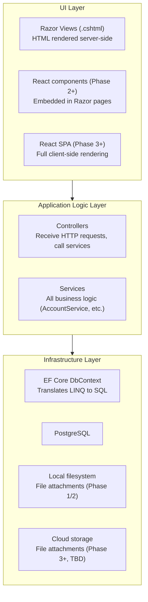
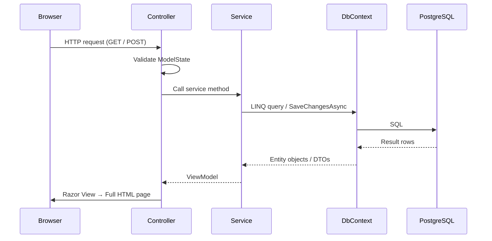
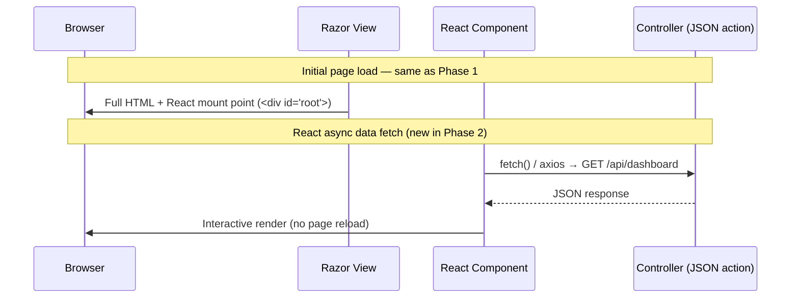
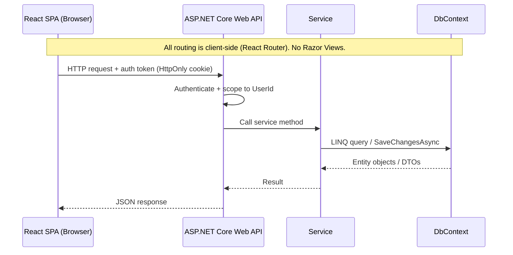

# System Architecture

> **Diataxis type:** Explanation — describes how the system is structured and how it evolves across phases.

## Index

1. [Layer Model](#layer-model)
2. [Request Flow](#request-flow)
3. [Architecture Evolution by Phase](#architecture-evolution-by-phase)
4. [Layer Boundaries](#layer-boundaries)
5. [What Lives Where](#what-lives-where)

---

## Layer Model

The application is structured in three layers. Each layer has a defined responsibility and may only talk to the layer directly below it.



Controllers do not call the database directly. Services do not render HTML. The UI layer does not contain business logic. These constraints are enforced by convention, not by the framework — they must be maintained as the codebase grows.

---

## Request Flow

### Phase 1 — Server-Side MVC (current)

Every page load is a full round-trip. Forms submit via POST. There is no JavaScript-driven partial update in Phase 1.



### Phase 2 — Hybrid (React components embedded in Razor)

Razor still drives page rendering. The delta from Phase 1: selected pages (e.g. the dashboard) embed interactive React components that fetch JSON from dedicated controller actions — a second async request path layered on top of the initial page load.



MVC routing still owns the page. React owns only the component. No separate frontend server or build pipeline beyond a Vite bundle is needed.

### Phase 3 — Full SPA (evaluation point)

The app is hosted, behind authentication, with no SEO concern for authenticated pages. The SPA model becomes viable and appropriate.

The delta from Phase 2: Razor Views are removed entirely. The backend becomes a pure JSON Web API. All routing moves to the client. Auth tokens replace session cookies.



**Public-facing pages** (landing page, marketing, pricing) are outside the SPA — they require server-side rendering for SEO and must be handled separately (Next.js or a static site).

---

## Architecture Evolution by Phase

| Phase | Frontend | Backend | API? | Trigger |
|-------|----------|---------|------|---------|
| **1 — Local MVP** | Razor Views only | ASP.NET Core MVC | No | — |
| **2 — Enhanced Local** | Razor + embedded React | ASP.NET Core MVC with JSON actions for React components | Partial (JSON actions, not a versioned API) | Charts and interactive dashboard require React |
| **3 — Hosted Beta** | React SPA (evaluation) | ASP.NET Core Web API | Yes | App is hosted, behind auth, multi-user; SPA model fits; API needed for mobile path |
| **4+ — Autónomo** | React SPA | ASP.NET Core Web API | Yes | — |

### The MVC → API trigger

The full decoupling from MVC to Web API is the right move at Phase 3, not earlier, because:

1. **Phase 3 is when auth exists** — a standalone API requires an authentication mechanism (JWT or cookie-based) that the SPA can use. Building API authentication without a user system is premature.
2. **Phase 3 is when hosting exists** — CORS policy, HTTPS enforcement, and reverse proxy configuration are all Phase 3 concerns that become prerequisites for a standalone API.
3. **Phase 3 is when multi-tenancy exists** — the API must scope every response to the authenticated user. This is not possible without auth.
4. **A React Native mobile app (future)** — a standalone Web API is reusable by a mobile client. This is an additional reason the decoupling pays off at Phase 3+, not at Phase 1/2.

Introducing a Web API in Phase 1 or 2 adds auth complexity, CORS configuration, and token management with no concrete benefit while the app is single-user and local.

---

## Layer Boundaries

### What each layer is allowed to do

| Layer | Allowed | Not allowed |
|-------|---------|-------------|
| **UI (Razor Views)** | Render data from ViewModels; submit forms | Contain business logic; call DbContext directly |
| **UI (React components)** | Fetch data from controller actions; render UI state | Call DbContext; contain business rules |
| **Controllers** | Receive HTTP requests; validate input; call services; return Views or JSON | Contain business logic; call DbContext directly |
| **Services** | Contain all business logic; call DbContext; call other services | Render HTML; know about HTTP (no HttpContext dependency) |
| **DbContext** | Translate LINQ to SQL; manage EF Core entity tracking | Contain business logic; be called from controllers directly |

### Why controllers must not call DbContext

The service layer is where business rules live — validation, cross-entity consistency, deletion rules, derived value computation. If controllers bypass services and call DbContext directly, business rules get duplicated or missed. Tests that mock services cannot catch this. The rule is: if it changes the database or computes a business result, it belongs in a service.

---

## What Lives Where

```
ProjectCeres/
  Controllers/         ← one per feature area (AccountsController, TransactionsController, etc.)
  Services/
    ← interfaces and implementations colocated (IAccountService.cs + AccountService.cs, etc.)
    ISettingsService.cs / SettingsService.cs         ← single Settings row; EnsureExistsAsync called at startup
    IAccountService.cs / AccountService.cs           ← CRUD, derived balance, Opening Balance auto-creation
    ICategoryService.cs / CategoryService.cs         ← CRUD, deactivate, IsSystem guard
    ITransactionService.cs / TransactionService.cs               ← CRUD (hard delete), paginated unified history (routes to ILiabilityPaymentService for LiabilityPayment type)
    ILiabilityPaymentService.cs / LiabilityPaymentService.cs    ← CRUD (hard delete), type/currency/date validation; called by TransactionService
    ITransferService.cs / TransferService.cs                    ← CRUD (hard delete), same-currency enforcement
    IBudgetService.cs / BudgetService.cs             ← CRUD, deactivate, derived actual spend
    IRecurringTransactionService.cs / RecurringTransactionService.cs  ← Confirm + Dismiss (advances NextDueDate)
    IReportService.cs / ReportService.cs             ← net worth, income/expense summary, breakdown, history
    IDashboardService.cs / DashboardService.cs       ← MTD totals, savings rate, pending reminders count
    IFileAttachmentService.cs / FileAttachmentService.cs  ← magic-byte upload, safe path, serve, delete
  Models/              ← EF Core entity classes (Account.cs, Transaction.cs, etc.)
  ViewModels/          ← one Create + one Edit ViewModel per write operation
  Helpers/
    NumberFormatHelper.cs  ← locale-aware decimal formatting: FormatAmount (display) + FormatInputValue (input pre-fill)
  Filters/
    NumberFormatActionFilter.cs  ← global IAsyncActionFilter; reads Settings.NumberFormat, injects ViewData["NumberFormat"] before every action
  ModelBinders/
    DecimalModelBinder.cs          ← parses decimal/decimal? form fields using the user's configured culture (comma or period)
    DecimalModelBinderProvider.cs  ← registers DecimalModelBinder for all decimal and decimal? parameters
  Data/
    AppDbContext.cs
    Migrations/
  Views/               ← Razor .cshtml files, one folder per controller
  Styles/
    app.css            ← Tailwind CSS input file — @tailwind directives + @apply component classes
  wwwroot/
    css/site.css       ← generated CSS output (do not edit by hand — overwritten on every build)
  uploads/             ← file attachments (outside wwwroot — not publicly accessible)
  package.json         ← pnpm manifest — Tailwind CSS dev dependency
  tailwind.config.js   ← Tailwind config — content paths point to all .cshtml files
  Program.cs           ← app startup, DI registration, middleware pipeline, EnsureExistsAsync call
```

See `docs/planning.md → Project Structure` for the full annotated directory listing.

---

## Frontend Build Pipeline (Phase 1)

Tailwind CSS is the only frontend build step in Phase 1. It runs entirely at build time — no JavaScript is shipped to the browser.

```
Styles/app.css  (Tailwind input — @apply component definitions)
       │
       │  pnpm run build:css
       │  (tailwindcss CLI scans all .cshtml files, generates only used utilities)
       ↓
wwwroot/css/site.css  (minified, generated output — served as a static file)
```

**How the build is triggered:**

| Scenario | Command |
|----------|---------|
| Normal development | `dotnet run` / `dotnet build` — MSBuild `<Target BeforeTargets="Build">` runs `pnpm run build:css` automatically |
| Active view editing | `pnpm --dir ProjectCeres run watch:css` in a second terminal — rebuilds CSS on every `.cshtml` change |
| CI / production | `dotnet publish` triggers the pre-build target, CSS is included in the published output |

**Phase 2 transition:** When React is introduced, the Tailwind CLI will be replaced by Vite (which includes Tailwind as a PostCSS plugin). The `@apply`-based component classes in `app.css` will be replaced by shadcn/ui React components using inline Tailwind utilities.
