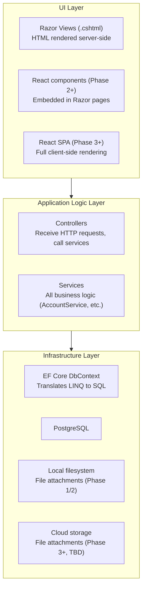
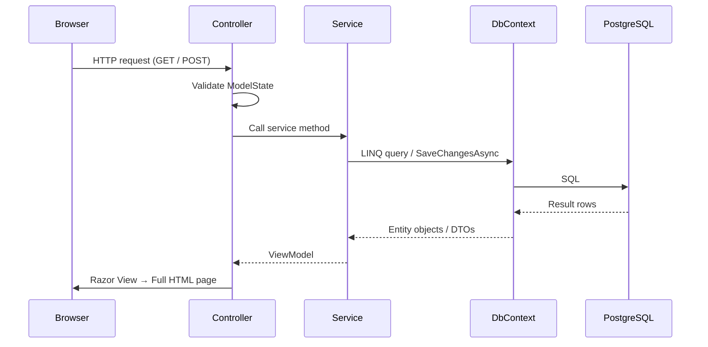
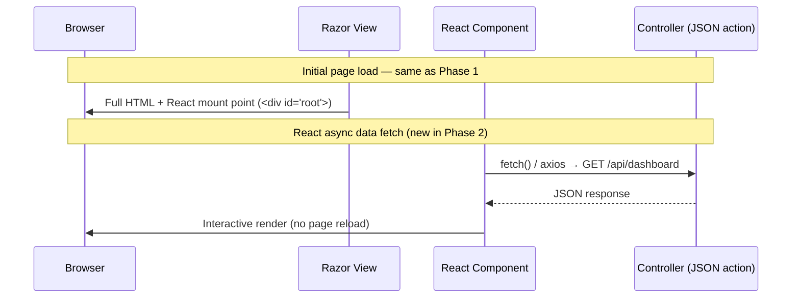
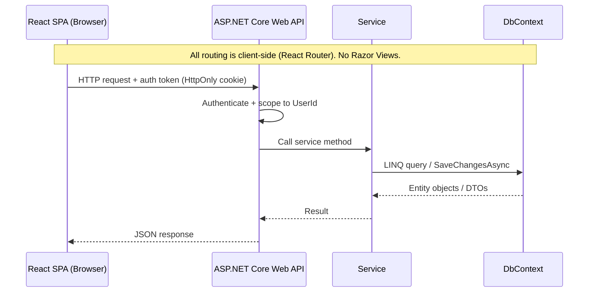

# System Architecture

> **Diataxis type:** Explanation — describes how the system is structured and how it evolves across phases.

## Index

1. [Layer Model](#layer-model)
2. [Request Flow](#request-flow)
3. [Architecture Evolution by Phase](#architecture-evolution-by-phase)
4. [Layer Boundaries](#layer-boundaries)
5. [What Lives Where](#what-lives-where)
6. [Service Registration — Scrutor Assembly Scanning](#service-registration--scrutor-assembly-scanning)

---

## Layer Model

The application is structured in three layers. Each layer has a defined responsibility and may only talk to the layer directly below it.


```mermaid
graph TD
    subgraph UI["UI Layer"]
        RV["Razor Views (.cshtml)\nHTML rendered server-side"]
        RC["React components (Phase 2+)\nEmbedded in Razor pages"]
        SPA["React SPA (Phase 3+)\nFull client-side rendering"]
    end

    subgraph App["Application Logic Layer"]
        CTRL["Controllers\nReceive HTTP requests, call services"]
        SVC["Services\nAll business logic (AccountService, etc.)"]
    end

    subgraph Infra["Infrastructure Layer"]
        DB["EF Core DbContext\nTranslates LINQ to SQL"]
        PG["PostgreSQL"]
        FS["Local filesystem\nFile attachments (Phase 1/2)"]
        CS["Cloud storage\nFile attachments (Phase 3+, TBD)"]
    end

    UI --> App
    App --> Infra
```

Controllers do not call the database directly. Services do not render HTML. The UI layer does not contain business logic. These constraints are enforced by convention, not by the framework — they must be maintained as the codebase grows.

### Compile-time enforcement (Stage 9.5c, shipped 2026-05-27)

A fourth layer wraps the three above: **Roslyn analyzers**, shipped via `ProjectCeres.Analyzers` and wired into `ProjectCeres` as `<ProjectReference OutputItemType="Analyzer">`. The analyzers run during `csc.exe` execution on every `dotnet build` and surface violations in the IDE in real time. They enforce:

- **CER001** — pre-auth call sites in `[PreAuthScope]`-marked classes must use `BeginPreAuthUserScopeAsync`, not plain `BeginTransactionAsync` (a `Reliability` invariant: pre-auth writes hit Postgres RLS `42501` otherwise).
- **CER002** — `IgnoreQueryFilters()` on `IUserOwned` entities via `AppDbContext` requires `[RlsBypassJustified("CER-NNNN")]` on the enclosing method (a `Security` invariant; complements ADR-0065's EF query filters + ADR-0068's Postgres RLS).
- **CER004** — `DateTime.UtcNow` / `DateTime.Now` in production code requires `[AllowsWallClock("reason")]` on the enclosing member (a `Reliability` invariant: forces `TimeProvider` injection elsewhere so integration tests can pin time).
- **CER010** — `[RlsBypassJustified(ticket)]` ticket argument must match `^(CER\|TICKET\|ADR)-\d+$` (a `Style` invariant: catches lazy justifications).
- **CER020** — EN/ES resx file parity (a `Localization` invariant; shipped at `error` severity from day 1).

Architecture tests in `ProjectCeres.Tests/Integration/Authentication/` remain the right tool for runtime invariants (DI registrations match expected services, every IUserOwned entity has an RLS migration, every controller action declares authz intent). The two enforcement mechanisms are complementary: analyzers catch the syntactically-locatable invariants at compile time; architecture tests catch the runtime-observable invariants at test time.

Decision record: `docs/decisions/ADR-0077-roslyn-analyzers-for-invariant-enforcement.md`.

---

## Request Flow

### Phase 1 — Server-Side MVC (current)

Every page load is a full round-trip. Forms submit via POST. There is no JavaScript-driven partial update in Phase 1.


```mermaid
sequenceDiagram
    participant Browser
    participant Controller
    participant Service
    participant DbContext
    participant PostgreSQL

    Browser->>Controller: HTTP request (GET / POST)
    Controller->>Controller: Validate ModelState
    Controller->>Service: Call service method
    Service->>DbContext: LINQ query / SaveChangesAsync
    DbContext->>PostgreSQL: SQL
    PostgreSQL-->>DbContext: Result rows
    DbContext-->>Service: Entity objects / DTOs
    Service-->>Controller: ViewModel
    Controller->>Browser: Razor View → Full HTML page
```

### Phase 2 — Hybrid (React components embedded in Razor) ✅ Complete

Razor still drives page rendering. The delta from Phase 1: selected pages (e.g. the dashboard) embed interactive React components that fetch JSON from dedicated controller actions — a second async request path layered on top of the initial page load.


```mermaid
sequenceDiagram
    participant Browser
    participant RazorView as Razor View
    participant ReactComponent as React Component
    participant JSONAction as Controller (JSON action)

    Note over Browser,JSONAction: Initial page load — same as Phase 1
    RazorView->>Browser: Full HTML + React mount point (<div id="root">)

    Note over Browser,JSONAction: React async data fetch (new in Phase 2)
    ReactComponent->>JSONAction: fetch() / axios → GET /api/dashboard
    JSONAction-->>ReactComponent: JSON response
    ReactComponent->>Browser: Interactive render (no page reload)
```

MVC routing still owns the page. React owns only the component. No separate frontend server or build pipeline beyond a Vite bundle is needed.

### Phase 3 — Full SPA (evaluation point) ← Target

The app is hosted, behind authentication, with no SEO concern for authenticated pages. The SPA model becomes viable and appropriate.

The delta from Phase 2: Razor Views are removed entirely. The backend becomes a pure JSON Web API. All routing moves to the client. Auth tokens replace session cookies.

> **Current state (cutover complete, 2026-06-29 — Stage 11).** The SPA migration is finished; the app is now a pure Web API + SPA.
> - SPA served at the site root `/` via `app.MapFallbackToFile("dist/app.html")` (the Vite-built host carries the hashed JS + stylesheet); React Router uses the default `/` basename.
> - Legacy `/app/*` bookmarks return a one-shot 301 to the prefix-free path (`RewriteOptions().AddRedirect`).
> - **All Razor controllers and `Views/` are deleted.** `Program.cs` retains `AddControllersWithViews()` for the antiforgery filter infrastructure only (dotnet/aspnetcore#22189) — no `.cshtml`, no `MapControllerRoute`. The API surface lives under `Controllers/Api/`.
> - Import + the Review page are shelved from the beta (ADR-0078): nav items + routes removed, the five import/review API endpoints fenced to non-beta environments; code retained (recoverable).
> - Auth ships via session cookies (Stage 6+); the "auth tokens" line above describes a possible future, not the current mechanism.
>
> The diagram below now describes the **achieved** architecture. See [`planning-phase3-spa-migration.md`](planning-phase3-spa-migration.md) for the per-controller migration history.


```mermaid
sequenceDiagram
    participant SPA as React SPA (Browser)
    participant WebAPI as ASP.NET Core Web API
    participant Service
    participant DbContext

    Note over SPA,DbContext: All routing is client-side (React Router). No Razor Views.
    SPA->>WebAPI: HTTP request + auth token (HttpOnly cookie)
    WebAPI->>WebAPI: Authenticate + scope to UserId
    WebAPI->>Service: Call service method
    Service->>DbContext: LINQ query / SaveChangesAsync
    DbContext-->>Service: Entity objects / DTOs
    Service-->>WebAPI: Result
    WebAPI-->>SPA: JSON response
```

**Public-facing pages** (landing page, marketing, pricing) are outside the SPA — they require server-side rendering for SEO and must be handled separately (Next.js or a static site).

---

## Architecture Evolution by Phase

| Phase | Frontend | Backend | API? | Trigger |
|-------|----------|---------|------|---------|
| **1 — Local MVP** | Razor Views only | ASP.NET Core MVC | No | — |
| **2 — Enhanced Local** | Razor + embedded React | ASP.NET Core MVC with JSON actions for React components | Partial (JSON actions, not a versioned API) | Charts and interactive dashboard require React |
| **3 — Hosted Beta** | React SPA (evaluation) | ASP.NET Core Web API | Yes | App is hosted, behind auth, multi-user; SPA model fits; API needed for mobile path |
| **4+ — Autónomo** | React SPA | ASP.NET Core Web API | Yes | — |

### The MVC → API trigger

The full decoupling from MVC to Web API is the right move at Phase 3, not earlier, because:

1. **Phase 3 is when auth exists** — a standalone API requires an authentication mechanism (JWT or cookie-based) that the SPA can use. Building API authentication without a user system is premature.
2. **Phase 3 is when hosting exists** — CORS policy, HTTPS enforcement, and reverse proxy configuration are all Phase 3 concerns that become prerequisites for a standalone API.
3. **Phase 3 is when multi-tenancy exists** — the API must scope every response to the authenticated user. This is not possible without auth.
4. **A React Native mobile app (future)** — a standalone Web API is reusable by a mobile client. This is an additional reason the decoupling pays off at Phase 3+, not at Phase 1/2.

Introducing a Web API in Phase 1 or 2 adds auth complexity, CORS configuration, and token management with no concrete benefit while the app is single-user and local.

---

## Layer Boundaries

### What each layer is allowed to do

| Layer | Allowed | Not allowed |
|-------|---------|-------------|
| **UI (Razor Views)** | Render data from ViewModels; submit forms | Contain business logic; call DbContext directly |
| **UI (React components)** | Fetch data from controller actions; render UI state | Call DbContext; contain business rules |
| **Controllers** | Receive HTTP requests; validate input; call services; return Views or JSON | Contain business logic; call DbContext directly |
| **Services** | Contain all business logic; call DbContext; call other services | Render HTML; know about HTTP (no HttpContext dependency) |
| **DbContext** | Translate LINQ to SQL; manage EF Core entity tracking | Contain business logic; be called from controllers directly |

### Why controllers must not call DbContext

The service layer is where business rules live — validation, cross-entity consistency, deletion rules, derived value computation. If controllers bypass services and call DbContext directly, business rules get duplicated or missed. Tests that mock services cannot catch this. The rule is: if it changes the database or computes a business result, it belongs in a service.

**Enforced by `CER007` (2026-08-15).** The rule was convention-only until an audit found 11 API controllers injecting `AppDbContext`. One of them, `SessionsApiController`, wrote two tables with no transaction and returned 500 when a user blocked the same IP twice — the unique index fired and no layer caught `UniqueConstraintViolationException`, exactly the failure this rule exists to prevent. `ISessionService` now owns those writes, and the account-deletability check moved into `IAccountService`.

`CER007` ships at **suggestion**, not error: 14 controllers still inject `AppDbContext`. Ten are read-path (GET actions projecting straight into DTOs, a shortcut from the Razor→SPA migration); the rest are the auth controllers (`AuthController`, `MfaController`, `ReauthController`, `PasswordResetController`, `EmailChangeController`, `EmailVerificationController`, `ResendWebhookController`), which pre-date the audit and were not part of the 2026-08-15 fix. None compute business rules the way `SessionsApiController` did, so they are lower risk than the write-path violation — but they are not sanctioned. Raise the severity to error once they are migrated. `dotnet build` does not print suggestions; to count the remaining sites, flip `dotnet_diagnostic.CER007.severity` to `warning` in `.editorconfig` and rebuild.

> **Known debt — error-signalling convention is not reconciled (flagged 2026-10-03, Stage 14 / ADR-0082).** [ADR-0025](decisions/ADR-0025-error-handling-domain-exceptions-and-global-middleware.md) chose typed domain exceptions + global middleware, but the service/controller layer has drifted to **three** co-existing conventions: `Result<T>`/`ResultError` (e.g. `AccountService`, `AccountsApiController`), thrown `InvalidOperationException` caught at the controller (e.g. `SupportApiController`), and a result enum (`CloseTicketResult`). Pick one, document it against ADR-0025, and migrate the others. Surfaced by the CQRS/MediatR investigation (ADR-0082) as the one genuine smell — it is a convention-reconciliation task, not missing infrastructure. Lower priority than the CER007 migration above but tracked alongside it; both are service-layer cleanups.

---

## What Lives Where

```
ProjectCeres/
  Controllers/         ← one per feature area (AccountsController, TransactionsController, etc.)
  Services/
    ← interfaces and implementations colocated (IAccountService.cs + AccountService.cs, etc.)
    ISettingsService.cs / SettingsService.cs         ← single Settings row; EnsureExistsAsync called at startup
    IAccountService.cs / AccountService.cs           ← CRUD, derived balance, Opening Balance auto-creation
    ICategoryService.cs / CategoryService.cs         ← CRUD, deactivate, IsSystem guard
    ITransactionService.cs / TransactionService.cs               ← CRUD (hard delete), paginated unified history (routes to ILiabilityPaymentService for LiabilityPayment type)
    ILiabilityPaymentService.cs / LiabilityPaymentService.cs    ← CRUD (hard delete), type/currency/date validation; called by TransactionService
    ITransferService.cs / TransferService.cs                    ← CRUD (hard delete), same-currency enforcement
    IMovementService.cs / MovementService.cs                   ← unified ledger query across Transaction, Transfer, LiabilityPayment (TPC UNION ALL); no write operations
    IBudgetService.cs / BudgetService.cs             ← CRUD, deactivate, derived actual spend
    IRecurringTransactionService.cs / RecurringTransactionService.cs  ← Confirm + Dismiss (advances NextDueDate)
    IReportService.cs / ReportService.cs             ← net worth, income/expense summary, breakdown, history
    IDashboardService.cs / DashboardService.cs       ← MTD totals, savings rate, pending reminders count; GetHealthSnapshotAsync (spendable balance, runway, income vs. rolling avg, budget burn rate)
    IFileAttachmentService.cs / FileAttachmentService.cs  ← magic-byte upload, safe path, serve, delete (transactions + transfers)
    IImportService.cs / ImportService.cs          ← import orchestration — format-blind; delegates parsing to ImportParserFactory
    IImportParser.cs                              ← parser abstraction — Format + ParseAsync
    CsvImportParser.cs                            ← CSV parsing via CsvHelper
    ExcelImportParser.cs                          ← XLSX parsing via ClosedXML; magic bytes check; sheet selection
    ImportParserFactory.cs                        ← routes ImportFormat → IImportParser; one line per format
    ICsvImportProfileService.cs / CsvImportProfileService.cs  ← CRUD + soft delete for ImportProfile
    IHeaderDetectionService.cs / HeaderDetectionService.cs    ← reads first row of CSV/XLSX; keyword-matches headers to date/amount/description/category fields; returns HeaderDetectionResult
  Models/              ← EF Core entity classes (Account.cs, Transaction.cs, etc.)
  ViewModels/          ← one Create + one Edit ViewModel per write operation
  Helpers/
    NumberFormatHelper.cs  ← locale-aware decimal formatting: FormatAmount (display) + FormatInputValue (input pre-fill)
  Filters/
    NumberFormatActionFilter.cs  ← global IAsyncActionFilter; reads Settings.NumberFormat, injects ViewData["NumberFormat"] before every action
  ModelBinders/
    DecimalModelBinder.cs          ← parses decimal/decimal? form fields using the user's configured culture (comma or period)
    DecimalModelBinderProvider.cs  ← registers DecimalModelBinder for all decimal and decimal? parameters
  Data/
    AppDbContext.cs
    Migrations/
  Views/               ← Razor .cshtml files, one folder per controller
  Styles/
    app.css            ← Tailwind CSS input file — @tailwind directives + @apply component classes
  wwwroot/
    css/site.css       ← generated CSS output (do not edit by hand — overwritten on every build)
  uploads/             ← file attachments (outside wwwroot — not publicly accessible)
  package.json         ← pnpm manifest — Tailwind CSS dev dependency
  tailwind.config.js   ← Tailwind config — content paths point to all .cshtml files
  Program.cs           ← app startup, DI registration, middleware pipeline, EnsureExistsAsync call
```

See `docs/planning.md → Project Structure` for the full annotated directory listing.

---

## Frontend Build Pipeline (Phase 1)

Tailwind CSS is the only frontend build step in Phase 1. It runs entirely at build time — no JavaScript is shipped to the browser.

```
Styles/app.css  (Tailwind input — @apply component definitions)
       │
       │  pnpm run build:css
       │  (tailwindcss CLI scans all .cshtml files, generates only used utilities)
       ↓
wwwroot/css/site.css  (minified, generated output — served as a static file)
```

**How the build is triggered:**

| Scenario | Command |
|----------|---------|
| Normal development | `dotnet run` / `dotnet build` — MSBuild `<Target BeforeTargets="Build">` runs `pnpm run build:css` automatically |
| Active view editing | `pnpm --dir ProjectCeres run watch:css` in a second terminal — rebuilds CSS on every `.cshtml` change |
| CI / production | `dotnet publish` triggers the pre-build target, CSS is included in the published output |

**Phase 2 transition:** When React is introduced, the Tailwind CLI will be replaced by Vite (which includes Tailwind as a PostCSS plugin). The `@apply`-based component classes in `app.css` will be replaced by shadcn/ui React components using inline Tailwind utilities.

---

## Service Registration — Scrutor Assembly Scanning

**Shipped Stage 13.a (2026-10-02).** Previously undocumented — `Program.cs` DI registration had no written convention; this section is that convention, written down for the first time rather than resolving a prior contradiction.

Before Stage 13.a, every service needing DI was a hand-written `builder.Services.AddScoped<IFoo, Foo>()` (or `AddSingleton`) line in `Program.cs` — 84 such lines at the stage's start. 79 of them followed one of two purely structural shapes and are now registered automatically by [Scrutor](https://github.com/khellang/Scrutor) assembly scanning instead. 5 stay manual because they sit inside environment-conditional branches a structural scan cannot express (see below).

### The scan rule

The rule is **structural, never a naming pattern** (e.g. no "classes ending in `Service`"):

- A class that implements **at least one interface** (declared or inherited, project-defined or framework) → registered via `AsImplementedInterfaces()`.
- A class that implements **no interface** → registered via `AsSelf()` (a self-registered concrete type, e.g. a factory or a job runner consumed by its own type, not an interface).
- Default lifetime is **Scoped**. The `[RegisterAsSingleton]` marker attribute (`ProjectCeres/Common/RegisterAsSingletonAttribute.cs`) overrides a class to Singleton. Because Scrutor's `AddClasses(...)` call can only terminate in one fixed lifetime (`WithScopedLifetime()` / `WithSingletonLifetime()` / `WithTransientLifetime()` — there is no per-type lifetime factory on Scrutor 7.0.0's `ILifetimeSelector`), every rule below is actually **two** `AddClasses(...)` batches: one filtered to `[RegisterAsSingleton]` classes terminating in `WithSingletonLifetime()`, one filtered to everything else terminating in `WithScopedLifetime()`.

### The namespace list

Two separate `Scan(...)` calls, chosen deliberately per namespace rather than one call across a shared parent:

| Namespace | Match mode | Why |
|---|---|---|
| `ProjectCeres.Services` | `InNamespaces` (prefix-inclusive) | Sub-namespaces like `ProjectCeres.Services.Reports` are meant to be swept in too. |
| `ProjectCeres.Admin` | `InExactNamespaces` | Exact-match only. |
| `ProjectCeres.Common.Authentication` | `InExactNamespaces` | Exact-match only. |
| `ProjectCeres.Common` | `InExactNamespaces` | **Must be exact-match, not prefix.** A prefix match (`InNamespaces("ProjectCeres.Common")`) would also sweep in the sibling namespace `ProjectCeres.Common.Exceptions` — exception types are not DI services, and a thrown exception type being registered in the container is a correctness bug, not a no-op. `InExactNamespaces` matches only classes declared directly in `ProjectCeres.Common`, never a sub-namespace. |
| `ProjectCeres.Common.Email` | `InExactNamespaces` | Exact-match only. |

`ScrutorNamespaceBoundaryTests` (`ProjectCeres.Tests/Unit/ScrutorNamespaceBoundaryTests.cs`) pins both boundary behaviors directly: a class outside every scanned namespace is never swept in, and `InExactNamespaces("ProjectCeres.Common")` does not accidentally match a `ProjectCeres.Common.*` sub-namespace.

### False positives the structural rule does not exclude on its own

A bare "implements an interface, or doesn't" rule over-matches several ordinary C# shapes that are not services: exception types, positional-record DTOs, custom `Attribute` subclasses, and conventional ASP.NET Core middleware (constructed by `ActivatorUtilities` via `app.UseMiddleware<T>()`, never resolved through DI). These are excluded via shared reflection predicates in `ScanExclusionPredicates` (`IsExceptionType` / `IsRecordType` / `IsAttributeType` / `IsConventionalMiddleware`) — the same predicates `DiCompletenessCheck` uses, so a fix to one can never silently diverge from the other. A class with only non-public constructors (`IsConstructibleByDi`) is excluded for the same reason: Scrutor registers it without checking constructor accessibility, which only fails at `ServiceProvider.ValidateOnBuild` (Development-only) or at first resolution.

### Dual-consumer / multi-registration / framework-preemption exclusions

Three further exclusion sets exist because "a class implements an interface" is not the same claim as "every consumer of that class resolves it through that interface." A future engineer who deletes a manual registration line and hits one of these walls needs to know these sets exist and what each one is for:

- **`selfWithInterfacesTargets`** — classes some consumers inject by **interface** and other consumers inject by **concrete type**. `AsImplementedInterfaces()` alone does not also self-register the concrete type, so a plain interface scan would leave the concrete-type consumers unable to resolve their dependency. These classes route through `AsSelfWithInterfaces()` instead, which registers the concrete type as itself *and* resolves every implemented interface through that same shared instance. Current members: `Argon2idPasswordHasher` (interface consumers via ASP.NET Identity's `IPasswordHasher<ApplicationUser>`, 13+ concrete-type consumers across `ProjectCeres.Common.Authentication` and `AuthController`); the 8 `IReportGenerator` classes under `ProjectCeres.Services.Reports` (`ReportGeneratorFactory` injects all 8 by concrete type); `CsvImportParser` / `ExcelImportParser` (`ImportParserFactory` injects both by concrete type, despite both declaring `: IImportParser`).
- **`multiRegistrationInterfaceTargets`** — interfaces that ASP.NET Core resolves as `IEnumerable<T>` and runs **every** registered implementation, by design (not last-registration-wins). The default scan strategy, `RegistrationStrategy.Skip` (= `TryAdd`, keyed purely by `ServiceType`), would silently register only the first-enumerated implementation and drop the rest — no error, no warning, just a check that quietly stops running. These classes use `RegistrationStrategy.Append` (= plain `Add`, no dedup) instead. Current members: `RecentAuthRequirementHandler` and `AdminLiveRequirementHandler`, both `IAuthorizationHandler`.
- **`replaceTargets`** — a service whose interface slot a **framework default already claims** before the scan runs. `AddControllersWithViews()` (called before either `Scan(...)`) internally registers a framework default for `IAuthorizationMiddlewareResultHandler` via `TryAddTransient`, so `RegistrationStrategy.Skip`'s `TryAdd` is a guaranteed no-op for that interface regardless of scan ordering. These classes use `RegistrationStrategy.Replace()`, which removes any existing registration for the `ServiceType` before adding — replicating what the original manual `AddSingleton` line (never `TryAdd`) always did unconditionally. Current member: `RecentAuthMiddlewareResultHandler`.

All three sets are asserted directly by `DiCompletenessTests` (`ProjectCeres.Tests/Integration/DiCompletenessTests.cs`), not just by "a dependency resolves to something" — e.g. an identity check that the interface and concrete-type resolutions of `Argon2idPasswordHasher` are the *same* instance, and exact-count checks that both `IAuthorizationHandler` implementations and exactly one `IAuthorizationMiddlewareResultHandler` descriptor survive.

### The `[RegisterAsSingleton]` escape hatch

`ProjectCeres/Common/RegisterAsSingletonAttribute.cs` is a marker attribute with no members. A class carrying it is registered `Singleton`; every other scanned class defaults to `Scoped`. `ScrutorNamespaceBoundaryTests.RegisterAsSingleton_attribute_changes_lifetime_from_the_Scoped_default` confirms the attribute actually changes the resolved lifetime, using `TokenLookupHasher` as the real example.

### Two-class interceptor exclusion

`UserOwnershipInterceptor` and `RowLevelSecurityInterceptor` (`ProjectCeres.Common`) both implement EF Core interceptor interfaces but are excluded from the interface-pair scan rule entirely (`interceptorExclusions`). EF Core interceptors are wired via `DbContextOptionsBuilder.AddInterceptors(...)` inside the `AddDbContext<AppDbContext>` configuration, not via `builder.Services.Add*<TInterface, TImpl>()` — a DI registration for either class would be inert (nothing resolves an EF interceptor interface through the container) and would pollute it with a self-registered-concrete entry nothing ever uses.

### The 5-line non-scannable boundary

A structural scan cannot express "only register this under condition X." Five registrations stay manual by design, all inside environment- or configuration-conditional branches in `Program.cs`:

1. `TimeProvider.System` — an instance registration (`AddSingleton(TimeProvider.System)`), not a type registration; Scrutor scans types, not pre-built instances.
2. `IEmailService` → a provider chosen by configuration (`AddSingleton<IEmailService>(sp => ...)` for a configured sender, `AddSingleton<IEmailService, LogOnlyEmailService>()` in Development, or `AddScoped<IEmailService, ResendEmailService>()` when Resend is configured) — three mutually-exclusive branches resolving the same interface.
3. `IBreachedPasswordChecker` → `AddSingleton<IBreachedPasswordChecker, AlwaysAllowBreachedPasswordChecker>()` in one environment branch, or `AddHttpClient<IBreachedPasswordChecker, HaveIBeenPwnedPasswordChecker>()` in another — `AddHttpClient` is a distinct registration shape a plain `AddClasses(...)` scan cannot replicate.

These, plus a separate, non-overlapping family of `AddDbContext<T>`, `Configure<TOptions>`, and `AddHttpClient<...>` calls (option binders and infrastructure registrations, never part of the scanned 84), are the complete non-scannable set. `grep -cE "builder\.Services\.Add(Scoped|Singleton|Transient)" ProjectCeres/Program.cs` returns exactly 5 — the stable verification command for this boundary.

### Verification

`DiCompletenessCheck.FindUnresolvable(IServiceProvider)` walks every scanned class's constructor dependencies and confirms each resolves, both as a fast automated test (`DiCompletenessTests`, boots the real DI graph via `TestWebApplicationFactory`) and implicitly at real app boot via ASP.NET Core's `ServiceProvider.ValidateOnBuild` (Development-only). Full design history, the 7 scan-mechanism gaps found during implementation, and the arithmetic reconciliation of the 84-registration figure: `docs/superpowers/specs/2026-09-27-stage-13a-scrutor-di-scanning-design.md`.
