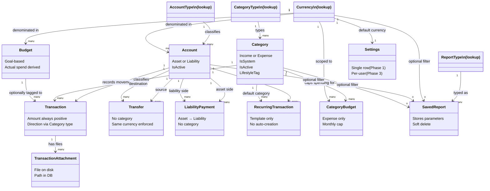

# Data Models

> **Diataxis type:** Reference — defines every entity, its columns, relationships, and deletion rules.

## Index

1. [Database Normalization — Plain English](#database-normalization--plain-english)
   - [First Normal Form (1NF)](#first-normal-form-1nf--one-fact-per-cell)
   - [Second Normal Form (2NF)](#second-normal-form-2nf--every-column-depends-on-the-whole-key)
   - [Third Normal Form (3NF)](#third-normal-form-3nf--every-column-depends-on-nothing-but-the-key)
2. [Domain Model](#domain-model)
3. [Entity Definitions](#entity-definitions)
   - [Primary Key Strategy](#primary-key-strategy)
   - [Currency](#currency)
   - [AccountType](#accounttype)
   - [Account](#account)
   - [CategoryType](#categorytype)
   - [Category](#category)
   - [Transaction](#transaction)
   - [TransactionAttachment](#transactionattachment)
   - [RecurringTransaction](#recurringtransaction)
   - [Transfer](#transfer)
   - [CategoryBudget](#categorybudget)
   - [Budget](#budget)
   - [ReportType](#reporttype)
   - [SavedReport](#savedreport)
   - [Settings](#settings)
4. [Relationships](#relationships)
5. [Derived Values](#derived-values)
6. [Multi-Currency Reporting](#multi-currency-reporting)
7. [Deletion Rules](#deletion-rules)
8. [Database Indexes](#database-indexes)
9. [Phase 2 — Schema Additions](#phase-2--schema-additions)
   - [ImportStagedTransfer](#importstagedtransfer-new-entity--phase-2-stage-35)
   - [ImportTransferExclusion](#importtransferexclusion-new-entity--phase-2-stage-35)
10. [Phase 3 — Entities To Be Defined](#phase-3--entities-to-be-defined)
    - [SavedSearch](#savedsearch-phase-3)
    - [SupportTicket](#supportticket-phase-3)
    - [UserSession](#usersession-phase-3)
    - [UserBlockedIp](#userblockedip-phase-3)
    - [CustomerArchive](#customerarchive-phase-3)
    - [AdminAuditLog](#adminauditlog-phase-3)

---

## Database Normalization — Plain English

Normalization is a set of rules for organizing your tables so that data is stored cleanly,
without redundancy and without the risk of data falling out of sync with itself.
There are three forms, each building on the previous one.

---

### First Normal Form (1NF) — "One fact per cell"

**Rule:** Every column holds one single value. No lists, no comma-separated values, no repeating groups. Every row must be uniquely identifiable (i.e. there is a primary key).

**Bad example:**

| TransactionId | Date       | Categories          |
|---------------|------------|---------------------|
| 1             | 2026-01-01 | Groceries, Food     |

You can't query "all Groceries transactions" reliably if two categories are stuffed into one cell.

**Fixed:**
Split into separate rows or a separate table so each cell holds exactly one value.

---

### Second Normal Form (2NF) — "Every column depends on the whole key"

**Rule:** Must already be in 1NF. No column should depend on only *part* of the primary key.
This only becomes a problem when your primary key is made up of more than one column (composite key).

**Bad example** — imagine a table with a composite key of (AccountId, CategoryId):

| AccountId | CategoryId | AccountName    | CategoryName |
|-----------|------------|----------------|--------------|
| 1         | 3          | Chase Checking | Groceries    |

`AccountName` only depends on `AccountId`, not on the full key.
`CategoryName` only depends on `CategoryId`, not on the full key.
Both are partial dependencies — a 2NF violation.

**Fixed:**
Pull `AccountName` into an Accounts table and `CategoryName` into a Categories table.
The join table only holds the keys.

---

### Third Normal Form (3NF) — "Every column depends on nothing but the key"

**Rule:** Must already be in 2NF. No column should depend on *another non-key column*.
These are called transitive dependencies.

**Bad example:**

| TransactionId | CategoryId | CategoryName | CategoryType |
|---------------|------------|--------------|--------------|
| 1             | 3          | Groceries    | Expense      |

`CategoryName` and `CategoryType` depend on `CategoryId`, not on `TransactionId`.
If the category name changes, you'd have to update every transaction row — that is a transitive dependency.

**Fixed:**
`CategoryName` and `CategoryType` belong in a Categories table.
The Transactions table only stores `CategoryId` as a foreign key and looks the rest up from there.

---

## Domain Model

Conceptual overview — relationships and responsibilities only. For column-level detail see the entity definitions below.



---

## Entity Definitions

### Primary Key Strategy

User-created entities use `uuid` as their primary key. System lookup tables use `int`.

| PK type | Applied to | Reason |
|---------|-----------|--------|
| `uuid` | Account, Category, Transaction, Transfer, TransactionAttachment, CategoryBudget, Budget, SavedReport, UserSession, UserBlockedIp | Appear in user-facing URLs — UUIDs prevent sequential ID enumeration and information leakage |
| `int` | Currency, AccountType, CategoryType, ReportType, Settings | System-seeded, never appear in URLs, conventional int is fine |

FK columns follow the referenced table's PK type: `Account.AccountTypeId` stays `int` (points to a lookup table), but `Transaction.AccountId` is `uuid` (points to Account).

**EF Core implementation:** `Guid` in C# maps to `uuid` in PostgreSQL natively via Npgsql. UUIDs are generated client-side on insert via `Guid.NewGuid()` — no database sequence or trigger required.

---

### Currency

Lookup table. Defines the supported currencies. Each account is assigned one currency.
No exchange rates are stored — reports filter by currency rather than converting between them.

| Column | Type    | Constraints      | Notes                                      |
|--------|---------|------------------|--------------------------------------------|
| Id     | int     | PK               |                                            |
| Code   | varchar | NOT NULL, UNIQUE | ISO 4217 code — e.g. "EUR", "USD"         |
| Name   | varchar | NOT NULL         | e.g. "Euro", "US Dollar"                  |
| Symbol | varchar | NOT NULL         | e.g. "€", "$", "£"                        |

**Supported currencies at launch:**

| Code | Name                  | Symbol |
|------|-----------------------|--------|
| EUR  | Euro                  | €      |
| USD  | US Dollar             | $      |
| GBP  | British Pound         | £      |
| COP  | Colombian Peso        | $      |
| ARS  | Argentine Peso        | $      |
| VED  | Venezuelan Bolívar Digital | Bs.D |

> **Note on ARS:** The user-provided code was ARP, but ARP refers to a historical Argentine currency
> that was only in circulation between 1983 and 1985. The current ISO 4217 code is ARS.

---

### AccountType

Lookup table. Keeps account classification in one place.

| Column | Type    | Constraints | Notes                  |
|--------|---------|-------------|------------------------|
| Id     | int     | PK          |                        |
| Name   | varchar | NOT NULL    | "Asset" or "Liability" |

---

### Account

Represents a financial account the user owns or owes on.

| Column        | Type    | Constraints    | Notes                                  |
|---------------|---------|----------------|----------------------------------------|
| Id            | uuid    | PK             |                                        |
| Name          | varchar | NOT NULL       | e.g. "Chase Checking"                  |
| AccountTypeId | int     | FK, NOT NULL   | → AccountType                          |
| CurrencyId    | int     | FK, NOT NULL   | → Currency                             |
| Description   | varchar | nullable       | e.g. "Main checking account"           |
| IsActive      | bit     | NOT NULL       | False = deactivated, hidden from UI but history preserved |
| Notes         | text    | nullable       | Phase 3. Free-text annotation for the account (e.g. "emergency fund — minimum €5,000"). Displayed on the account detail view. |

**Deactivated accounts in calculations:**
A deactivated account still counts toward net worth and account balance reports. Deactivation
means the account is closed or no longer in active use — the money still exists (or the debt
is still owed). Excluding it from calculations would silently produce a wrong net worth figure.
Deactivated accounts are hidden from pickers and the active account list, but included in
all aggregation queries.

**Opening balance:**
Account has no balance column — balance is always derived from transactions. When a user creates
an account and enters a starting balance, the app automatically creates an opening balance
transaction for that amount, tagged to the system "Opening Balance" category. The creation form
prompts for a starting balance (can be zero). The user never has to construct this transaction
manually — the app does it on their behalf. The transaction is visible in transaction history
labeled as the opening entry. The Amount and Date fields are editable if the user entered the wrong value. The CategoryId is locked — the service layer must reject any attempt to change it away from the Opening Balance system category, regardless of how the request arrives. Allowing a category change would silently move the opening balance into income reports and distort all financial totals.

**Why AccountTypeId instead of storing "Asset" directly?**
Storing the string on every row means a rename requires updating every account record.
With a lookup table it changes in one place — and the string value can never drift. (3NF)

---

### CategoryType

Lookup table. Distinguishes income categories from expense categories.

| Column | Type    | Constraints | Notes                   |
|--------|---------|-------------|-------------------------|
| Id     | int     | PK          |                         |
| Name   | varchar | NOT NULL    | "Income" or "Expense"   |

---

### Category

User-defined labels for classifying transactions.

| Column         | Type    | Constraints  | Notes                          |
|----------------|---------|--------------|--------------------------------|
| Id             | uuid    | PK           |                                |
| Name           | varchar | NOT NULL     | e.g. "Groceries", "Salary"     |
| CategoryTypeId | int     | FK, NOT NULL | → CategoryType                 |
| IsActive       | bit     | NOT NULL     | False = deactivated, hidden from pickers but existing transactions unaffected |
| IsSystem       | bit     | NOT NULL     | True = seeded by the app, not editable or deletable by the user |
| LifestyleTag   | varchar | nullable     | "Needs" or "Wants" — used for ratio-based budgeting framework reports (50/30/20). Null = untagged. Only meaningful for Expense categories; ignored on Income and system categories. Seeded expense categories ship with suggested default tags. Prompted once when a user creates a custom category. |

**System categories:**
Some categories are seeded by the app and must not be renamed or deleted because the application
logic depends on them by name or ID. Currently one: "Opening Balance" (Income type, IsSystem = true).
It is excluded from all income/expense report totals — its only purpose is to anchor the starting
balance of an account. The UI must hide edit and delete controls for any category where IsSystem = true.
The service layer must also enforce this — reject any edit or delete request for an IsSystem category regardless of how the request arrives. UI-only enforcement is bypassed by direct HTTP requests.

**Opening Balance and the balance sign convention:**
Although the Opening Balance category carries `CategoryTypeId = Income`, it is treated as a neutral
starting point — not as income or expense — in all balance calculations. The service layer checks
`Category.IsSystem` *before* applying the income/expense direction rule, and always adds the amount
to the balance regardless of account type. This means a liability account's opening balance correctly
increases what is owed, even though it is stored as an Income-typed transaction.

---

### Transaction

The central record. Every dollar movement lives here.

| Column      | Type    | Constraints  | Notes                                         |
|-------------|---------|--------------|-----------------------------------------------|
| Id          | uuid    | PK           |                                               |
| Date        | date         | NOT NULL     | When the transaction occurred — stored as local date, no timezone (see note) |
| Amount      | decimal(18,2)| NOT NULL     | Always stored as a positive number — direction derived from Category → CategoryType |
| Description | varchar      | nullable     | e.g. "Whole Foods run"                        |
| AccountId   | uuid         | FK, NOT NULL | → Account (which account was affected)        |
| CategoryId  | uuid         | FK, NOT NULL | → Category (what kind of transaction this is) |
| CreatedAt   | datetime     | NOT NULL     | Set by the application on insert. Used as tiebreaker when ordering transactions that share the same date. Not editable — reflects when the record was entered, not when the transaction occurred. |
| BudgetId    | uuid         | FK, nullable | → Budget (optional — tags this transaction to a goal budget) |

**Note on Income vs. Expense classification:**
Whether a transaction is income or expense is not stored on this table. That classification
already lives in Category → CategoryType. Duplicating it here would create a transitive
dependency — a 3NF violation — because the value would depend on CategoryId, not on the
transaction's own key. If the two ever disagreed, there would be no way to know which is correct.

**Note on date and timezone:**
Date is stored as a local date with no timezone component. The assumption is that the user
records transactions in their local timezone and reports use the same timezone for period
boundaries (start/end of month, year). In Phase 3 (multi-user), this assumption must be
revisited — users in different timezones will have different interpretations of "today."

**Note on BudgetId when a Budget is deactivated:**
If the linked Budget is deactivated, the FK on this row is preserved. The transaction
still contributed to that budget's actual spend while it was active. Transaction History
views should display the budget name even when the budget is deactivated, so the link
remains interpretable.

**Split transactions — deferred, not Phase 2:**
One Transaction links to exactly one Category. Split transactions (one payment across
multiple categories) are not supported in Phase 1 or Phase 2. Revisit at Phase 3 scope
definition — outcome may be implement, defer again, or discard. See ADR-0041.

**Cleared / reconciliation status (Phase 2):**
`IsCleared bool NOT NULL DEFAULT false` — added in Phase 2. Marks a transaction as
verified against a bank statement. Set automatically on clean CSV imports; held false
for potential duplicates pending reconciliation review. See ADR-0039.
Can be toggled from three surfaces: (1) the `ToggleCleared` POST action on the Transactions
Index view (inline, preserves filter state); (2) the `BulkMarkCleared` POST action that sets
all transactions in a date range to cleared; (3) the `IsClearedSwitch` React component
embedded in the Transaction Edit form, which writes to a hidden field submitted with the
standard form POST.

**Needs review flag (Phase 2):**
`NeedsReview bool NOT NULL DEFAULT false` — set to `true` automatically on every transaction
created by the import pipeline. Signals that the transaction has not been manually verified
and may need recategorisation. The user clears this flag after reviewing the imported row.
Not exposed as a standalone toggle yet — displayed in the Transactions list as a badge.

---

### TransactionAttachment

Stores metadata for files attached to a transaction. One transaction can have many attachments.
The actual file is saved to the filesystem — only the reference lives in the database.

| Column        | Type     | Constraints  | Notes                                                      |
|---------------|----------|--------------|------------------------------------------------------------|
| Id            | uuid     | PK           |                                                            |
| TransactionId | uuid     | FK, NOT NULL | → Transaction                                              |
| FileName      | varchar  | NOT NULL     | Original filename as uploaded (e.g. "receipt.pdf")        |
| StoredPath    | varchar  | NOT NULL     | Path used to locate the file. Phase 1/2: absolute filesystem path. Phase 3+: cloud storage URL or blob key — provider TBD, see open question in planning.md |
| ContentType   | varchar  | NOT NULL     | MIME type (e.g. "application/pdf", "image/jpeg")           |
| FileSizeBytes | bigint   | NOT NULL     | Size of the file in bytes                                  |
| UploadedAt    | datetime | NOT NULL     | When the file was attached                                 |

**Deletion rule:** hard delete. Both the DB row and the file on disk are deleted together by `FileAttachmentService.DeleteAsync`. This is called explicitly in two places: (1) the user clicks Remove on the Edit view, and (2) `TransactionService.DeleteAsync` cascades deletion to all attachments before removing the transaction row. EF Core cascade delete is not used — deletion is handled in the service layer to ensure the filesystem file is also removed.

**Why not store the file in the database?**
Storing binary file data (BLOBs) in the database bloats it, slows down every backup,
and makes queries against other columns slower. The filesystem is purpose-built for files.
The database holds the path so the app can find it — that's the right split of responsibility.

**StoredPath naming convention:**
Files are saved under `uploads/{transactionId}/{guid}{extension}`.
The transactionId is a UUID (the PK of the Transaction record). A second GUID prevents filename collisions within the same transaction. The transactionId subdirectory groups a transaction's
attachments together and makes manual inspection easier. `FileName` preserves the original
name for display in the UI — `StoredPath` is never shown to the user.
Files must be served via a controller action, not directly — they must not be accessible
without authentication and must not be placed inside `wwwroot`.

**File upload security requirements:**
The following constraints must be enforced in the service layer before any file is written to disk:
- **Allowed MIME types (whitelist):** `image/jpeg`, `image/png`, `image/gif`, `image/webp`, `application/pdf`. Reject anything not on this list — do not use a blacklist.
- **Maximum file size:** 10 MB per file. Enforce in both the controller (via `RequestSizeLimitAttribute` or `IFormFile.Length` check) and the service layer.
- **Path traversal prevention:** The stored path must be constructed entirely from application-controlled values (`transactionId` and a freshly generated `Guid`) — never from any part of the user-supplied filename. Never pass `FileName` to any filesystem API. Only `StoredPath` (constructed by the app) is used for disk operations.
- **Content-type verification:** Do not trust the MIME type declared by the browser in the HTTP request. Verify the actual file content using magic bytes (file header inspection) before saving. Libraries such as `MimeDetective` can handle this.
- **File extension:** Derive the stored file extension from the verified MIME type, not from the original filename.
- **Polyglot file awareness:** magic bytes verification reduces risk but does not eliminate polyglot files — files that are simultaneously valid as two formats (e.g. a file that passes JPEG header checks but also contains executable HTML). The `Content-Disposition: attachment` header set at serve time is the primary defence against polyglots rendering in the browser. Both layers must be consistently applied — a single endpoint missing the header breaks the protection.
- **Attachment limits:** enforce a maximum number of attachments per transaction (e.g. 10 files) and a maximum total storage per user (e.g. 1 GB) at the service layer. Without these caps, a user could attach large volumes of files and exhaust disk space. Limits should be configurable via application settings, not hardcoded.

**File serving security requirements:**
When streaming a file to the user, the controller action must:
- Verify that the authenticated user owns the transaction the attachment belongs to before streaming — never serve a file based on `StoredPath` alone.
- Set `Content-Disposition: attachment; filename*=UTF-8''<percent-encoded FileName>` — forces the browser to download rather than render, preventing stored XSS via uploaded HTML or SVG. Use the RFC 5987 `filename*` parameter for non-ASCII characters and to prevent header injection via filenames containing quotes or semicolons. A plain `filename` parameter may be included alongside it as a fallback for older clients.
- Set `Content-Type` from the stored `ContentType` value, not from the filename or from any user-supplied header.
- Re-verify the MIME type whitelist at serve time — reject any record whose `ContentType` is not on the allowed list, even if it passed the upload check.

---

### RecurringTransaction

A template for a predictable financial event that repeats on a regular schedule (salary, rent, subscriptions). Does **not** create transactions automatically — instead surfaces a reminder when the due date arrives, which the user must confirm before a real `Transaction` record is written. This prevents unverified entries from appearing in the ledger.

| Column | Type | Constraints | Notes |
|--------|------|-------------|-------|
| Id | uuid | PK | |
| Name | varchar | NOT NULL | User-given label, e.g. "Monthly Rent", "Salary" |
| EstimatedAmount | decimal(18,2) | NOT NULL | Default amount pre-filled in the confirmation form — the user can adjust before confirming |
| AccountId | uuid | FK, NOT NULL | → Account |
| CategoryId | uuid | FK, NOT NULL | → Category |
| Frequency | varchar | NOT NULL | "monthly", "weekly", "biweekly", "annual" |
| DayOfPeriod | int | nullable | Day within the frequency period when the reminder fires. Monthly: day of month (e.g. 1 = 1st). Weekly: day of week (1 = Monday). Null for annual entries where NextDueDate is managed directly. |
| NextDueDate | date | NOT NULL | Date on which the next reminder appears. Advances to the next period automatically after the user confirms. |
| IsActive | bit | NOT NULL | False = paused, hidden from the dashboard pending list |

**How confirmation works:** when `NextDueDate` is reached (or within a configurable look-ahead window, e.g. 3 days before), the dashboard shows a pending reminder count. The user opens the reminder to see a pre-filled transaction form using the template values. They adjust any field if needed — the actual amount or date may differ from the estimate — then confirm to write a real `Transaction` record. On confirmation, `NextDueDate` advances to the next period. Dismissing a reminder does not create a transaction and does not advance the schedule.

**Why not auto-create:** amounts vary (utility bills, freelance income), payment dates shift (holidays, bank processing delays), and some periods may be skipped or cancelled. Auto-creation silently produces wrong data in the ledger. The reminder model keeps the user in control while eliminating the need to remember when entries are due.

**Deletion rule:** hard delete allowed. Deleting a template does not affect any previously confirmed transactions. Pausing (`IsActive = false`) is preferred for temporary suspension.

---

### Transfer

Represents a movement of money between two accounts the user owns.
A transfer is neither income nor expense — it does not have a category and is excluded
from all income/expense report calculations. Both accounts must share the same currency.

| Column          | Type     | Constraints  | Notes                                       |
|-----------------|----------|--------------|---------------------------------------------|
| Id              | uuid     | PK           |                                             |
| Date            | date     | NOT NULL     | When the transfer occurred — local date, no timezone |
| Amount          | decimal(18,2) | NOT NULL | Always stored as a positive number          |
| SourceAccountId | uuid     | FK, NOT NULL | → Account (money leaves here)               |
| DestAccountId   | uuid     | FK, NOT NULL | → Account (money arrives here)              |
| Description     | varchar  | nullable     | e.g. "Monthly savings transfer"             |
| CreatedAt       | datetime | NOT NULL     | Set by the application on insert. Used as tiebreaker when ordering transfers that share the same date. Not editable — reflects when the record was entered, not when the transfer occurred. |

**Constraint:** SourceAccountId and DestAccountId must not be equal — a transfer from an account to itself is logically invalid and must be rejected by the service layer.

**Constraint:** SourceAccountId and DestAccountId must reference accounts with the same currency.
Cross-currency transfers are not supported — they would require a conversion rate, which is out of scope.

**Cleared / reconciliation status (Phase 2):**
`IsCleared bool NOT NULL DEFAULT false` — added in Phase 2. Same semantics as Transaction.
Transfers are internal movements and are not reconciled against CSV imports. See ADR-0039.
Can be toggled from two surfaces: (1) the `ToggleCleared` POST action on the Transfers Index
view; (2) the `IsClearedSwitch` React component embedded in the Transfer Edit form.

**File attachments on transfers (Phase 2):**
`TransferAttachment` entity added in Phase 2 — mirrors `TransactionAttachment` with a
`TransferId` FK. Hard delete with confirmation. See ADR-0042.

---

### LiabilityPayment

Represents a payment made from an asset account toward a liability account — for example,
paying a credit card balance from a checking account. Records the event atomically as a
single entry visible in the Transactions list.

A liability payment is semantically distinct from a `Transfer`:
- A `Transfer` moves money between two accounts the user owns, with no P&L effect (asset → asset or liability → liability).
- A `LiabilityPayment` reduces a debt while simultaneously reducing an asset — a balance-sheet event that affects both sides.

Like `Transfer`, a `LiabilityPayment` has no category and is excluded from all income/expense
report calculations. Net worth is not changed by a liability payment (the asset decrease is
exactly offset by the liability decrease).

| Column             | Type          | Constraints  | Notes                                        |
|--------------------|---------------|--------------|----------------------------------------------|
| Id                 | uuid          | PK           |                                              |
| Date               | date          | NOT NULL     | When the payment occurred — local date, no timezone |
| Amount             | decimal(18,2) | NOT NULL     | Always stored as a positive number           |
| AssetAccountId     | uuid          | FK, NOT NULL | → Account (money leaves here — must be Asset type) |
| LiabilityAccountId | uuid          | FK, NOT NULL | → Account (debt reduced here — must be Liability type) |
| Description        | varchar       | nullable     | e.g. "Credit card payment March"            |
| IsCleared          | bool          | NOT NULL DEFAULT false | Added Phase 2. Reconciliation status — same semantics as Transaction. See ADR-0039. |
| CreatedAt          | datetime      | NOT NULL     | Set by the application on insert. Tiebreaker for same-date ordering. |

**Constraint:** `AssetAccountId` must reference an account with `AccountType.Name == "Asset"`. Enforced at the service layer.

**Constraint:** `LiabilityAccountId` must reference an account with `AccountType.Name == "Liability"`. Enforced at the service layer.

**Constraint:** Both accounts must share the same currency. Cross-currency payments are not supported.

**Constraint:** Date must not be before the opening balance date of either account. Enforced at the service layer.

**Balance calculation impact:**
- Asset account balance: liability payment amounts are subtracted (money left the account).
- Liability account balance: liability payment amounts are subtracted (debt was reduced).
- Both subtractions are applied in `AccountService.GetBalanceAsync` by querying `LiabilityPayments` separately from `Transactions`.

**UI integration:**
`LiabilityPayment` records are surfaced within the Transactions UI — not on a separate page.
The Create/Edit form has a type toggle ("Transaction" / "Liability Payment") that conditionally
shows/hides the relevant fields. The Transactions Index list merges both `Transaction` and
`LiabilityPayment` rows into a unified view using `TransactionListItemViewModel`.

**Deletion rule:** hard delete with confirmation prompt (same as `Transaction` and `Transfer`).

---

### CategoryBudget

A monthly spending cap for an expense category. Resets every month.
Feeds the Category Budget Progress bars on the dashboard.

| Column     | Type    | Constraints  | Notes                                            |
|------------|---------|--------------|--------------------------------------------------|
| Id         | uuid    | PK           |                                                  |
| CategoryId | uuid    | FK, NOT NULL | → Category (must be an Expense category)         |
| CurrencyId | int     | FK, NOT NULL | → Currency                                       |
| LimitAmount    | decimal(18,2) | NOT NULL  | Maximum amount to spend in this category per month |
| IsActive       | bit           | NOT NULL  | False = deactivated, hidden from dashboard       |
| PeriodStartDay | int           | nullable  | **Deferred.** Originally planned as a per-budget override, but the global `Settings.PeriodStartDay` shipped first (2026-05-01). The override can be added later without breaking existing data. |

**Note:** CategoryBudget only applies to Expense categories — setting a cap on an Income
category is not meaningful. This constraint should be enforced at the application level.

**Uniqueness constraint:** Only one active CategoryBudget per CategoryId + CurrencyId combination
is permitted. Two active limits for the same category and currency would produce ambiguous
dashboard progress bars. Enforce via unique index on (CategoryId, CurrencyId) where IsActive = true.

**Currency matching for actual spend:** When calculating how much has been spent against a CategoryBudget, only transactions from accounts whose `CurrencyId` matches the budget's `CurrencyId` are included. An expense recorded from a USD account does not count toward a EUR budget for the same category — they are tracked independently.

**Actual spend method signature:** `GetActualSpendAsync(id, year, month)` — the caller always specifies the calendar month. The dashboard passes the current month; the Budget vs. Actual report (Stage 7) passes historical months. No default overload exists — call sites must be explicit. See ADR-0056.

---

### Budget

A named, purpose-driven financial target. Two archetypes exist, distinguished by `GoalType`. See ADR-0040.

| Column          | Type          | Constraints  | Notes                                                        |
|-----------------|---------------|--------------|--------------------------------------------------------------|
| Id              | uuid          | PK           |                                                              |
| Name            | varchar       | NOT NULL     | e.g. "Trip to Japan", "Kitchen Renovation"                   |
| TargetAmount    | decimal(18,2) | NOT NULL     | The planned total for this goal                              |
| CurrencyId      | int           | FK, NOT NULL | → Currency                                                   |
| StartDate       | date          | NOT NULL     | When tracking begins                                         |
| EndDate         | date          | nullable     | Null = open-ended goal                                       |
| Description     | varchar       | nullable     | Optional notes about the goal                                |
| IsActive        | bit           | NOT NULL     | False = completed or paused, hidden from active list         |
| GoalType        | varchar(20)   | NOT NULL     | `Spending` or `Savings` — determines progress source        |
| LinkedAccountId | uuid          | FK, nullable | → Account. Required when `GoalType = Savings`, null otherwise |

**Spending goal** — tracks money spent toward a target. Progress = SUM of tagged expense transactions.
One transaction can be tagged to at most one goal budget via the optional `BudgetId` FK on Transaction.

**Savings goal** — tracks money accumulated in a designated account. Progress = balance of `LinkedAccountId`.
No transaction tagging — progress is always derived from the account balance. See ADR-0040.

**GoalType validation rules (enforced at application level):**
- `GoalType = Savings` → `LinkedAccountId` is required
- `GoalType = Spending` → `LinkedAccountId` must be null

**Progress** is always derived via `GetProgressAsync(id)` — never stored. Remaining = TargetAmount − progress.

**Transaction link:** The Transaction entity has an optional `BudgetId` FK.
One transaction can be linked to at most one goal budget. Not all transactions need a budget.
Savings goals do not use transaction tagging — their progress comes from the linked account balance.

---

### ReportType

Lookup table. Defines the available report types in the system.

| Column | Type    | Constraints | Notes                                                                 |
|--------|---------|-------------|-----------------------------------------------------------------------|
| Id     | int     | PK          |                                                                       |
| Name   | varchar | NOT NULL    | e.g. "Net Worth Statement", "Income & Expense Summary"               |

**Phase 1 report types (seed data):**

| Id | `ReportTypeKey` enum | Name |
|----|----------------------|------|
| 1  | `NetWorth`           | Net Worth Statement |
| 2  | `IncomeExpense`      | Income & Expense Summary |
| 3  | `ExpenseBreakdown`   | Expense Breakdown |
| 4  | `TransactionHistory` | Transaction History |

**Phase 2 report types (added in Phase 2 — see ADR-0054 for prioritisation rationale):**

| Id | `ReportTypeKey` enum | Name |
|----|----------------------|------|
| 5  | `BudgetVsActual`     | Budget vs. Actual |
| 6  | `LargestExpenses`    | Largest Expenses |
| 7  | `MonthlyCashFlow`    | Monthly Cash Flow Trend |
| 8  | `NetWorthOverTime`   | Net Worth Over Time |

Each report type is handled by a dedicated `IReportGenerator` implementation registered in `ReportGeneratorFactory`. See [architecture.md](architecture.md) for the Strategy pattern details.

---

### SavedReport

Stores a user-saved report configuration — a named snapshot of a report type plus its
parameters (date range, filters) so it can be re-run at any time without re-entering the inputs.

| Column      | Type     | Constraints  | Notes                                                          |
|-------------|----------|--------------|----------------------------------------------------------------|
| Id          | uuid     | PK           |                                                                |
| Name        | varchar  | NOT NULL     | User-given name, e.g. "March 2026 Overview"                   |
| ReportTypeId| int      | FK, NOT NULL | → ReportType                                                   |
| DateFrom    | date     | nullable     | Start of the date range filter                                 |
| DateTo      | date     | nullable     | End of the date range filter                                   |
| CategoryId  | uuid     | FK, nullable | → Category (optional filter by category)                       |
| AccountId   | uuid     | FK, nullable | → Account (optional filter by account)                         |
| CurrencyId  | int      | FK, nullable | → Currency (optional filter — scopes report to one currency)   |
| CreatedAt   | datetime | NOT NULL     | When this saved configuration was created                      |
| DeletedAt   | datetime | nullable     | Null = active. Set when user deletes — record is hidden but recoverable |

**Note:** SavedReport stores the *parameters* of a report, not the results.
Results are always recalculated live when the report is run, so they reflect current data.

**On soft delete:** Setting `DeletedAt` hides the report from normal views but keeps the record in
the database. The UI can offer a restore option for soft-deleted reports. This prevents accidental
permanent loss of a saved configuration.

---

### Settings

Stores application-wide formatting preferences. In Phase 1 (local, single user) this table
always contains exactly one row. In Phase 3 (multi-user), this table is replaced by a
per-user preferences table tied to the authenticated user — the columns remain the same,
only the scope changes.

| Column            | Type    | Constraints  | Notes                                                              |
|-------------------|---------|--------------|-------------------------------------------------------------------|
| Id                | int     | PK           |                                                                   |
| NumberFormat      | varchar | NOT NULL     | `"period_decimal"` (1,234.56) or `"comma_decimal"` (1.234,56)   |
| DateFormat        | varchar | NOT NULL     | `"DD/MM/YYYY"`, `"MM/DD/YYYY"`, or `"YYYY-MM-DD"`. The separator is embedded in the format string — no separate separator field is needed. |
| DefaultCurrencyId    | int     | FK, NOT NULL | → Currency. Pre-selected in the account creation form. Seeds to EUR on first run. Editable via the Settings page. |
| PeriodStartDay       | int     | NOT NULL DEFAULT 1 | **Implemented (2026-05-01).** Day of month all monthly cycles start (1–31). Drives every monthly view in the app — Cycle to Date, Spending by Category, Income vs. Avg, and Budget periods. For months shorter than the chosen day (e.g., 31 in April), the cycle starts on that month's last day. Period boundaries are computed via the `BudgetPeriod` helper; periods are named after their end-date's calendar month. Default 1 = calendar months. Renamed from `BudgetPeriodStartDay` (2026-05-01) once it grew beyond budgets. |
| Language             | varchar(5) | NOT NULL DEFAULT `'en'` | Phase 3. BCP 47 language tag. Supported values: `en`, `es`. Validated at service layer — reject unsupported codes. Determines language for UI, transactional emails, and generated reports. |
| Country              | varchar(2) | nullable | Phase 3. ISO 3166-1 alpha-2 country code (e.g. `ES`, `US`, `GB`, `CO`, `AR`, `VE`). Nullable — users who select "Other" or skip without specifying are stored as null. Used for legal/compliance scoping. No lookup table — country is a preference label until it drives data logic. |

**Note:** Settings has one foreign key — `DefaultCurrencyId → Currency`. The per-user
migration in Phase 3 will add a UserId column and remove the single-row constraint.

**Initialization:** The single Settings row is seeded by EF Core on first run with the
following defaults: `NumberFormat = "comma_decimal"`, `DateFormat = "DD/MM/YYYY"`,
`DefaultCurrencyId = EUR`. These defaults reflect the primary
user's locale (Spain). No setup prompt — defaults are applied silently and are
editable via the Settings page.
The app must not crash if the Settings row is missing — on startup, check for its existence
and create it with defaults if absent.

---

## Relationships

```
Currency ──< Account
             │
AccountType ─┤
             ├──< Transaction >── Category >── CategoryType
             │         │    └──> Budget (optional)
             │         └──< TransactionAttachment
             │
             ├──< Transfer (as SourceAccount)
             └──< Transfer (as DestAccount)

Category >── CategoryBudget
Currency ──< CategoryBudget
Currency ──< Budget

ReportType ──< SavedReport >── Currency (optional)
                    │
                    ├──> Account  (optional filter)
                    └──> Category (optional filter)

Currency ──< Settings (via DefaultCurrencyId)
```

- One Currency → many Accounts
- One AccountType → many Accounts
- One Account → many Transactions
- One Account → many Transfers (as source or destination)
- One Category → many Transactions
- One Category → many CategoryBudgets
- One Currency → many CategoryBudgets
- One Currency → many Budgets
- One Budget → many Transactions (via optional BudgetId)
- One CategoryType → many Categories
- One Transaction → many TransactionAttachments
- One ReportType → many SavedReports
- SavedReport optionally filters by one Account, one Category, and/or one Currency

---

## Derived Values

These are never stored as columns — they are always calculated at query time:

| Value              | How it is calculated                                                  |
|--------------------|-----------------------------------------------------------------------|
| Account Balance    | Depends on AccountType — see sign convention note below               |
| Total Assets       | SUM of balances for all accounts where AccountType = "Asset"          |
| Total Liabilities  | SUM of balances for all accounts where AccountType = "Liability"      |
| Net Worth (Equity) | Total Assets − Total Liabilities                                      |
| Total Income       | SUM of amounts where CategoryType = "Income" for a date range, scoped to a currency        |
| Total Expenses     | SUM of amounts where CategoryType = "Expense" for a date range, scoped to a currency       |
| Net Cash Flow      | Total Income − Total Expenses (within the same currency)                                   |

**Account balance — sign convention by account type:**
The formula differs depending on whether the account is an Asset or a Liability. Transfers and LiabilityPayments also affect the balance, not just transactions.

- **Asset account balance** = SUM(system transaction amounts) + SUM(Income transaction amounts) − SUM(Expense transaction amounts) + SUM(incoming transfer amounts) − SUM(outgoing transfer amounts) − SUM(outgoing liability payment amounts)
- **Liability account balance** = SUM(system transaction amounts) + SUM(Expense transaction amounts) − SUM(Income transaction amounts) − SUM(incoming transfer amounts) + SUM(outgoing transfer amounts) − SUM(liability payment amounts received)

System transactions (i.e. `IsSystem = true`, currently only "Opening Balance") always add to the balance regardless of account type — they are a neutral starting point, not income or expense.

For an Asset account (e.g. checking): income and transfers in add to the balance; expenses, transfers out, and liability payments out subtract.
For a Liability account (e.g. credit card): expenses add to the balance (debt grows); income (e.g. refunds), transfers in (debt payments via Transfer), and liability payments (via `LiabilityPayment`) subtract from it.

Liability balances are always positive in normal use — they represent what is owed. Net Worth = Total Assets − Total Liabilities holds because both totals are expressed as positive numbers.

`AccountService.GetBalanceAsync` handles this by running two extra aggregation queries against `LiabilityPayments` (one for `AssetAccountId`, one for `LiabilityAccountId`) and subtracting both from the transaction-derived balance.

---

## Multi-Currency Reporting

Each account belongs to exactly one currency. Transactions inherit the currency of their account —
there is no currency field on the transaction itself.

**There is no currency conversion.** Reports do not convert amounts between currencies.
Instead, when a user views a report, they select a currency and the report shows only the
accounts and transactions that belong to that currency. Accounts in other currencies are excluded.

This means:
- Net Worth, Income, Expenses, and Cash Flow are always shown per currency
- A user with accounts in EUR and USD will see two separate views — one per currency — not a combined total
- No exchange rate data needs to be stored or fetched

**Currency conversion is explicitly out of scope** and would be introduced only as a future
feature if there is clear demand for it.

---

## Deletion Rules

| Entity | Rule | Reason |
|--------|------|--------|
| Account | Deactivate (`IsActive = false`) — never hard delete | Has transactions linked to it. Hard delete would orphan financial history. |
| Category | Deactivate (`IsActive = false`) — never hard delete. System categories (`IsSystem = true`) cannot be deactivated either. | Has transactions linked to it. Hard delete would orphan financial history. System categories are required for app logic. |
| Transaction | Hard delete allowed — requires confirmation prompt | Cascades to all linked `TransactionAttachment` records — both the DB rows and the files on disk are deleted atomically by the service layer before the transaction row is removed. Removes its contribution from any linked Budget's actual spend. |
| Transfer | Hard delete allowed — requires confirmation prompt | No downstream records depend on it. User-initiated correction. |
| LiabilityPayment | Hard delete allowed — requires confirmation prompt | No downstream records depend on it. User-initiated correction. |
| CategoryBudget | Deactivate (`IsActive = false`) — never hard delete | Historical dashboard and report data depends on it. |
| Budget | Deactivate (`IsActive = false`) — never hard delete | Transactions are linked to it. Deleting would orphan those links and erase goal tracking history. |
| TransactionAttachment | Hard delete allowed | File and record removed together. No history depends on an attachment. |
| SavedReport | Soft delete (`DeletedAt` timestamp) — restorable | No financial history attached, but accidental deletion should be recoverable. |
| AccountType | Not deletable — system-defined | Core reference data the system depends on. |
| CategoryType | Not deletable — system-defined | Core reference data the system depends on. |
| ReportType | Not deletable — system-defined | Core reference data the system depends on. |
| Currency | Not deletable — system-defined | Removing a currency used by accounts would break those accounts. |
| Settings | Not deletable — only editable | Always exactly one row in Phase 1. |

**Deactivate vs. soft delete — the distinction:**
- **Deactivate** (`IsActive`): the record is still in active use by historical data. It is hidden from pickers and active views but continues to appear correctly in past transactions and reports.
- **Soft delete** (`DeletedAt`): the user intentionally removed the record and it has no ongoing role in history. It is fully hidden but can be restored on request.

---

## Database Indexes

These must be created via Fluent API in `OnModelCreating` or via explicit migration scripts. EF Core creates indexes for FK columns automatically, but does not create indexes for non-FK columns, compound columns, or filtered indexes — those must be defined explicitly via `HasIndex(...).HasFilter(...)`.

| Table | Index columns | Type | Reason |
|-------|--------------|------|--------|
| Transaction | (AccountId) | Standard | Account balance and transaction history queries filter by account |
| Transaction | (CategoryId) | Standard | Expense breakdown and category budget spend queries filter by category |
| Transaction | (Date DESC) | Standard | All date-range report queries order by date |
| Transaction | (BudgetId) WHERE BudgetId IS NOT NULL | Filtered | Budget actual spend calculation — partial index avoids indexing the majority of null rows |
| Transfer | (SourceAccountId) | Standard | Transfer history queries filter by source account |
| Transfer | (DestAccountId) | Standard | Transfer history queries filter by destination account |
| Transfer | (Date DESC) | Standard | Transfer history date ordering |
| LiabilityPayment | (AssetAccountId) | Standard | Balance calculation and list queries filter by paying account |
| LiabilityPayment | (LiabilityAccountId) | Standard | Balance calculation and list queries filter by receiving account |
| LiabilityPayment | (Date DESC) | Standard | Unified transaction list date ordering |
| CategoryBudget | (CategoryId, CurrencyId) WHERE IsActive = true | Filtered compound | Enforces the uniqueness constraint and speeds up dashboard lookups |
| SavedReport | (DeletedAt) WHERE DeletedAt IS NOT NULL | Filtered | Soft-delete purge job filters on DeletedAt |

---

## Phase 2 — Schema Additions

The following fields and entities are added in Phase 2. Full column definitions are added
to entity sections above when implemented or in the entity sections below for Stage 3.5 additions.

### Account — new Phase 2 fields

| Field | Type | Notes |
|---|---|---|
| `ExcludeFromSpendable` | bool NOT NULL DEFAULT false | Excludes account from spendable balance display. Net worth unaffected. See ADR-0050. |
| `LiabilityRepaymentType` | varchar NULL | `FullMonthly` or `Amortising`. Null for asset accounts. See ADR-0043. |
| `InterestRate` | decimal NULL | Optional. Only meaningful for `Amortising` liability accounts. See ADR-0043. |

### Transaction — new Phase 2 fields

| Field | Type | Notes |
|---|---|---|
| `IsCleared` | bool NOT NULL DEFAULT false | Verified against bank statement. See ADR-0039. |

### Transfer — new Phase 2 fields

| Field | Type | Notes |
|---|---|---|
| `IsCleared` | bool NOT NULL DEFAULT false | Verified against bank statement. See ADR-0039. |

### LiabilityPayment — new Phase 2 fields

| Field | Type | Notes |
|---|---|---|
| `IsCleared` | bool NOT NULL DEFAULT false | Reconciliation status — same semantics as Transaction. See ADR-0039. Added outside the Phase 2 baseline migration as part of Stage 2.5 (required for the Movement base class). |

### Movement — abstract base class (Phase 2, Stage 2.5)

`Movement` is an abstract C# class, not a DB table. It captures the six columns shared by `Transaction`, `Transfer`, and `LiabilityPayment`: `Id`, `Date`, `Amount`, `Description`, `IsCleared`, `CreatedAt`. EF Core is configured with **Table Per Concrete type (TPC)**: each concrete subtype maps to its own existing DB table — no base table, no schema change. The generated `TpcMovementHierarchy` migration has an empty `Up()` and `Down()`. See ADR-0058.

`IMovementService.GetRecentAsync` and `CountAsync` query all three concrete tables and merge/sort the results in memory. The `/Movements` controller is the primary consumer.

### Budget — new Phase 2 fields

| Field | Type | Notes |
|---|---|---|
| `GoalType` | varchar NOT NULL | `Spending` or `Savings`. See ADR-0040. |
| `LinkedAccountId` | uuid FK NULL | → Account. Required when `GoalType = Savings`. See ADR-0040. |

### RecurringTransaction — new Phase 2 fields

| Field | Type | Notes |
|---|---|---|
| `ReminderBehaviour` | varchar NOT NULL DEFAULT 'SnapToCalendarDay' | `SnapToCalendarDay`, `RelativeToLastConfirmation`, or `ManualDate`. See ADR-0045, ADR-0051. |
| `EstimatedAmount` | decimal NULL | Optional estimated amount for variable-amount recurring transactions. |

### TransferAttachment (new entity — Phase 2)

Mirrors `TransactionAttachment` with `TransferId` FK instead of `TransactionId`.
Hard delete with confirmation. See ADR-0042.

### ImportProfile (new entity — Phase 2)

Stores named column mapping profiles for CSV and Excel import. See ADR-0047, ADR-0059.

| Column | Type | Constraints | Notes |
|---|---|---|---|
| Id | uuid | PK | |
| Name | varchar | NOT NULL | User-given name e.g. "BBVA" |
| ColumnMappings | varchar/jsonb | NOT NULL | Serialised `ImportColumnMappings` — `{ "dateColumn": "Fecha", "amountColumn": "Importe", ... }` |
| Format | varchar | NOT NULL DEFAULT 'Csv' | `Csv` or `Excel` — stored as `ImportFormat` enum string |
| SheetName | varchar | NULL | Excel only: override which worksheet to read. Null = first worksheet. |
| CreatedAt | datetime | NOT NULL | |
| DeletedAt | datetime | NULL | Soft delete — 90-day recovery window shown to user |

### ImportStagedTransfer (new entity — Phase 2, Stage 3.5)

Holds import rows that triggered transfer detection and are awaiting manual review before
they can be imported as transactions or linked to existing transfers. One row per staged
import row. Rows are never deleted — they transition through `Status` values instead.

| Column | Type | Constraints | Notes |
|---|---|---|---|
| Id | uuid | PK | |
| ImportedAt | datetime | NOT NULL | When the import ran that produced this row |
| AccountId | uuid | FK NOT NULL → Account | The destination account from the import |
| RawDate | date | NOT NULL | Date parsed from the CSV/XLSX row |
| RawAmount | decimal(18,2) | NOT NULL | Signed — negative = debit/withdrawal |
| RawDescription | varchar | NULL | Description from the import row |
| CandidateTransactionId | uuid | FK NULL → Transaction (SetNull) | Set when cross-account pairing finds a likely counterpart transaction |
| Status | varchar | NOT NULL DEFAULT 'Pending' | `Pending`, `Linked`, `CreatedAsTransfer`, `DismissedAsTransaction` |
| ResolvedAt | datetime | NULL | Set when status transitions out of Pending |

**FK behavior:** `AccountId` → Restrict (staged row cannot outlive its account). `CandidateTransactionId` → SetNull on delete (staged row survives if the candidate transaction is deleted). See ADR-0061.

**Status lifecycle:**

| Status | Meaning |
|---|---|
| `Pending` | Awaiting user review on the Transfer Review screen |
| `Linked` | User confirmed the candidate match; a `Transfer` record was created using the candidate transaction |
| `CreatedAsTransfer` | User specified the other account; a new `Transfer` record was created |
| `DismissedAsTransaction` | User confirmed this is not a transfer; the row was imported as a plain transaction |

**Deletion:** Never hard-deleted. Resolved rows remain for audit history. See ADR-0061.

---

### ImportTransferExclusion (new entity — Phase 2, Stage 3.5)

Training store for description patterns the user has dismissed as "not a transfer". During
detection, rows whose description contains any stored pattern (case-insensitive substring
match) are skipped and imported directly as transactions without staging. Patterns are added
automatically when the user dismisses a staged row with "Not a transfer". See ADR-0061.

| Column | Type | Constraints | Notes |
|---|---|---|---|
| Id | uuid | PK | |
| DescriptionPattern | varchar | NOT NULL, unique index | Stored as-is; matched via case-insensitive substring |
| CreatedAt | datetime | NOT NULL | When the pattern was first saved |

**Deletion:** Hard delete. Users can manage exclusions if needed — no soft-delete required.

---

### InvestmentHolding — deferred to Phase 3 or Phase 4

Investment tracking is not in Phase 2 scope. Revisit at Phase 3 or Phase 4 scope
definition based on whether the user actively uses investment accounts.

---

## Phase 3 — Entities To Be Defined

### UserSession (Phase 3)

Tracks active authenticated sessions server-side. Enables multi-device support, user-visible session management, per-session revocation, and per-session IP enforcement. One row per active session per device.

| Column | Type | Constraints | Notes |
|--------|------|-------------|-------|
| Id | uuid | PK | UUID — not int, prevents sequential ID enumeration |
| UserId | int | FK, NOT NULL | → User (Phase 3 auth entity) |
| TokenHash | varchar | NOT NULL | Hash of the session token — raw token is never stored |
| DeviceName | varchar | nullable | User-provided label shown on the Security settings page (e.g. "MacBook Pro") |
| IpAddress | varchar | NOT NULL | IP at session creation — stored for display and IP enforcement checks |
| CreatedAt | datetime | NOT NULL | When the session was created |
| LastActivityAt | datetime | NOT NULL | Updated on each authenticated request |
| ExpiresAt | datetime | NOT NULL | Short sessions: idle or browser-close expiry. Persistent ("remember me"): e.g. 30 days rolling |
| IsRevoked | bit | NOT NULL | True = session terminated (logout, user-revoked, IP blocked, or admin action) |
| IsPersistent | bit | NOT NULL | True = "remember me" session with long-lived rotating token |

**IP enforcement is per session:** when the user has IP enforcement enabled, each incoming request is validated against the `IpAddress` of its own session row — not against a single account-wide IP. This means multiple devices with different IPs are fully compatible with IP enforcement on, since each device has its own session anchored to its own creation IP. See planning.md Phase 3 for the full behavioral specification.

**Token rotation:** on each request using a persistent session token, issue a new token and invalidate the old one, storing only the hash of the new token. This limits replay exposure if a token is intercepted.

---

### UserBlockedIp (Phase 3)

Records IP addresses explicitly blocked by a user. Any request from a blocked IP is rejected and all active sessions from that IP are revoked immediately. Users manage this list from the Security settings page, informed by the login/logout audit log.

| Column | Type | Constraints | Notes |
|--------|------|-------------|-------|
| Id | uuid | PK | |
| UserId | uuid | FK, NOT NULL | → User |
| IpAddress | varchar | NOT NULL | The blocked IP address |
| BlockedAt | datetime | NOT NULL | When the user added this block |
| Note | varchar | nullable | User-provided reason (e.g. "suspicious login from unknown location") |

**Uniqueness constraint:** one active block per (UserId, IpAddress) combination.

**Effect on existing sessions:** when a block is created, all `UserSession` rows for that user where `IpAddress` matches must be set to `IsRevoked = true` immediately.

**Relationship to IP enforcement toggle:** IP blocking is always active regardless of whether the user has IP enforcement enabled. Blocking is a manual, explicit action; enforcement is an automatic per-request check. They are independent.

### CustomerArchive (Phase 3)

Created when a user account is closed. Records the closure type and manages the archive lifecycle. See ADR-0029 for the full lifecycle specification.

| Column | Type | Constraints | Notes |
|--------|------|-------------|-------|
| Id | uuid | PK | |
| UserId | uuid | NOT NULL | References the now-inactive user record |
| ClosureType | varchar | NOT NULL | Enum: `NaturalChurn` \| `GdprErasure` |
| ClosedAt | datetime | NOT NULL | UTC timestamp of account closure |
| GracePeriodEndsAt | datetime | nullable | 30 days after `ClosedAt`; null for `GdprErasure` |
| PermanentDeletionScheduledAt | datetime | nullable | 180 days after `ClosedAt`; null for `GdprErasure` |
| ArchiveFilePath | varchar | nullable | Filesystem path to the sealed archive file; null for `GdprErasure` or after deletion |
| ArchivedFileDeletedAt | datetime | nullable | Stamped when the archive file is permanently deleted |
| RestorationFee | decimal(18,2) | nullable | Set at archive creation time by policy; null for `GdprErasure` |
| RestoredAt | datetime | nullable | Stamped when restoration completes; null if never restored |

**Critical constraint:** `ClosureType = GdprErasure` rows must never have an `ArchiveFilePath` set. Enforced at the service layer, not just the UI.

**Deletion rule:** `CustomerArchive` rows are never hard deleted — they are the audit trail of the closure itself. Only the `ArchiveFilePath` file is deleted at `PermanentDeletionScheduledAt`.

### SavedSearch (Phase 3)

Stores a named set of filter parameters for a specific table, so users can re-apply frequently used filter combinations without re-entering them. One row per saved search, scoped to the authenticated user and a specific table name (e.g. "transactions", "movements").

| Column        | Type     | Constraints  | Notes                                                                           |
|---------------|----------|--------------|---------------------------------------------------------------------------------|
| Id            | uuid     | PK           |                                                                                 |
| UserId        | uuid     | FK, NOT NULL | → User                                                                          |
| TableName     | varchar  | NOT NULL     | The table this search applies to — e.g. `"transactions"`, `"movements"`, `"transfers"` |
| Name          | varchar  | NOT NULL     | User-given name, e.g. "This month groceries"                                   |
| FilterSetJson | jsonb    | NOT NULL     | Serialised filter state — shape varies by table; parsed by the relevant list component |
| CreatedAt     | datetime | NOT NULL     | When the saved search was created                                               |

**Deletion rule:** hard delete with confirmation. No soft delete — no financial history is attached to a saved search.

**Uniqueness:** no uniqueness constraint on `(UserId, TableName, Name)` — the user may create duplicates if they choose.

---

### SupportTicket (Phase 3)

Stores user-submitted support requests. Admin management is handled via a separate admin surface.

| Column    | Type     | Constraints  | Notes                                                               |
|-----------|----------|--------------|---------------------------------------------------------------------|
| Id        | uuid     | PK           |                                                                     |
| UserId    | uuid     | FK, NOT NULL | → User (the submitting user)                                        |
| Subject   | varchar  | NOT NULL     |                                                                     |
| Message   | text     | NOT NULL     |                                                                     |
| Status    | varchar  | NOT NULL     | `Open`, `InProgress`, `Resolved`, `Closed`                         |
| Priority  | varchar  | NOT NULL     | `Low`, `Normal`, `High`, `Urgent`                                   |
| CreatedAt | datetime | NOT NULL     |                                                                     |
| UpdatedAt | datetime | NOT NULL     | Stamped on every status or priority change                          |

**Email notification:** on creation, an email is sent to the configurable admin address.

**Deletion rule:** no deletion — tickets are the audit trail of user contact. Status transitions to `Closed` when resolved.

---

### AdminAuditLog (Phase 3)

Append-only record of every action performed by an admin. No endpoint exposes edit or delete on this table. See ADR-0028.

| Column | Type | Constraints | Notes |
|--------|------|-------------|-------|
| Id | uuid | PK | |
| AdminUserId | uuid | FK, NOT NULL | → User (the admin who performed the action) |
| TargetUserId | uuid | FK, nullable | → User (the user affected); null for system-level actions |
| Action | varchar | NOT NULL | Enum: `Deactivate`, `Reactivate`, `ForceLogout`, `Impersonate`, `ImpersonateEnd`, `GdprExport`, `GdprErasure`, `PasswordReset`, `PlanOverride` |
| Detail | jsonb | nullable | Before/after state or relevant parameters for the action |
| PerformedAt | datetime | NOT NULL | UTC timestamp |
| ImpersonationSessionId | uuid | nullable | Groups all actions within one impersonation session |

**Append-only:** INSERT is the only permitted operation. No UPDATE or DELETE — not even for admins.
