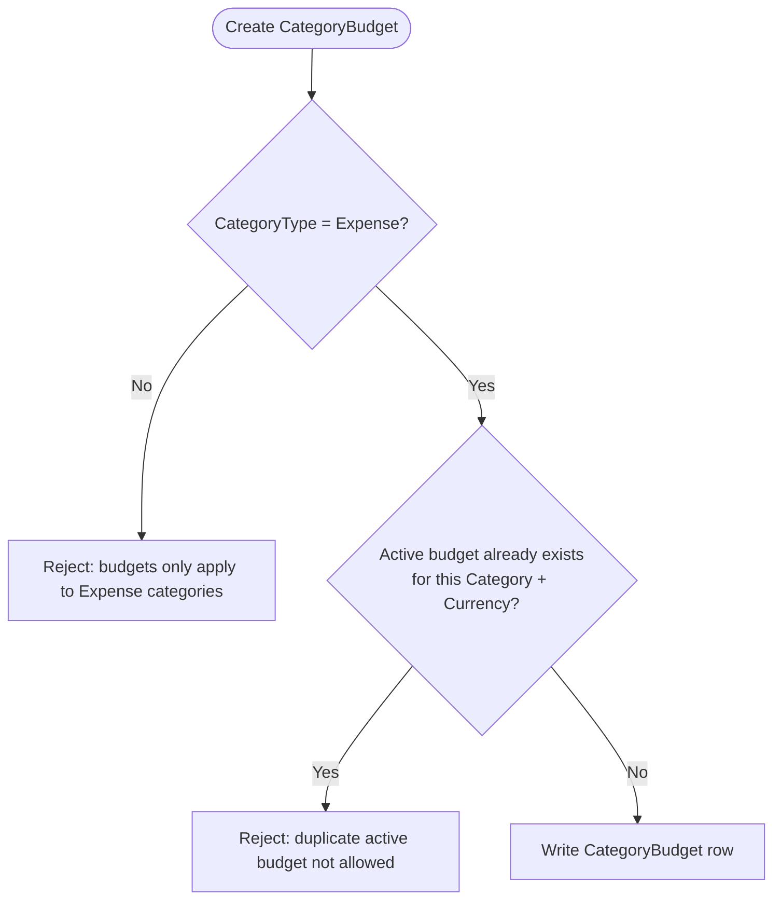

# Project Ceres — Phase 2 Planning (Local Extended)

> **Diataxis type:** Reference — defines Phase 2 scope, planned features, and open decisions for the local extended phase.
>
> **This is the active phase.** Phase 1 is complete as of 2026-04-22.

## Index

1. [Financial Reports](#financial-reports)
2. [Planned Features (Phase 2)](#planned-features-phase-2)
   - [CSV Import flow](#csv-import-flow)
   - [Budgeting](#budgeting-phase-2)
     - [CategoryBudget applicability](#categorybudget-applicability)
   - [Unified Movements Ledger](#unified-movements-ledger-phase-2)
   - [Visual Dashboard](#visual-dashboard-phase-2)
   - [Financial Health Metrics](#financial-health-metrics-phase-2)
   - [Opening Balance Cutover UX](#opening-balance-cutover-ux-phase-2)
3. [Open Questions (Phase 2)](#open-questions-phase-2)
   - [Architecture & Frontend](#architecture--frontend)
   - [Testing / TDD](#testing--tdd)
   - [Data & Schema](#data--schema)
   - [Features with Unresolved Design](#features-with-unresolved-design)
   - [Reports](#reports)

---

**Gate: Phase 1 must be fully complete and in daily use before this phase begins.**

Phase 2 adds depth — features that make the app significantly more powerful but that require
Phase 1 to be stable first. These are features that were deliberately held back, not forgotten.

Phase 2 also serves as the preparation gate for hosting. By the time this phase is complete,
the app should be polished and reliable enough to show to other people. That is the condition
for moving to Phase 3 — not a deadline, but a quality bar.

---

## Financial Reports

### Essential Reports (all phases reference)

| Report                            | Description                                                                       |
| --------------------------------- | --------------------------------------------------------------------------------- |
| **Net Worth Statement**           | Snapshot of total assets, total liabilities, and resulting equity at a given date |
| **Income & Expense Summary**      | Total income vs. total expenses for a selected period, with net cash flow         |
| **Expense Breakdown by Category** | How much was spent per category in a period                                       |
| **Account Balances Summary**      | Current balance of every account, grouped by type (Phase 2)                       |
| **Transaction History**           | Filterable list of all transactions by account, category, date range, or type     |
| **Transfer History**              | Filterable list of all transfers — separate from transactions                     |

### Nice-to-Have Reports (Phase 2)

| Report                             | Description                                                         |
| ---------------------------------- | ------------------------------------------------------------------- |
| **Net Worth Over Time**            | Tracks equity month by month                                        |
| **Monthly Cash Flow Trend**        | Income vs. expenses across multiple months side by side             |
| **Spending by Category Over Time** | How a category's spending changes month to month                    |
| **Year-over-Year Comparison**      | Compares income, expenses, and net worth between two calendar years |
| **Budget vs. Actual**              | How much was planned vs. actually spent per category                |
| **Largest Expenses**               | Top N transactions by amount in a period                            |

---

## Planned Features (Phase 2)

- Account Balances Summary report
- Confirmed nice-to-have reports: Budget vs. Actual, Largest Expenses, Monthly Cash Flow Trend, Net Worth Over Time (see ADR-0054)
- **UI component library — shadcn/ui:** Migrate views from Tailwind `@apply`-based classes to shadcn/ui React components. Inline Tailwind utilities replace `@apply` patterns.
- **Charting library — Chart.js** via `react-chartjs-2` wrapper. Covers all seven dashboard chart types. See ADR-0033.
- **CSV and XLSX import** — OFX deferred to Phase 3/4 (see ADR-0046). Format dispatched via `IImportParser` / `ImportParserFactory` (see ADR-0059). Column mapping via saved `ImportProfile` (see ADR-0047). Stepped 3-card import form with progressive disclosure (see ADR-0060).

### **Import flow**

```mermaid
sequenceDiagram
    participant User
    participant Controller
    participant HeaderDetectionService
    participant ImportService
    participant IImportParser
    participant TransactionService
    participant DbContext

    User->>Controller: Step 1 — upload file + select account
    Controller->>HeaderDetectionService: DetectAsync(file)
    HeaderDetectionService-->>Controller: HeaderDetectionResult (headers + auto-matched columns)
    Controller->>User: Step 2 — column mapping pre-populated; user confirms or adjusts
    User->>Controller: Step 3 — review summary, click Import
    Controller->>ImportService: ImportAsync(file, accountId, mappings)
    ImportService->>IImportParser: ParseAsync(stream, mappings)
    IImportParser-->>ImportService: IReadOnlyList<ParsedImportRow>
    loop Each parsed row
        ImportService->>ImportService: Reconciliation pass — match by amount + date ±1 day
        alt Row matches existing transaction
            ImportService->>TransactionService: MarkClearedAsync(existingId, cleared: true)
        else No match — new transaction
            ImportService->>ImportService: Sign-based category fallback (+ → Uncategorized Income, - → Uncategorized Expense)
            ImportService->>DbContext: Insert Transaction (IsCleared=true, NeedsReview=true)
        end
    end
    ImportService-->>Controller: ImportResult (RowsImported, RowsReconciled, RowsFlagged, RowsFailed)
    Controller->>User: Summary — 4-card result + optional save-profile prompt
```

**Key decisions in the import flow:**

- **No default category required** — category is inferred from sign: positive amount → `Uncategorized Income`, negative → `Uncategorized Expense`. Both are seeded with fixed GUIDs and `IsSystem = false` (so they appear in transaction lists and affect balances). GUID-based guard in `CategoryService` prevents editing or deactivation. See ADR-0060.
- **Reconciliation pass** — before inserting, each row is matched against existing uncleared transactions by `Math.Abs(amount)` equality and date ±1 day. A match marks the existing transaction `IsCleared = true` (no new row inserted, count as `RowsReconciled`).
- **Header auto-detection** — `IHeaderDetectionService.DetectAsync` is called on the file after Step 1. It reads the first row and keyword-matches column names (e.g. "fecha" → Date). Result pre-populates Step 2 dropdowns. Detection is best-effort; user can override any mapping.
- **Profile save after import** — if the user mapped columns manually (no saved profile used), the Summary screen offers to save the mapping as a named profile for future imports.

- **CSV export** — sanitize all fields before writing. Values starting with `=`, `@`, `+`, or `-` are interpreted as formulas by spreadsheet applications. Prefix any such cell value with a single quote (`'`) to neutralize CSV injection.
- File attachments on transactions (receipts, invoices) — built in Phase 1, carried forward
- **File attachments on transfers** — `TransferAttachment` entity mirroring `TransactionAttachment`. See ADR-0042.
- **Cleared / reconciliation status** — `IsCleared bool` on Transaction and Transfer. Merge-not-delete reconciliation flow. See ADR-0039. **Stage 2 server-side work complete:** `MarkClearedAsync` and `BulkMarkClearedAsync` on `ITransactionService`; `MarkClearedAsync` on `ITransferService`; `ToggleCleared` and `BulkMarkCleared` POST actions on `TransactionsController`; `ToggleCleared` on `TransfersController`; `IsClearedSwitch` React component on Transaction and Transfer Edit forms (writes to hidden field, no API call). `ClearedBadge` async list toggle (Stage 2.5.3) is still planned.
- **Unified Movements ledger** — `Movement` abstract base class (TPC, no schema change). `/Movements` view merges all three movement types in one sorted ledger. `ClearedBadge` React component for inline async toggle. `returnUrl` routing preserves navigation context. See ADR-0058.
- **Liability account repayment type + payoff projection** — `LiabilityRepaymentType` (`FullMonthly` | `Amortising`) and `InterestRate` fields on `Account`. `AccountService` validates repayment type/interest rate consistency. `ILiabilityProjectionService` / `LiabilityProjectionService` compute the amortisation schedule (no DB access, pure math). `AccountsController.Ledger` (GET + POST) shows the projection panel on Amortising liability account ledger pages. See ADR-0043, ADR-0052.
- **Split transactions** — not in Phase 2. Revisit at Phase 3 scope definition. See ADR-0041.
- **Saved report configurations** — not in Phase 2. Revisit after Phase 2 daily use. See ADR-0055.

### Budgeting (Phase 2)

> **Status: Implemented in Stage 1.** `CategoryBudgetService`, `BudgetsController`, all views, `DashboardApiController` endpoints, and React `CategoryBudgetBars` / `GoalBudgetBars` components are complete. 180 dotnet tests + 4 Vitest tests passing.

> **Schema note:** The `Budget`, `CategoryBudget` entities and `BudgetService` were scaffolded in Phase 1 as foundation. What Phase 2 adds is the controller, views, and dashboard integration — not the data model.

**Category Budgets — monthly spending caps**

- Set a monthly limit per expense category (e.g. Groceries ≤ €300/month)
- Dashboard shows progress bar: spent vs. limit for the current month
- Report shows actual vs. limit across months

**CategoryBudget applicability**



**Goal Budgets — purpose-driven financial targets**

- Create a budget with a name, target amount, currency, start date, and optional end date
- Tag individual transactions to a goal budget when recording them
- Dashboard and report show: target amount, amount spent so far, amount remaining, % used
- Examples: "Trip to Japan — €3,000", "Kitchen Renovation — €8,000", "Emergency Fund — €5,000"
- A goal budget can be marked complete or left open-ended
- One transaction can be linked to one goal budget (optional — not all transactions need one)

### Unified Movements Ledger (Phase 2)

> **Status: Planned — Stage 2.5.** Follows Stage 2 (Cleared / Reconciliation Status).

`Transaction`, `Transfer`, and `LiabilityPayment` are all financial movements — they share `Id`, `Date`, `Amount`, `Description`, `IsCleared`, and `CreatedAt`. Stage 2.5 formalises this at the model layer and exposes it as a single `/Movements` ledger view, making reconciliation easier by putting every financial event in one place.

**Model layer — Movement base class (TPC)**

An abstract `Movement` class is introduced as the base for all three concrete types. EF Core's Table Per Concrete type (TPC) strategy is used: each type still maps to its own existing DB table (`Transactions`, `Transfers`, `LiabilityPayments`) — no migration, no schema change. A `db.Set<Movement>()` query resolves as a SQL `UNION ALL` across all three tables.

```
Movement (abstract)
├── Transaction       → Transactions table (unchanged)
├── Transfer          → Transfers table (unchanged)
└── LiabilityPayment  → LiabilityPayments table (unchanged)
```

**Unified Movements view**

- `/Movements` is the primary ledger — all three movement types interleaved, sorted `Date DESC`, `CreatedAt DESC`
- Each row shows movement type, date, amount, account(s), description, and an inline `IsCleared` badge
- Edit and Delete buttons route to the correct existing controller (`/Transactions` or `/Transfers`)
- After saving or deleting from `/Movements`, the user is returned to `/Movements` via `returnUrl`
- Navigating directly to `/Transactions` or `/Transfers` and editing/deleting there still returns to that page (no `returnUrl` set)
- `/Transactions` and `/Transfers` pages remain fully functional as secondary views

**ClearedBadge React component**

The inline "Clear / Unmark" form-submit toggle is replaced by a `ClearedBadge` React component on all three list views (`/Movements`, `/Transactions`, `/Transfers`). It calls `PATCH /api/movements/{id}/cleared` and flips the badge state optimistically — no page reload. A dedicated `MovementsApiController` handles this endpoint, routing to `ITransactionService.MarkClearedAsync` or `ITransferService.MarkClearedAsync` based on the `type` field in the request body.

See ADR-0058 for the full decision rationale (TPC strategy, alternatives rejected, zero-migration guarantee).

---

### Visual Dashboard (Phase 2)

Always-on charts — no generation step required. Automatically reflect current data.
Distinct from reports: reports are formal documents produced on demand; these are live at-a-glance visuals.

| Chart                    | Type                 | Description                                             |
| ------------------------ | -------------------- | ------------------------------------------------------- |
| Net Worth Over Time      | Line chart           | Equity trend by month                                   |
| Income vs. Expenses      | Bar chart            | Side-by-side comparison per month for the last 6 months |
| Spending by Category     | Donut chart          | Breakdown of expenses for the current month             |
| Account Balances         | Horizontal bar chart | Balance per account, grouped by currency                |
| Category Budget Progress | Progress bars        | Spent vs. monthly limit per expense category            |
| Goal Budget Progress     | Progress bars        | Spent vs. target amount per goal budget                 |
| Monthly Cash Flow        | Bar chart            | Net income minus expenses per month                     |

### Financial Health Metrics (Phase 2)

**Savings rate**

- Savings rate = (Income − Expenses) ÷ Income for a selected period
- Displayed on the Phase 1 dashboard (current month) and available as a Phase 2 report metric

**Ratio-based frameworks (50/30/20)**

- Methods like 50/30/20 require each expense category to be tagged as "need" or "want"
- `LifestyleTag` column added to `Category` in Phase 1 to support this without a Phase 2 migration
- Starter categories ship with suggested default tags (e.g. Rent → Needs, Dining Out → Wants)
- Creation-time prompt for new Expense categories: "Needs / Wants / Skip for now"
- Untagged is a visible fourth bucket in the Financial Health report — never silently excluded
- Framework options: 50/30/20 (most common), 80/20
- Users can re-tag any category at any time from the Category settings page

### Opening Balance Cutover UX (Phase 2)

- Revisit the opening balance UX once real usage patterns are known from Phase 1 daily use
- See Open Questions in [planning.md](planning.md)

---

## Open Questions (Phase 2)

All Phase 2 open questions resolved. See [planning-resolved.md](planning-resolved.md) for the full decision log and ADRs 0034–0055.
