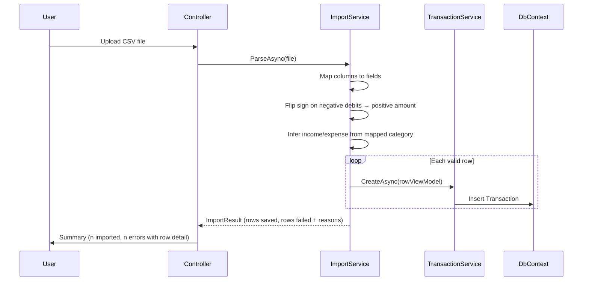

# Project Ceres — Phase 2 Planning (Local Extended)

> **Diataxis type:** Reference — defines Phase 2 scope, planned features, and open decisions for the local extended phase.

## Index

1. [Financial Reports](#financial-reports)
2. [Planned Features (Phase 2)](#planned-features-phase-2)
   - [CSV Import flow](#csv-import-flow)
   - [Budgeting](#budgeting-phase-2)
     - [CategoryBudget applicability](#categorybudget-applicability)
   - [Visual Dashboard](#visual-dashboard-phase-2)
   - [Financial Health Metrics](#financial-health-metrics-phase-2)
   - [Opening Balance Cutover UX](#opening-balance-cutover-ux-phase-2)
3. [Open Questions (Phase 2)](#open-questions-phase-2)

---

**Gate: Phase 1 must be fully complete and in daily use before this phase begins.**

Phase 2 adds depth — features that make the app significantly more powerful but that require
Phase 1 to be stable first. These are features that were deliberately held back, not forgotten.

Phase 2 also serves as the preparation gate for hosting. By the time this phase is complete,
the app should be polished and reliable enough to show to other people. That is the condition
for moving to Phase 3 — not a deadline, but a quality bar.

---

## Financial Reports

### Essential Reports (all phases reference)

| Report                            | Description                                                                       |
| --------------------------------- | --------------------------------------------------------------------------------- |
| **Net Worth Statement**           | Snapshot of total assets, total liabilities, and resulting equity at a given date |
| **Income & Expense Summary**      | Total income vs. total expenses for a selected period, with net cash flow         |
| **Expense Breakdown by Category** | How much was spent per category in a period                                       |
| **Account Balances Summary**      | Current balance of every account, grouped by type (Phase 2)                       |
| **Transaction History**           | Filterable list of all transactions by account, category, date range, or type     |
| **Transfer History**              | Filterable list of all transfers — separate from transactions                     |

### Nice-to-Have Reports (Phase 2)

| Report                             | Description                                                         |
| ---------------------------------- | ------------------------------------------------------------------- |
| **Net Worth Over Time**            | Tracks equity month by month                                        |
| **Monthly Cash Flow Trend**        | Income vs. expenses across multiple months side by side             |
| **Spending by Category Over Time** | How a category's spending changes month to month                    |
| **Year-over-Year Comparison**      | Compares income, expenses, and net worth between two calendar years |
| **Budget vs. Actual**              | How much was planned vs. actually spent per category                |
| **Largest Expenses**               | Top N transactions by amount in a period                            |

---

## Planned Features (Phase 2)

- Account Balances Summary report
- Nice-to-have reports (Net Worth Over Time, Monthly Cash Flow Trend, etc.)
- **UI component library — shadcn/ui:** Migrate views from Tailwind `@apply`-based classes to shadcn/ui React components. Requires the Phase 2 React introduction. Inline Tailwind utilities replace `@apply` patterns.
- **JavaScript / charting libraries:** Interactive dashboard charts — requires React. **Chart.js** is the leading candidate (decision deferred until Phase 2 begins).
- CSV and OFX file import — note: bank exports represent debits as negative numbers; the import logic must flip signs and infer income/expense direction from the mapped category.

**CSV Import flow**

- **CSV export** — sanitize all fields before writing. Values starting with `=`, `@`, `+`, or `-` are interpreted as formulas by spreadsheet applications. Prefix any such cell value with a single quote (`'`) to neutralize CSV injection.
- File attachments on transactions (receipts, invoices)
- Saved report configurations
- **Split transactions (optional)** — allow a single transaction to be split across multiple categories. Requires schema change: 1:1 Transaction→Category becomes a 1:many `TransactionLine` table.
- **Cleared / reconciliation status** — mark a transaction or transfer as "cleared" once verified against a bank statement. Manual checkbox or automatic CSV match. Requires `ClearedAt` (or `IsCleared`) on both Transaction and Transfer.
- **File attachments on transfers** — mirror the transaction attachment feature. Requires a `TransferAttachment` entity.

### Budgeting (Phase 2)

**Category Budgets — monthly spending caps**

- Set a monthly limit per expense category (e.g. Groceries ≤ €300/month)
- Dashboard shows progress bar: spent vs. limit for the current month
- Report shows actual vs. limit across months

**CategoryBudget applicability**

**Goal Budgets — purpose-driven financial targets**

- Create a budget with a name, target amount, currency, start date, and optional end date
- Tag individual transactions to a goal budget when recording them
- Dashboard and report show: target amount, amount spent so far, amount remaining, % used
- Examples: "Trip to Japan — €3,000", "Kitchen Renovation — €8,000", "Emergency Fund — €5,000"
- A goal budget can be marked complete or left open-ended
- One transaction can be linked to one goal budget (optional — not all transactions need one)

### Visual Dashboard (Phase 2)

Always-on charts — no generation step required. Automatically reflect current data.
Distinct from reports: reports are formal documents produced on demand; these are live at-a-glance visuals.

| Chart                    | Type                 | Description                                             |
| ------------------------ | -------------------- | ------------------------------------------------------- |
| Net Worth Over Time      | Line chart           | Equity trend by month                                   |
| Income vs. Expenses      | Bar chart            | Side-by-side comparison per month for the last 6 months |
| Spending by Category     | Donut chart          | Breakdown of expenses for the current month             |
| Account Balances         | Horizontal bar chart | Balance per account, grouped by currency                |
| Category Budget Progress | Progress bars        | Spent vs. monthly limit per expense category            |
| Goal Budget Progress     | Progress bars        | Spent vs. target amount per goal budget                 |
| Monthly Cash Flow        | Bar chart            | Net income minus expenses per month                     |

### Financial Health Metrics (Phase 2)

**Savings rate**

- Savings rate = (Income − Expenses) ÷ Income for a selected period
- Displayed on the Phase 1 dashboard (current month) and available as a Phase 2 report metric

**Ratio-based frameworks (50/30/20)**

- Methods like 50/30/20 require each expense category to be tagged as "need" or "want"
- `LifestyleTag` column added to `Category` in Phase 1 to support this without a Phase 2 migration
- Starter categories ship with suggested default tags (e.g. Rent → Needs, Dining Out → Wants)
- Creation-time prompt for new Expense categories: "Needs / Wants / Skip for now"
- Untagged is a visible fourth bucket in the Financial Health report — never silently excluded
- Framework options: 50/30/20 (most common), 80/20
- Users can re-tag any category at any time from the Category settings page

### Opening Balance Cutover UX (Phase 2)

- Revisit the opening balance UX once real usage patterns are known from Phase 1 daily use
- See Open Questions in [planning.md](planning.md)

---

## Open Questions (Phase 2)

**How should recurring reminders notify the user, and how should `DayOfPeriod` be used?**

In Phase 1, reminders are entirely pull-based — the user has to open the app and check whether anything is due. There is no automatic notification of any kind. The `DayOfPeriod` field is stored on each reminder but is currently ignored when calculating the next due date; the app simply adds a fixed interval (7 days, 1 month, etc.) from the last confirmed or dismissed date regardless of what day it lands on.

Two questions need to be answered before Phase 2 implementation begins:

1. **Notification delivery** — Should the app push a notification to the user (e.g. email, macOS desktop notification) when a reminder becomes due, or is an improved in-app indicator (e.g. a badge, a dedicated reminders view, or a daily summary screen) sufficient? Push notifications require a background process and, in Phase 3, a hosted environment. An enhanced in-app experience requires only UI work.

2. **`DayOfPeriod` behaviour** — Once the next due date is advanced, should it snap to the configured day of the period (e.g. always land on the 15th for monthly reminders, or always on Monday for weekly ones), or should the interval always be relative to the last confirmed date regardless of calendar position? Snapping to a fixed day is more predictable for bills with a fixed calendar date; relative intervals are better for habits with flexible timing. The field supports both approaches — the decision determines how `AdvanceDueDate` should use it.
