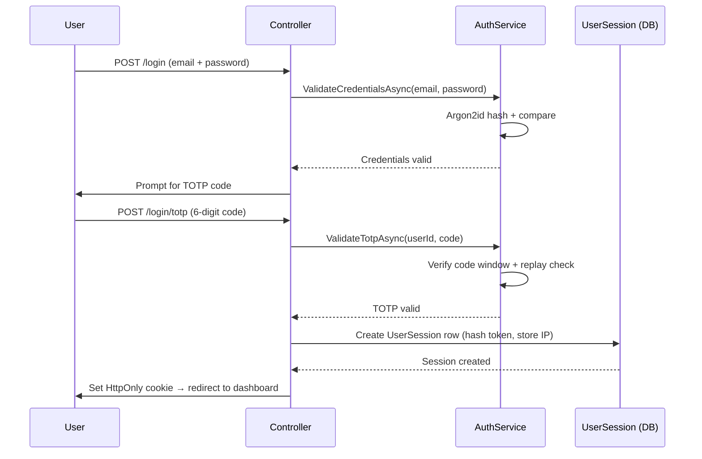
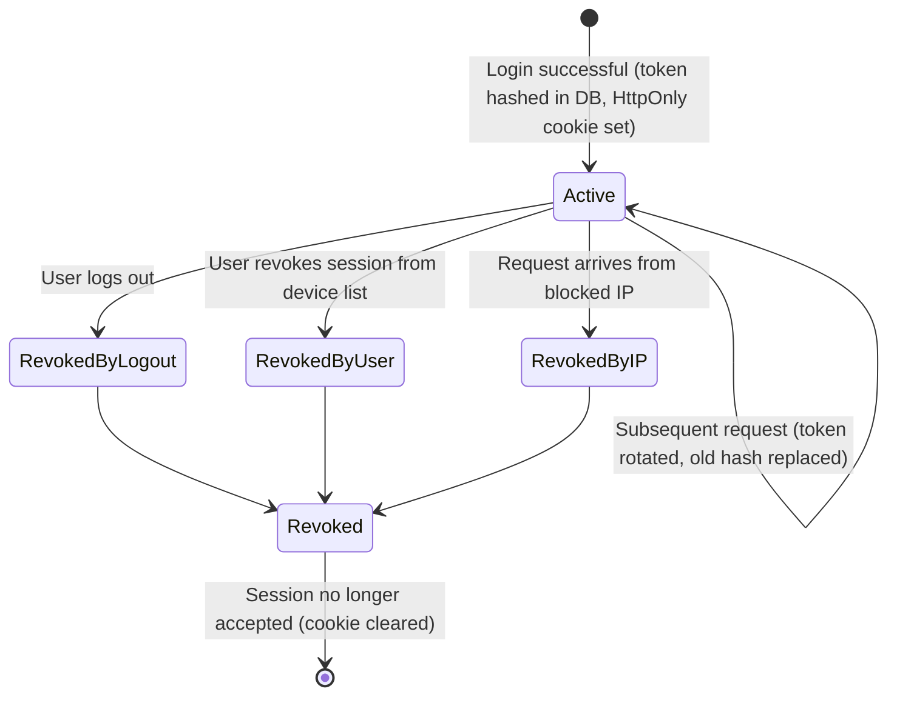

# Project Ceres — Phase 3 Planning (Hosted Beta)

> **Diataxis type:** Reference — defines Phase 3 scope, security requirements, and open decisions for the hosted beta.

## Index

1. [Planned Features (Phase 3)](#planned-features-phase-3)
   - [Login with TOTP — happy path](#login-with-totp--happy-path)
   - [Session token lifecycle](#session-token-lifecycle)
   - [IDOR enforcement](#idor-enforcement)
2. [Open Questions (blocks Phase 3)](#open-questions-blocks-phase-3)

---

**Gate: Phase 2 must be fully complete before starting.**

The app moves from local to a hosted server. Goal: make the app accessible to a small group
of collaborators who can help test and improve it. This phase introduces the foundational
changes needed for any multi-user product.

---

## Planned Features (Phase 3)

- **Authentication** — user registration and login with username + password (hashed with Argon2, never stored in plain text), with optional social login (Google, Facebook, Apple, Microsoft) as an alternative credential method. Social login eliminates password storage complexity but introduces an external availability dependency — if the provider is down, users can't log in. If social login is implemented, it is offered alongside email/password, not as a replacement. TOTP MFA applies regardless of login method.

**Login with TOTP — happy path**

- **Password policy** — minimum 8 characters, no maximum below 64 (NIST SP 800-63B). Do not enforce mandatory complexity rules — check against a breached password list (Have I Been Pwned API or local top-N list) instead. Hashing: Argon2id with pinned parameters: m=19456 (19 MB memory), t=2 iterations, p=1 parallelism (OWASP minimum baseline). Do not rely on library defaults.
- **Account enumeration prevention** — login and password-reset endpoints must return identical error messages and take identical wall-clock time regardless of whether the email exists. Always run the Argon2id hash even when the user is not found — hash against a dummy value and discard the result.
- **MFA** — mandatory for all users via authenticator app (TOTP). No SMS — vulnerable to SIM-swap attacks.
- **TOTP shared secret storage** — TOTP seed must be stored encrypted at rest. Verify encryption is applied via ASP.NET Core Data Protection before Phase 3 launch.
- **TOTP replay prevention** — server must track recently accepted codes per user and reject any code already used within its window. ASP.NET Core Identity does not do this by default.
- **Session management** — sessions tracked server-side in a `UserSession` table. Supports multi-device, user-visible session list, per-session revocation.
  - **Always enforced:** session token regenerated after login (session fixation prevention); server-side session record marked revoked on logout.
  - **User-configurable:** session lifetime (short vs. persistent "remember me"). Persistent sessions: long-lived token in `HttpOnly` secure cookie, store only a hash in the database, rotate token on each use.
  - **IP enforcement (user-configurable):** per session, not per user. Each `UserSession` stores its creation IP. Multiple devices with different IPs are fully compatible.
  - **IP blocking:** users can block specific IPs from Security settings. Any request from a blocked IP is rejected and all active sessions from that IP revoked.

**Session token lifecycle**

- **Secure cookie configuration** — `HttpOnly = true`, `Secure = true`, `SameSite = Strict` or `Lax`. Configure via `CookieAuthenticationOptions` in `Program.cs`.
- **Multi-tenancy** — all data scoped to the logged-in user
- **Per-user settings** — single-row Settings table migrates to per-user preferences table
- **Hosting setup** — deploy to a server. No business model yet — invite-only for beta testers.
- **HTTP security headers** — `X-Content-Type-Options: nosniff`, `X-Frame-Options: DENY`, `Referrer-Policy: strict-origin-when-cross-origin`, HSTS once HTTPS is enforced. Define `Content-Security-Policy` when Phase 2 JS is added — avoid inline scripts. Use `NetEscapades.AspNetCore.SecurityHeaders` or custom middleware.
- **Rate limiting** — protect login and registration against brute-force. Fixed window (e.g. 10 requests/min/IP) minimum. Add account-level lockout: after N consecutive failed attempts (e.g. 10), lock for a fixed period (e.g. 15 min) and notify by email. Lockout counter resets on successful login.
- **IDOR prevention** — every controller action loading a resource by ID must scope the query to the authenticated user's data. Integration tests must cover: User A targeting User B's resource must return 404, not 403.

**IDOR enforcement**

- **UUID primary keys** — all user-created entities use `uuid` PKs, not sequential integers. System lookup tables retain `int` PKs. Decision applies from Phase 1 — no migration required later. See models.md Primary Key Strategy.
- **CORS policy** — required when a separate frontend origin is introduced. Whitelist only known frontend origin(s). Never combine `AllowAnyOrigin` with `AllowCredentials`.
- **Dependency vulnerability scanning** — run `dotnet list package --vulnerable` before each release. In Phase 3, integrate into CI pipeline on every code push.
- **Forwarded headers middleware** — register `app.UseForwardedHeaders()` with `XForwardedFor | XForwardedProto` before all other middleware. Restrict trusted proxy addresses via `KnownProxies` to prevent IP spoofing.
- **Audit logging** — required for GDPR. Minimal audit record for: login/logout, account creation, data export, right-to-erasure requests. Schema: `(Id, UserId, Action, EntityType, EntityId, OccurredAt, IpAddress)`. Auto-purged after 6 months per `legal.md`. Do not log financial amounts in audit entries.
- **Support ticket system** — users submit support requests (subject + message). Stored in `SupportTicket` table. Email notification to configurable admin address. Status: `Open`, `InProgress`, `Resolved`, `Closed`. Priority: `Low`, `Normal`, `High`, `Urgent`.
- **GDPR & legal compliance** — required before any user outside yourself can access the app. See [`legal.md`](legal.md). Minimum before Phase 3 launch: privacy policy, legal basis for each data type, data retention policy enforced, data breach notification procedure, right to erasure flow.

## Deferred from Phase 2

- **Recurring reminder email push** — daily digest and per-reminder email notifications. Deferred from Phase 2; lands alongside the Phase 3 email service (already needed for registration and password reset). User-configurable opt in/out. See ADR-0044.
- **OFX import** — deferred from Phase 2. Revisit at Phase 3 or Phase 4 based on real usage data. If implemented, use `<FITID>` as primary duplicate detection key. See ADR-0046.
- **Irregular income baseline budgeting** — rolling average income baseline for category and goal budget evaluation. Priority deferral from Phase 2 — `LifestyleTag` groundwork already in place. Revisit at Phase 3 scope definition. See ADR-0048.
- **Guided onboarding** — first-run experience for new users: enter assets and liabilities, produce immediate net worth. Build alongside multi-tenancy as the first impression for Phase 3 beta users. See ADR-0053.
- **InvestmentHolding entity** — tracks individual positions within an investment account (ticker, units, purchase price, current price, unrealized gain/loss). Deferred from Phase 2 — revisit at Phase 3 or Phase 4 based on whether investment accounts are actively used.
- **Spending by Category Over Time** — month-by-month category spending trend. Deferred from Phase 2 — overlaps with Expense Breakdown + date range. Reassess at Phase 3 scope definition. See ADR-0054.
- **Year-over-Year Comparison** — income, expenses, and net worth between two calendar years. Deferred from Phase 2 — requires at least two years of data to be meaningful. Reassess at Phase 3 scope definition. See ADR-0054.
- **Saved report configurations** — named snapshots of report parameters for quick re-use. Deferred from Phase 2 — insufficient usage experience to design correctly. Reassess after Phase 2 daily use reveals which parameters are worth saving and whether a full report builder is warranted. See ADR-0055.
- **Goal budget milestones** — allow users to define intermediate milestones within a goal budget (e.g. "Trip to Japan — €3,000" with milestones at €1,000 flights, €2,000 hotel). Each milestone displayed as a progress bar segment. Requires a `BudgetMilestone` table. Deferred from Phase 2 — validate basic goal tracking in daily use first.
- **Split transactions — revisit at Phase 3 scope definition.** Not committed for Phase 3 — decision is: implement, defer again, or discard based on Phase 2 daily use. Would require a `TransactionLine` table touching reports, import, views, and budget eligibility. Workaround in Phase 2: record multiple transactions. See ADR-0041.

## Open Questions (blocks Phase 3)

See [planning.md — Open Questions](planning.md#open-questions--decisions) for the full list. Key items:

- Authentication framework
- Hosting platform
- Email service
- Invite mechanism
- Multi-tenancy implementation
- Settings migration
- MVC → Web API decoupling
- Production migration strategy
- CI service
- CD strategy
- E2E testing — Playwright chosen; implement after Phase 2 React migration stabilizes. See [testing.md](testing.md#e2e-tool-playwright).
