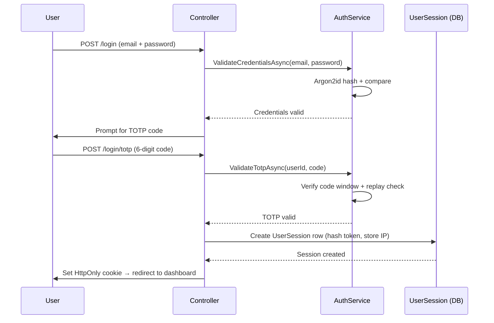
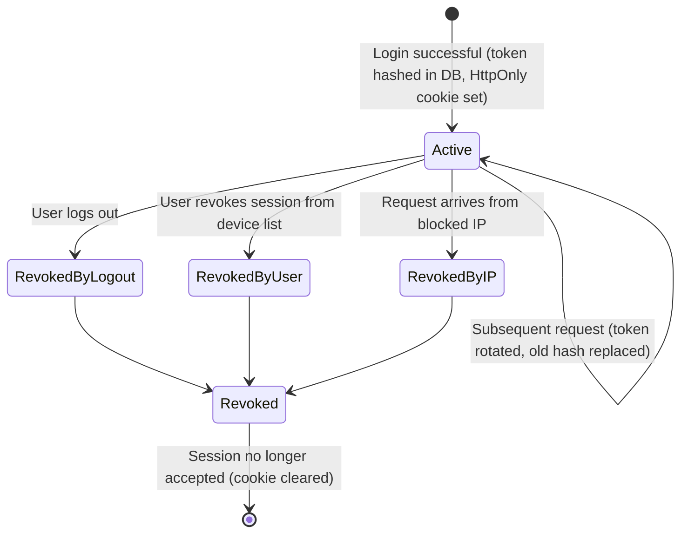
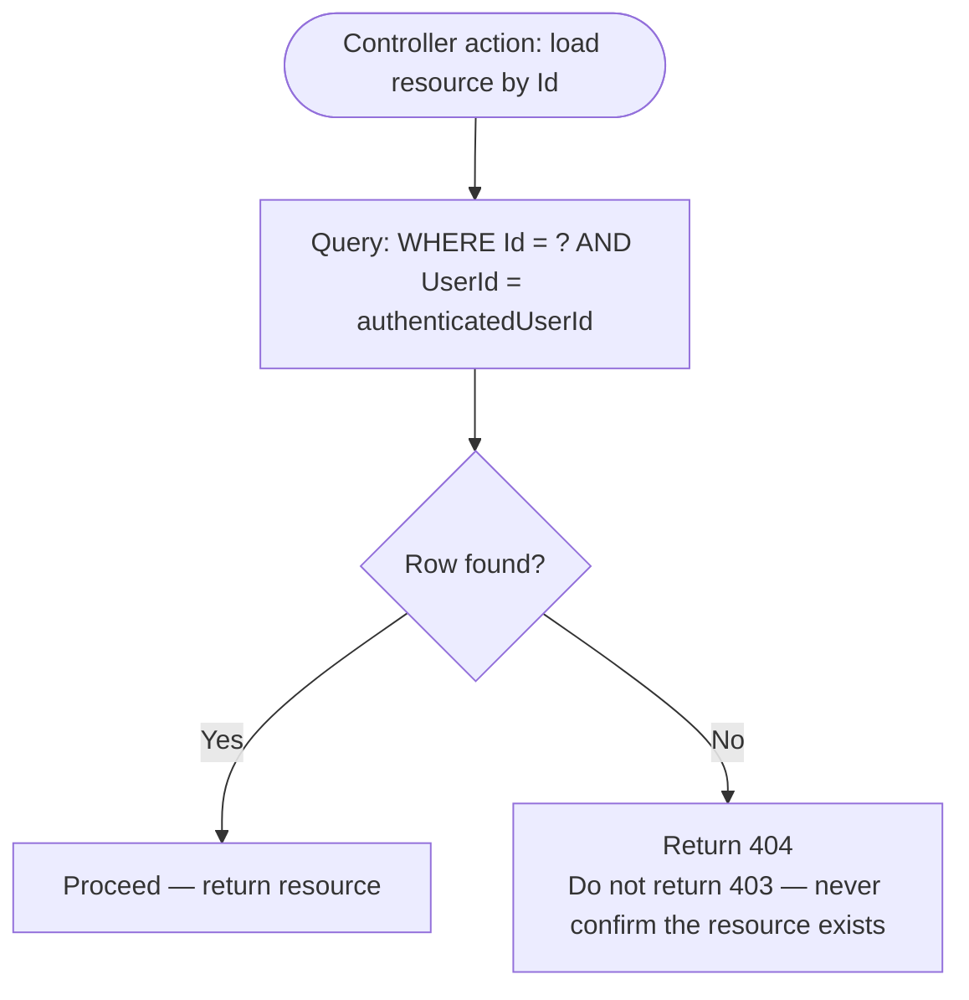

# Project Ceres — Phase 3 Planning (Hosted Beta)

> **Diataxis type:** Reference — defines Phase 3 scope, security requirements, and open decisions for the hosted beta.

## Index

1. [Planned Features (Phase 3)](#planned-features-phase-3)
   - [Login with TOTP — happy path](#login-with-totp--happy-path)
   - [Session token lifecycle](#session-token-lifecycle)
   - [IDOR enforcement](#idor-enforcement)
2. [Design System & Visual Overhaul](#design-system--visual-overhaul)
3. [MVC → SPA Migration Plan](#mvc--spa-migration-plan)
4. [Responsive design](#responsive-design)
5. [Phase 3 execution batches](#phase-3-execution-batches)
   - [Batch 3 — Auth + multi-tenancy](#batch-3--auth--multi-tenancy)
   - [Batch 4 — Razor + URL cleanup](#batch-4--razor--url-cleanup)
   - [Batch 5 — Launch readiness](#batch-5--launch-readiness)
6. [Deferred from Phase 2](#deferred-from-phase-2)
7. [Open Questions (blocks Phase 3)](#open-questions-blocks-phase-3)

---

**Phase 2 is complete as of 2026-04-28. This is now the active phase.**

The app moves from local to a hosted server. Goal: make the app accessible to a small group
of collaborators who can help test and improve it. This phase introduces the foundational
changes needed for any multi-user product.

---

## Planned Features (Phase 3)

- **Authentication** — user registration and login with email + password (hashed with Argon2id, never stored in plain text) and **opt-in** TOTP MFA (per [ADR-0069](decisions/ADR-0069-mfa-opt-in-for-personal-users.md) — MFA was originally mandated; reversed on 2026-05-09 to match industry practice for personal-finance products and avoid onboarding-conversion damage). Social login is **deferred to Phase 4** per [ADR-0064](decisions/ADR-0064-social-login-deferred-to-phase-4.md); the architecture stays open (provider-agnostic `UserSession` schema, no `ExternalLogin` table in Phase 3). Cookie-based session auth — see [ADR-0063](decisions/ADR-0063-cookie-samesite-lax-with-csrf-tokens.md) for cookie configuration.

**Login with TOTP — happy path**

- **Password policy** — minimum 8 characters, no maximum below 64 (NIST SP 800-63B). Do not enforce mandatory complexity rules — check against a breached password list (Have I Been Pwned API or local top-N list) instead. Hashing: Argon2id with pinned parameters: m=19456 (19 MB memory), t=2 iterations, p=1 parallelism (OWASP minimum baseline). Do not rely on library defaults.
- **Password reset flow (✅ shipped Stage 6c.1, 2026-05-10)** — token format: cryptographically random 256-bit value, stored as Argon2id hash only. Expiry: 15 minutes. Single-use: token invalidated on first successful use. On successful reset: all existing `UserSession` rows revoked + `SecurityStamp` regenerated + lockout cleared + `EmailConfirmed` promoted + **any pending email-change for the same user is cancelled** (Stage 6.12 cross-feature) with a notification to the old address. MFA gating is **conditional** per ADR-0069: required only when the user has `TwoFactorEnabled = true`; users without MFA reset with the email-link token alone (the email-channel ownership proof IS the second factor for those accounts). Backup codes are NOT accepted at reset — they're the recovery path at `/login/totp` if the TOTP device is lost. Enumeration prevention: the reset request endpoint returns an identical 204 response regardless of whether the email is registered, with `RunDummyHash` parity ensuring constant-time. See `security-model.md → Password Reset` for the full spec, `docs/superpowers/specs/2026-05-10-password-reset-design.md` for the design, and `docs/superpowers/plans/2026-05-10-stage-6c-1-password-reset-plan.md` for implementation.
- **Email-address-change flow (✅ shipped Stage 6.12, 2026-05-10)** — three endpoints (`POST /api/auth/email-change/request|confirm|revoke`). Dual-token model in a single `EmailChangeTokens` table with `Purpose` discriminator (`VerifyNew=1` 30-min, `RevokeOld=2` 7-day), Argon2id-hashed, atomic supersession on a new `/request` via per-user `SemaphoreSlim`. `/request` is `[RequireRecentAuth]`-gated; `/confirm` and `/revoke` are anonymous because the email-link token IS the auth (per-IP `AuthLoginByIp` 10/min). Per-new-email service-side rate gate (`MemoryCache`, 5/hour). On `/confirm`: `SetEmailAsync` + `SetUserNameAsync`, `EmailConfirmed = true`, sibling `RevokeOld` row consumed atomically, all `UserSession` rows revoked, `SecurityStamp` regenerated, notifications sent to BOTH new and old addresses. **Does NOT clear lockout** — explicit divergence from password-reset (email proof ≠ password recovery). On `/revoke`: both sibling rows consumed; `user.Email` UNCHANGED; sessions NOT revoked; notification to old address only. **Cross-feature with password-reset:** a successful `/api/auth/password-reset/confirm` atomically cancels any pending email-change for the same user. New error codes: `INVALID_EMAIL_CHANGE_TOKEN` (401), `EMAIL_ALREADY_IN_USE` (422), `EMAIL_UNCHANGED` (422). See `security-model.md → Email Address Change` and `docs/superpowers/specs/2026-05-10-stage-6-12-email-change-design.md`.
- **Account enumeration prevention** — login and password-reset endpoints must return identical error messages and take identical wall-clock time regardless of whether the email exists. Always run the Argon2id hash even when the user is not found — hash against a dummy value and discard the result.
- **MFA** — **opt-in** via authenticator app (TOTP) per [ADR-0069](decisions/ADR-0069-mfa-opt-in-for-personal-users.md). Users enable from Settings → Security; users who enable it must use it on every subsequent login. Onboarding presents MFA as recommended-but-skippable; login does not block on enrollment. Sensitive operations require step-up: fresh TOTP if MFA enabled, fresh password if not. New-device login from a non-MFA account triggers an email-link step-up (ships in 6c with the email service). No SMS — vulnerable to SIM-swap attacks. The compensating-control stack for non-MFA accounts (HIBP breach-screening + Argon2id + lockout + new-device email-link step-up + step-up reauth on sensitive ops + new-device login email alert) matches NIST SP 800-63B-4 AAL1's required controls.
- **TOTP shared secret storage** — TOTP seed must be stored encrypted at rest. Verify encryption is applied via ASP.NET Core Data Protection before Phase 3 launch.
- **TOTP replay prevention** — server must track recently accepted codes per user and reject any code already used within its window. ASP.NET Core Identity does not do this by default.
- **Session management** — sessions tracked server-side in a `UserSession` table. Supports multi-device, user-visible session list, per-session revocation.
  - **Always enforced:** session token regenerated after login (session fixation prevention); server-side session record marked revoked on logout.
  - **User-configurable:** session lifetime (short vs. persistent "remember me"). Persistent sessions: long-lived token in `HttpOnly` secure cookie, store only a hash in the database, rotate token on each use.
  - **IP enforcement (user-configurable):** per session, not per user. Each `UserSession` stores its creation IP. Multiple devices with different IPs are fully compatible.
  - **IP blocking:** users can block specific IPs from Security settings. Any request from a blocked IP is rejected and all active sessions from that IP revoked.

**Session token lifecycle**

- **Secure cookie configuration** — `__Host-` prefix, `HttpOnly = true`, `Secure = true`, `SameSite = Lax` per [ADR-0063](decisions/ADR-0063-cookie-samesite-lax-with-csrf-tokens.md). Configure via `CookieAuthenticationOptions` in `Program.cs`. Paired with the XSRF-TOKEN double-submit CSRF pattern on all state-changing endpoints — see `security-model.md` § CSRF.
- **Multi-tenancy** — all data scoped to the logged-in user
- **Per-user settings** — single-row Settings table migrates to per-user preferences table
- **Hosting setup** — deploy to a server. No business model yet — invite-only for beta testers.
- **HTTP security headers** — `X-Content-Type-Options: nosniff`, `X-Frame-Options: DENY`, `Referrer-Policy: strict-origin-when-cross-origin`, HSTS once HTTPS is enforced. Define `Content-Security-Policy` when Phase 2 JS is added — avoid inline scripts. Use `NetEscapades.AspNetCore.SecurityHeaders` or custom middleware.
- **Rate limiting** — protect login and registration against brute-force. Fixed window (e.g. 10 requests/min/IP) minimum. Add account-level lockout: after N consecutive failed attempts (e.g. 10), lock for a fixed period (e.g. 15 min) and notify by email. Lockout counter resets on successful login.
- **IDOR prevention** — every controller action loading a resource by ID must scope the query to the authenticated user's data. Integration tests must cover: User A targeting User B's resource must return 404, not 403.

**IDOR enforcement**

- **UUID primary keys** — all user-created entities use `uuid` PKs, not sequential integers. System lookup tables retain `int` PKs. Decision applies from Phase 1 — no migration required later. See models.md Primary Key Strategy.
- **CORS policy** — required when a separate frontend origin is introduced. Whitelist only known frontend origin(s). Never combine `AllowAnyOrigin` with `AllowCredentials`.
- **Dependency vulnerability scanning** — run `dotnet list package --vulnerable` before each release. In Phase 3, integrate into CI pipeline on every code push.
- **Forwarded headers middleware** — register `app.UseForwardedHeaders()` with `XForwardedFor | XForwardedProto` before all other middleware. Restrict trusted proxy addresses via `KnownProxies` to prevent IP spoofing.
- **Audit logging** — required for GDPR. Minimal audit record for: login/logout, account creation, data export, right-to-erasure requests. Schema: `(Id, UserId, Action, EntityType, EntityId, OccurredAt, IpAddress)`. Auto-purged after 6 months per `legal.md`. Do not log financial amounts in audit entries.
- **Support ticket system** — users submit support requests (subject + message). Stored in `SupportTicket` table. Email notification to configurable admin address. Status: `Open`, `InProgress`, `Resolved`, `Closed`. Priority: `Low`, `Normal`, `High`, `Urgent`.
- **GDPR & legal compliance** — required before any user outside yourself can access the app. See [`legal.md`](legal.md). Minimum before Phase 3 launch: privacy policy, legal basis for each data type, data retention policy enforced, data breach notification procedure, right to erasure flow.
- **Full data export (GDPR portability)** — a structured ZIP download containing all data held for the authenticated user: one CSV per entity type (accounts, transactions, transfers, budgets, categories, recurring transactions), plus all attachment files in their original format. Required to satisfy GDPR Art. 15 (right of access) and Art. 20 (right to portability) — the Phase 2 transaction-only CSV export does not cover this. Must be available before any external user accesses the app. The export link lives in user Settings and produces an audit log entry. Each export is rate-limited (maximum one per 24 hours per user) to prevent abuse. **Implementation: asynchronous** — the export must be generated as a background job (accept request → queue job → return 202 Accepted → notify user by email when ready). A synchronous ZIP export of years of data plus attachments will exhaust HTTP worker threads and time out. The download link must be authenticated and time-limited (24-hour expiry).
- **Account-level notes** — a free-text `Notes` field (`text`, nullable) on the `Account` entity. Displayed on the account detail view. Allows users to annotate accounts with intent or constraints (e.g. "emergency fund — minimum €5,000", "joint account, do not use for autónomo expenses"). Trivial schema change; bundled with Phase 3 account UI work.
- **Category budget period start day** — users can define which day of the month their budget period starts (e.g. the 15th, to align with salary arrival), preventing false "budget available" signals mid-cycle. Two levels: (1) a global default in user Settings (applies to all category budgets), and (2) a per-budget override on each `CategoryBudget` (overrides the global default for that budget only). When the user sets or changes the start day, the current period is calculated retroactively from the most recent occurrence of that day — no gap or overlap in history. The `CategoryBudget` entity gains an optional `PeriodStartDay` column (`int?`, 1–28); the Settings/preferences table gains a `PeriodStartDay` column (`int`, default 1). Day 29–31 are excluded to avoid month-length edge cases.
- **Safe to Spend alert** — when the Safe to Spend value (Available Today − Budget Reserved, as shown in the Financial Health card) reaches zero or goes negative, the user is alerted through three surfaces: (1) **Dashboard:** a prominent warning banner or insight card on the Financial Health section advising them to avoid discretionary spending for the remainder of the period; (2) **Movements and Transactions pages:** a persistent inline warning at the top of the page so the alert is visible while the user is actively recording or reviewing transactions; (3) **Proactive notification:** an in-app notification and, if the user has email notifications enabled, an email alert the first time Safe to Spend crosses zero within a given budget period — not on every subsequent transaction. The notification is sent once per period crossing, not repeatedly. The alert clears automatically when Safe to Spend returns above zero. This feature is a precursor to the **Projection and Insights Engine** (Phase 4+), which will draft forward-looking spending projections and personalised recommendations based on historical patterns. That engine is out of scope for Phase 3 — the alert described here is the MVP safety net.
- **Weekly financial digest email** — a scheduled email (every Monday morning) summarising the previous week: net worth delta, income vs. expenses, any CategoryBudget over 80% of limit. Delivered by the same email service used for auth. **Opt-in only** — disabled by default, enabled from notification preferences in Settings. Users who enable it can disable it at any time from the same settings page or via a one-click unsubscribe link in every digest email. Never sent to users who have not explicitly opted in.
- **New session alert email** — when a new `UserSession` is created from an IP address not seen before for that user, an email notification is sent: "A new sign-in was detected from IP x.x.x.x at [time]. If this was you, no action is needed. If not, revoke this session here: [link]." **Opt-out** — enabled by default; users may disable from notification preferences in Settings with a disclosure of the security implication. The active sessions list and per-session revocation are always available regardless of this setting — the email is a convenience layer on top, not the primary security control.
- **API authentication** — Phase 3 uses **cookie-based auth** (HttpOnly session cookie). JWT access token issuance is deferred to Phase 4 when a mobile client requires bearer token authentication. See `api-contract.md → Authentication` and `security-model.md → Authentication Model` for the resolved decision.
- **Identity masking (HMAC pseudonymisation)** — every data row stores `UserRef = HMAC-SHA256(USER_REF_SECRET, userId)` instead of the raw UUID, so a database dump cannot link financial records to real user identities without the server secret. `USER_REF_SECRET` lives in the secrets store; a rotation procedure must be documented before Phase 3 launch. **Per-tenant payload encryption** (Phase 4+): encrypt financial payload columns (amount, description, merchant) under per-tenant keys derived from a master key via HKDF — deferred until Phase 4. See [`security-model.md — API Authentication and Identity Masking`](security-model.md#api-authentication-and-identity-masking).
- **Email security** — three layers required before Phase 3 launch. (1) **DNS authentication:** configure SPF, DKIM, and DMARC on the sending domain once the email provider is chosen. SPF and DKIM must be active and passing; DMARC at minimum `p=none` at launch, advancing to `p=reject` after aggregate reports confirm clean sending. (2) **Application controls:** lock all outgoing email `To:` addresses to the authenticated user's own verified address (never from a request parameter); sanitize any user-controlled strings rendered into email subject or body; apply a tight per-user rate limit on all email-triggering endpoints. (3) **API key hygiene:** store the provider API key in environment variables or the hosting secret store — never in source control; use a send-only scoped key where supported; document the rotation procedure before launch. See [`security-model.md — Email Security Rules`](security-model.md#email-security-rules).
- **Localization (EN / ES)** — the app ships in English and Spanish. See [`docs/superpowers/specs/2026-04-28-localization-design.md`](superpowers/specs/2026-04-28-localization-design.md) for the full design. Key decisions:
  - **Scope:** all static UI strings, system-seeded category names, transactional emails, and generated report content. User-entered strings (transaction descriptions, account names) are never translated.
  - **Two translation layers:** React SPA uses `react-i18next` + JSON files (`en.json`, `es.json`). Server-side emails and reports use `.resx` files (`Emails.en.resx`, `Emails.es.resx`, `Reports.en.resx`, `Reports.es.resx`) via `IStringLocalizer`.
  - **Pre-auth language detection:** `Accept-Language` header → best match (`en`/`es`) → write `lang` cookie (non-HttpOnly, `SameSite=Lax`). Cookie persists for the session and is overwritten on login with `Settings.Language`.
  - **Auth screen toggle:** a globe icon toggle at the bottom of every auth card (login, register, password reset, TOTP) lets users switch language before they have an account. Instant in-place swap via `i18n.changeLanguage()` — no reload.
  - **Onboarding Preferences step:** the first wizard step groups five locale fields (language, country, default currency, number format, date format), all pre-filled from detected locale, all independently overridable. No cascade between fields — changing country does not change currency, because Latin American users commonly operate in USD regardless of their country.
  - **Post-auth switcher:** `EN / ES` pill toggle inline in the user avatar dropdown. Instant in-place swap, no reload, no confirmation dialog. Also accessible from Settings → Preferences.
  - **Data model:** `Settings` gains two new columns: `Language varchar(5) NOT NULL DEFAULT 'en'` and `Country varchar(2) nullable` (ISO 3166-1 alpha-2). No `Country` lookup table — country is a preference label until it drives data logic. Both columns land in the Phase 3 per-user preferences migration.
  - **Supported countries at launch (short list):** ES, US, GB, CO, AR, VE, plus Other (stored as user-entered ISO code or null).

## Design System & Visual Overhaul

> **Status: Approved.** Design decisions locked via brainstorming session 2026-04-28. See full spec: [`docs/superpowers/specs/2026-04-28-spa-migration-ux-overhaul-design.md`](superpowers/specs/2026-04-28-spa-migration-ux-overhaul-design.md).

The full SPA migration (Razor deleted, ASP.NET Core becomes a pure Web API, React Router handles all routing) is the architectural prerequisite for this work. That decision is already committed — see [architecture.md](architecture.md#phase-3--full-spa-evaluation-point). Approach: design-first, then migrate feature by feature — each ported page gets the final design on arrival, no second-pass redesign.

---

### 1–5. UX/UI specification

The navigation shell, global search, per-table search and saved searches, form field behavior, and Movements + quick-add fixes are specified in the design spec — see [`docs/superpowers/specs/2026-04-28-spa-migration-ux-overhaul-design.md`](superpowers/specs/2026-04-28-spa-migration-ux-overhaul-design.md). The spec is the source of truth; this document covers the items not in the spec (brand foundation, dark mode, accessibility, toast system, auth screen design, onboarding design, component library, implementation order).

---

### 6. Brand foundation

**Status: Resolved.** All brand tokens — color palette (deep teal primary + zinc neutrals + emerald/rose/amber/sky semantics + 8-color chart palette), typography (Inter + IBM Plex Mono), spacing, radius, shadow, motion, and shadcn override list — are defined in [`docs/design-system.md`](design-system.md) and live in `ProjectCeres.Client/src/index.css`. The internal `/design-system.html` route renders every token for visual reference. See plan: [`docs/superpowers/plans/2026-04-29-design-system-foundation.md`](superpowers/plans/2026-04-29-design-system-foundation.md).

---

### 7. Dark mode

Commit to the token structure that supports dark mode — no hardcoded color values anywhere. Ship light-only at Phase 3 launch. Enable dark mode as a fast follow once the token layer is verified.

---

### 8. Accessibility baseline (EU Accessibility Act — EN 301 549 / WCAG 2.1 AA)

The EU Accessibility Act (Directive 2019/882) private sector obligations are in force from 28 June 2025. As of Phase 3 launch, full compliance is legally required. Penalties range up to EUR 1,000,000 or 4% of EU turnover for serious/very serious infractions. See [`docs/legal.md — EU Accessibility Act`](legal.md#eu-accessibility-act) for the full analysis including applicability, SME exemption assessment, and penalty tiers.

The operative technical standard is **EN 301 549 v3.2.1**, which incorporates **WCAG 2.1 Level AA** for web content.

**Legal prerequisites — must exist before any external user:**
- Accessibility statement published at `/accesibilidad` (conformance status, known gaps, feedback contact, enforcement link)
- `accesibilidad@[domain]` feedback inbox operational with ≤30-day SLA
- "Declaración de Accesibilidad" link in global footer on all pages
- `lang="es"` (or correct language) on `<html>` in the React SPA shell (`index.html`)

**High-impact implementation requirements:**
- All form labels associated — `<Label htmlFor>` on every input; no placeholder-as-label
- Validation errors: text description with `aria-describedby` association; descriptive messages ("Use DD/MM/YYYY", not "Invalid date"); focus moves to first error on failed submit
- Focus visible on all interactive elements — audit for `focus:outline-none` without replacement in shadcn base styles; every element must have a visible focus ring
- `<DialogTitle>` present on every `<Dialog>`; focus returns to trigger on close; fallback focus for dialogs where trigger is removed from DOM
- Toast notifications: `aria-live="polite"` for success, `role="alert"` for errors — differentiated by severity
- Icon-only buttons: `aria-label` on every `<Button>` containing only a Lucide icon; `aria-hidden="true"` on the SVG
- DataTable: `aria-sort` on sortable columns, `<button>` inside sortable `<th>`, `aria-label` on row actions including entity context, `aria-live` result count region, `<caption>` or `aria-label` on `<table>`
- Income/Expense and all status badges: text label must accompany color coding — color cannot be the only differentiator (WCAG 1.4.1)

**Charts (recharts) — all charts require:**
- Container: `role="img"` + `aria-label="[Chart type]: [brief summary]"` on the wrapper div
- Data alternative: `

View data as table
<table>...</table>
` or a `sr-only` table beneath each chart
- Individual data points keyboard-focusable via recharts `Cell` component with `aria-label`
- Non-color differentiators for multi-series charts (direct labels, patterns)
- Create a `ChartWrapper` component that enforces these requirements; wrap all charts in it

**Complex widgets — known gaps requiring active work:**
- **Combobox (cmdk-based):** cmdk does not fully implement the ARIA 1.2 combobox pattern. Must be audited and patched or replaced with a conformant implementation. Add result-count `aria-live` announcer.
- **Date picker:** verify react-day-picker v8; trigger `aria-label` must reflect current value; keyboard navigation (arrows, Page Up/Down, Escape); test with VoiceOver + Safari
- **Onboarding wizard:** on step transition, move focus to new step `<h2>` heading (`tabindex="-1"` + `.focus()`); `aria-live="polite"` step announcer; `aria-current="step"` on step indicator; error focus management

**Reflow and contrast:**
- Color contrast: run axe-core across all routes; zero `critical` contrast violations before launch; verify chart labels and muted text specifically
- Reflow at 320px CSS width: DataTable must be inside a keyboard-accessible horizontal scroll container (`tabindex="0"`, `role="region"`, `aria-label`)
- Fixed-height containers: replace `h-[x]` with `min-h-[x]` on interactive rows/cards to survive WCAG text spacing overrides (WCAG 1.4.12)

**Tooling (integrate into CI):**
- `eslint-plugin-jsx-a11y` in React ESLint config — treat violations as build failures
- `vitest-axe` assertions in Vitest tests for Dialog, DataTable, Combobox, DatePicker, Wizard — zero `critical`/`serious` axe violations
- Manual screen reader testing before launch: NVDA + Firefox, VoiceOver + Safari, keyboard-only walkthrough of all critical flows
- Third-party WCAG audit recommended before public launch (budget EUR 3,000–8,000)

---

### 9. Toast and feedback system

The SPA model eliminates Razor redirect-with-flash-message. Replace with:
- Toast notifications for non-critical success (transaction saved, attachment uploaded)
- Field-level inline errors for form validation
- Full error state for failed page loads (error boundary with retry)
- Optimistic UI where appropriate — `ClearedBadge` already does this; extend the pattern

---

### 10. Auth screen design

Login, TOTP, register, and password reset are the first thing beta users see — design to a higher bar:
- Ceres logo / wordmark placement
- Minimal layout: centered card, no sidebar or app shell
- Clear error states: wrong password, expired TOTP, locked account
- TOTP setup flow: QR code display, manual entry fallback, backup codes download

---

### 11. Onboarding flow design

Multi-step wizard for first-run users (deferred from Phase 2 — see ADR-0053):
1. **Preferences** — language, country, default currency, number format, date format. Pre-filled from locale detection; all fields independently overridable. Live format preview (e.g. `€1.234,56 · 28/04/2026`). Saving this step applies the language immediately so all subsequent steps render in the user's chosen language.
2. Create first asset account (checking, savings)
3. Create first liability (optional)
4. Record opening balance
5. Immediate net worth display

Full-screen stepper with progress indicator, distinct from the standard app shell.

---

### 12. `docs/design-system.md`

Create at Phase 3 kickoff. Source of truth for all visual decisions:
- Token definitions: CSS variable name → purpose → light value → dark value
- shadcn/ui override list
- Color palette with hex values and contrast ratios
- Typography, spacing, chart color palette, component usage guidelines, icon rules, motion tokens

---

### 13. Component library additions

shadcn/ui covers the Phase 2 baseline. Phase 3 additions required:

| Component | Where needed |
|---|---|
| `Tabs` | Settings page, report filter panels |
| `Tooltip` | Contextual help on financial terms |
| `Sheet` (slide-over) | Mobile-friendly edit forms, sidebar mobile drawer |
| `Breadcrumb` | Deep navigation (Account → filtered Movements) |
| `Avatar` | User menu, session list |
| `Skeleton` | Loading states for async chart and table data |
| `Toast` / `Sonner` | Success/error feedback — replaces full-page redirects |
| `Command` / `Combobox` | Global search modal, category/account selectors |
| `DataTable` | Transactions, Movements, Transfers lists |

---

### 14. Implementation order

> The list below is the **architectural sequencing** — what depends on what at the API + auth + design-system layers. The actual frontend execution was reorganised into batches once Phase 2's API surface and the sentinel-based pre-auth scaffolding made it clear that most SPA work is unblocked by Auth/Onboarding. **Source of truth for the running batch order: [planning-phase3-spa-migration.md → "Frontend execution batches"](planning-phase3-spa-migration.md#frontend-execution-batches--actual-revised-order-locked-2026-05-02).**

1. Token layer + `docs/design-system.md` — zero visible change; everything downstream depends on it ✓
2. App shell (sidebar, top bar, responsive behavior) ✓
3. Auth screens (login, TOTP, register, password reset) — **deferred to Batch 3** (after every Razor view is deleted; sentinel `SingleUserAccessor` covers identity in the meantime)
4. Onboarding wizard — **deferred to Batch 3** (same reason as above)
5. Dashboard — first page inside the shell ✓ **Migrated (2026-04-29).** All 5 chart endpoints ship typed wrapper DTOs with `currencyCode`/`currencySymbol`. React dashboard is live at `/app/`. Razor dashboard view, partial, and controller deleted; 302 redirect from `/Dashboard` → `/app/` is live.
6. Movements + Transactions + Transfers — highest daily usage; includes quick-add, per-table search, saved searches
   - ✓ **Movements list page + quick-add (2026-04-30).** SPA Movements at `/app/movements` with text search + 3 filters. Quick-add modal wired to TopBar `+` and Movements page header. POST endpoints for Transactions, Transfers, Liability Payments. Sonner toasts. Razor `MovementsController` redirected to SPA.
   - ✓ **Full Transactions/Transfers/LiabilityPayments CRUD (2026-05-01).** SPA Movements supports Create/Edit/Delete via routed pages at `/app/movements/new` and `/app/movements/:id/edit`. Attachments via two-phase upload on Edit. Bulk-cleared and CSV export buttons in the page header. Razor `TransactionsController` and `TransfersController` page actions now 302-redirect to the SPA. See spec: `docs/superpowers/specs/2026-04-30-movements-crud.md`. Plans: `docs/superpowers/plans/2026-04-30-movements-crud-plan-{1,2,3}-*.md`.
   - Pending: Per-table search & saved searches (own brainstorm).
   - ✓ **Budgets — full CRUD with archive lifecycle (2026-05-01).** Unified `/app/budgets` page with Category and Goal tabs. `Settings.PeriodStartDay` (1–31, originally shipped as `BudgetPeriodStartDay`) implemented; every monthly view (Cycle to Date, Spending by Category, Income vs. Avg, CategoryBudget actual-spend) respects the configured cycle. Razor `BudgetsController` page actions 302-redirect to the SPA. Spec: `docs/superpowers/specs/2026-05-01-budgets-spa-design.md`. Plan: `docs/superpowers/plans/2026-05-01-budgets-spa-implementation.md`.
7. Accounts + Categories + Budgets + Recurring Transactions — management screens
   - ✓ **Categories — list + nested CRUD + archive lifecycle (2026-05-02).** SPA at `/app/categories` with `/new` and `/:id/edit`. AlertDialog-confirmed archive flow, 409 in-use error surfaced in the toast, system rows pinned with leading lock icon, `Save` + `Cancel` form pattern. Razor `CategoriesController` slimmed to four 302 redirects; Razor views and throwing service methods deleted (covered at the API level by `CategoriesCrudApiTests`). Spec: `docs/superpowers/specs/2026-05-02-categories-spa-design.md`. Plan: `docs/superpowers/plans/2026-05-02-categories-spa.md`.
   - ✓ **Accounts — list + Create/Edit + Ledger + payoff projection (2026-05-03).** SPA at `/app/accounts` with nested `/new` and `/:id/edit`, plus a sibling top-level `/accounts/:id/ledger` route for per-account audit trail. Per-currency subtotal strip rendered above the list whenever the user has at least one account (single- and multi-currency); only hidden when the user has zero accounts. Type-driven balance colour (Liability rows always render in destructive). Conditional Asset/Liability fields on the form with two-layer interest-rate normalisation (SPA submit-time clears the rate when not Amortising; server policy now also rejects `null repaymentType + non-null rate`). SPA-side payoff projection for amortising-liability accounts (math util in `projection.ts`). Adaptive archive AlertDialog copy via the new `HasTransactions` field on `AccountListItemDto`. Razor `AccountsController` slimmed to five 302 redirects; Razor views, throwing CRUD service methods, and `LiabilityProjectionService` (zero callers post-cutover) deleted. Spec: `docs/superpowers/specs/2026-05-03-accounts-spa-design.md`. Plan: `docs/superpowers/plans/2026-05-03-accounts-spa.md`.
   - ✓ **Recurring transactions — list + Create/Edit + Confirm/Dismiss/Archive/Reactivate + topbar bell wiring + Weekly/Biweekly Snap fix (2026-05-03).** SPA at `/app/recurring` with nested `/new` and `/:id/edit`. AlertDialog-confirmed archive flow; Dismiss dialog accepts optional override next-due-date for ManualDate reminders; Confirm dialog creates a Transaction. `ReminderCountProvider` drives the TopBar bell badge — updates optimistically on Confirm/Dismiss, refreshes from `GET /api/dashboard/summary`. `EstimatedAmount` is `decimal?` (null = amount varies). `SnapToCalendarDay` corrected for Weekly/Biweekly frequencies. `PATCH /api/recurring-transactions/:id/reactivate` added. Razor `RecurringTransactionsController` slimmed to 302 redirects; Razor views and throwing service methods deleted. Spec: `docs/superpowers/specs/2026-05-03-recurring-spa-design.md`. Plan: `docs/superpowers/plans/2026-05-03-recurring-spa.md`.
8. Reports + Import/Export — complex, lower frequency
   - ✓ **Reports — 8 report pages + shared layout + sticky filter bar + CSV export (2026-05-03).** SPA at `/app/reports` with `ReportsLayout` + `ReportsFilterBar` (sticky, slug-aware). 8 routes: net-worth, income-expense, expense-breakdown, transaction-history, budget-vs-actual, largest-expenses, monthly-cash-flow, net-worth-over-time. `DateRangePicker` extracted as generic shared component (wraps Movements too). CSV export via `?format=csv` on each report endpoint. `ReportsController` actions → 302 redirects; all 9 Razor views deleted. SavedReport CRUD deferred (ADR-0055). Plan: `docs/superpowers/plans/2026-05-03-reports-spa.md`. Post-launch polish (2026-05-04): distinct lucide icon per report card, back-link gap fix, equal filter widths, default period respects `Settings.PeriodStartDay` via `src/app/lib/period.ts` TS helper, `budget-vs-actual` `LimitAmount` aggregated across periods in range.
   - ✓ **Review — unified `/app/review` with Reconciliations + Transfers tabs (2026-05-06).** Tabs deep-link via `?tab=reconciliations` / `?tab=transfers` (also the targets of the legacy Razor controllers' 302 redirects). Reconciliations: inline `Confirm match` + `Dispute` row menu (AlertDialog) + `Confirm all` (AlertDialog). Transfers: per-card `Link to existing` / `Create transfer` / `Dismiss`; Link/Create open a shared dialog with same-currency-filtered account picker; Dismiss fires immediately. Sidebar `Review` badge driven by new `ReviewCountProvider` over the two existing `pending/count` endpoints. Server-side: throwing CRUD variants dropped from `ITransferReviewService` and `IImportStagedTransactionService`; new `TryConfirmAllAsync` replaces the throwing `ConfirmAllAsync`; `StagedTransactionDto` and `StagedTransferDto` enriched with `AccountCurrencyCode` + `AccountCurrencySymbol`. Razor controllers slimmed to redirects (commits `7ba0423`, `101d79b`); views, Razor-only `Staged*ViewModel` classes, and `_Layout` pending-count badges deleted in `<sha>`. Spec: `docs/superpowers/specs/2026-05-04-review-spa-design.md`. Plan: `docs/superpowers/plans/2026-05-04-review-spa.md`.
   - ✓ **Import — wizard + profiles SPA (2026-05-06).** Two SPA surfaces: `/app/import` (3-step wizard: file + account → mapping → review → result) and `/app/import/profiles` (list + nested `/new` and `/:id/edit`, archive/reactivate within the existing 90-day soft-delete window). New SPA primitives: `FileDropzone` (single-file drag-and-drop + click-to-browse + 10 MB guard) and `WizardStepper` (numbered pills, completed pills clickable). Header detection via `POST /api/import/headers`; profile-driven mapping copies from `GET /api/import-profiles/:id`; submit posts multipart to `POST /api/import`. Result tiles deep-link to Review (reconciliations / transfers) and Movements (`?needsReview=true`). Save-as-profile prompt on the result step gated on `selectedProfileId === null`; format inferred from the uploaded file's extension. Razor `ImportController` and `CsvImportProfilesController` slimmed to 302 redirects; Razor views and the four Razor-only ViewModels (`ImportUploadViewModel`, `ImportSummaryViewModel`, `ImportProfileCreateViewModel`, `ImportProfileEditViewModel`) deleted. **Out of scope (deferred to follow-up plans):** dual debit/credit columns, confidence-scored transfer detection, transfer-keyword settings. Plan: `docs/superpowers/plans/2026-05-06-import-spa-cutover.md`.
9. Settings + Sessions + Support — lowest frequency; includes saved searches management
   - ✓ **Settings — first SPA-pattern pilot (2026-05-02).** SPA at `/app/settings` exercising the locked `features/<area>/` template + Popover+Command pickers + `useApi` GET / hand-rolled `fetch` PATCH idiom. Razor `SettingsController` page action 302-redirects to the SPA; Razor view + view models deleted. Spec: `docs/superpowers/specs/2026-05-02-spa-page-pattern-and-settings-design.md`. Plan: `docs/superpowers/plans/2026-05-02-spa-page-pattern-and-settings.md`.
   - Pending: Sessions and Support SPA pages — both depend on Batch 3 Auth and live in [Batch 5 — Launch readiness](#batch-5--launch-readiness).

---

## MVC → SPA Migration Plan

The execution plan for migrating from ASP.NET Core MVC + Razor Views to a pure Web API + React SPA is maintained in a dedicated document to keep this file readable.

See [planning-phase3-spa-migration.md](planning-phase3-spa-migration.md).

> **Status: Approach locked (2026-04-28).** Design-first, migrate feature by feature — each feature area is fully API-tested, then React-built, then Razor-deleted. Never a big-bang deletion. Hosting model: Option A (React served from ASP.NET Core `wwwroot/`). See full spec: [`docs/superpowers/specs/2026-04-28-spa-migration-ux-overhaul-design.md`](superpowers/specs/2026-04-28-spa-migration-ux-overhaul-design.md).

## Responsive design

Responsive web-browser design (mobile / tablet / desktop) is not a separate phase — every SPA surface is built mobile-first as it ships. The strategy doc covers breakpoint tiers (`mobile` < 640px / `tablet` 640–1023px / `desktop` ≥ 1024px), navigation drawer behaviour, table → card collapse on mobile, form-presentation rules per tier, chart reflow, the per-surface inventory, and the open questions to resolve at each kickoff.

See [planning-phase3-responsive.md](planning-phase3-responsive.md).

> **Rule:** do not ship a surface without its mobile layout. Touch targets ≥ 44×44px on mobile. No horizontal overflow at or above 320px. Verification items are integrated into the per-stage checklists in [`roadmap-phase-three.md`](roadmap-phase-three.md).

---

## Phase 3 execution batches

> **Status:** Locked 2026-05-07. Batches 1 and 2 (SPA migration) are complete — see [planning-phase3-spa-migration.md → "Frontend execution batches"](planning-phase3-spa-migration.md#frontend-execution-batches--actual-revised-order-locked-2026-05-02). The three remaining batches are documented here because they are predominantly **server / security / launch-readiness** work, not Razor → React UI ports — which is what the SPA migration doc tracks.

The remaining work to ship Phase 3 splits into three sequential batches with distinct identities:

- **Batch 3 — Auth + multi-tenancy** — make the app multi-user
- **Batch 4 — Razor + URL cleanup** — remove the Razor scaffolding
- **Batch 5 — Launch readiness** — make it legal to launch

Sequencing constraints: Batch 3 → Batch 4 (the cleanup needs auth to be live); Batch 5 mostly depends on Batch 3 (most launch-readiness items presuppose real users). Batch 4 and Batch 5 can interleave.

### Batch 3 — Auth + multi-tenancy

> **Goal:** the app supports real users, with real authentication, real tenant isolation, and the email service that auth flows depend on.

| # | Sub-batch | Status | Scope |
|---|---|---|---|
| 3a | ADR decisions pass | ✅ Done 2026-05-07 (commit `d2460d2`) | Cookie `SameSite`, social login deferral, EF global query filters, sentinel migration approach, background-job user resolution. ADRs [0063](decisions/ADR-0063-cookie-samesite-lax-with-csrf-tokens.md) → [0067](decisions/ADR-0067-background-job-user-scope-with-iuserscope-and-runner.md). |
| 3b | Identity infrastructure | Pending | ASP.NET Core Identity wiring (hardened options per [`security-model.md` § ASP.NET Core Identity Hardening](security-model.md#aspnet-core-identity-hardening)); Argon2id password hashing with pinned parameters (m=19456, t=2, p=1); `UserSession` table per [ADR-0019](decisions/ADR-0019-session-management-user-configurable-with-ip-controls.md); TOTP infrastructure (encrypted seed via Data Protection, persistent replay-prevention table, hashed backup codes); CSRF middleware with XSRF-TOKEN double-submit pattern; global authorization fallback policy (`RequireAuthenticatedUser`); rate limiting on login/register/reset endpoints; cookie config (`__Host-`, `HttpOnly`, `Secure`, `SameSite=Lax` per [ADR-0063](decisions/ADR-0063-cookie-samesite-lax-with-csrf-tokens.md)); failed-login logging table; account-lockout self-service unlock token. **No UI yet — integration tests only.** |
| 3c | Multi-tenancy cutover | Pending | `IUserScope.EnterAs` + `IUserJobRunner.ForEachUserAsync` primitives per [ADR-0067](decisions/ADR-0067-background-job-user-scope-with-iuserscope-and-runner.md); swap `SingleUserAccessor` for `HttpContextAccessor`-backed `ICurrentUserAccessor` (resolves HTTP → background scope → throw); apply EF global query filters to every user-owned entity per [ADR-0065](decisions/ADR-0065-ef-global-query-filters-with-explicit-redundancy.md); architecture test gating `IgnoreQueryFilters()` to `Admin/` namespace; sentinel-to-real-user data migration per [ADR-0066](decisions/ADR-0066-sentinel-remap-to-first-registered-user.md) (single transaction, pre-/post-checks, run on first registration); audit every existing service for `UserId` scoping per [`multi-tenancy-strategy.md` § Services to audit for Phase 3](multi-tenancy-strategy.md#services-to-audit-for-phase-3); IDOR integration test suite (User A → User B's resource → 404, not 403) for every user-owned entity per [`multi-tenancy-strategy.md` § Required Integration Tests Before Phase 3 Launch](multi-tenancy-strategy.md#required-integration-tests-before-phase-3-launch); remove `ISettingsService.EnsureExistsAsync` from `Program.cs` startup. **Highest risk in Phase 3 — touches every service.** |
| 3c.5 | RLS defence in depth | Pending | PostgreSQL Row-Level Security on every user-owned table with both `USING` and `WITH CHECK` policies tied to `current_setting('app.current_user_ref')`; `IDbCommandInterceptor` issues `SET LOCAL` per command from `ICurrentUserAccessor`; three-role separation (`ceres_app` / `ceres_admin` with `BYPASSRLS` / `ceres_migrator`); architecture test enforcing parity between EF `HasQueryFilter` registrations and migration-level RLS policies; per-table integration tests proving `FromSqlRaw` bypass + `WITH CHECK` insert blocking + admin-role escape work. Originally deferred to Phase 4 by ADR-0065 then moved into Phase 3 by [ADR-0068](decisions/ADR-0068-postgres-rls-as-phase-3-defence-in-depth.md) (2026-05-09) — closes the named gap that EF query filters alone do not catch (raw SQL against user-owned tables). Lands immediately after 3c so policies turn on against a freshly remapped schema. See [`roadmap-phase-three.md` § Stage 7.5](roadmap-phase-three.md). |
| 3d | Email service + email security | Pending | Integrate **Resend** (provider chosen 2026-05-12 — see `planning-resolved.md` § Email provider for Phase 3); configure SPF + DKIM + DMARC per [`security-model.md` § Email Security Rules](security-model.md#email-security-rules) (DMARC `p=none` at launch, advance to `p=reject` after aggregate reports confirm clean sending); recipient lock to authenticated user's verified address; per-user rate limit on email-triggering endpoints; Resend send-only API key in secret store with documented rotation; transactional templates EN + ES (registration confirmation, password reset, password-changed, email-change verify-new, email-change revoke-old, TOTP-disabled warning, TOTP re-enrolled, backup codes regenerated, lockout self-service unlock, new-session alert, account-locked notification). Lands before 3e because auth UI flows depend on a working email service. |
| 3e | Auth SPA pages | Pending | `/login`, `/login/totp`, `/register`, `/password-reset` (request + reset-with-TOTP), email-verification interstitial, lockout / unlock screens. Centered card layout (no app shell), language toggle on every auth card, Ceres logo/wordmark placement. Error states: wrong password, expired TOTP, locked account. TOTP setup flow: QR code display, manual-entry fallback, backup-codes download. Backup-codes recovery flow when TOTP device lost. Reauthentication prompts on sensitive operations per [`security-model.md` § Login → Reauthentication](security-model.md#login). |
| 3f | Onboarding wizard | Pending | Five-step `/onboarding` per [`planning-phase3.md` § 11 Onboarding flow design](#11-onboarding-flow-design): Preferences → first asset account → first liability (optional) → opening balance → immediate net worth display. Full-screen stepper, distinct from app shell. Accessibility: focus moves to step heading on transition; `aria-live="polite"` step announcer; `aria-current="step"` on indicator. Language applied immediately after Preferences step. See [ADR-0053](decisions/ADR-0053-guided-onboarding-deferred.md). |

### Batch 4 — Razor + URL cleanup

> **Goal:** remove the Razor scaffolding now that auth is live and the SPA is the only UI.

This batch is already documented in detail in [`planning-phase3-spa-migration.md` → "Final cleanup plan"](planning-phase3-spa-migration.md#final-cleanup-plan-after-every-razor-view-is-gone). Summary:

1. Drop the `/app/` prefix; React Router `basename` changes from `/app` to `/`.
2. Add one-shot `/app/*` → `/*` 301 redirects for legacy bookmarks.
3. Delete every per-area 302 redirect added during Batch 2.
4. Strip MVC infrastructure from `Program.cs` (controllers-only API surface remains).
5. Delete the Razor host views (`Views/App/`, `Views/Home/`, `Views/Shared/_Layout.cshtml`, etc.) and any remaining `.cshtml` scaffolding.

Net result: a clean URL space with one one-shot legacy redirect, and a pure Web API + SPA hosting model.

### Batch 5 — Launch readiness

> **Goal:** the app meets the legal, security, and operational bar to open to invited beta testers.

| Sub-batch | Scope |
|---|---|
| Sessions + Support SPA pages | `/settings/sessions` — active-sessions list with per-row revoke, IP-block toggles, and the reauthentication gate per [`security-model.md` § Reauthentication for sensitive operations](security-model.md#login). `/support` — ticket form + list, `SupportTicket` entity if not already present, email notification to admin on new ticket. Both depend on Batch 3 auth. |
| GDPR baseline | Privacy policy text + page; cookie consent banner per AEPD 2024 guidelines per [`security-model.md` § Cookie Consent](security-model.md#cookie-consent-eprivacy--aepd-2024-guidelines); data retention policy enforced (audit log 6-month auto-purge, failed-login retention purge — both run via [ADR-0067](decisions/ADR-0067-background-job-user-scope-with-iuserscope-and-runner.md) cross-tenant background jobs); full ZIP data export as async background job (request → 202 Accepted → email when ready, 24h rate limit, audit-logged); right-to-erasure flow with reauthentication gate; breach notification runbook documented; Records of Processing Activities (RoPA) documented. See [`legal.md`](legal.md). |
| HTTP security headers + CORS | Configure CSP, X-Content-Type-Options, X-Frame-Options, Referrer-Policy, HSTS (once HTTPS is enforced) per [`security-model.md` § HTTP Security Headers](security-model.md#http-security-headers). CORS whitelist for the React origin only — never combined with `AllowAnyOrigin`. Forwarded headers middleware with restricted `KnownProxies`. |
| Identity masking (HMAC `UserRef`) | Every user-owned data row stores `UserRef = HMAC-SHA256(USER_REF_SECRET, userId)` per [`security-model.md` § Identity pseudonymisation](security-model.md#layer-2--identity-pseudonymisation-breach-mitigation). `USER_REF_SECRET` lives in the secrets store with documented rotation procedure. Per-tenant payload encryption is deferred to Phase 4. |
| Hosting + ops | Pick host (most likely a small VPS or managed PaaS); HTTPS termination + auto-renewal; PostgreSQL TLS per [`security-model.md` § Database Connection TLS](security-model.md#database-connection-tls); reverse proxy with `KnownProxies` set; backup encryption + retention + restoration testing per [`security-model.md` § Backup Security](security-model.md#backup-security); CI dependency vulnerability scanning per [`security-model.md` § Dependency Scanning](security-model.md#dependency-scanning). |

---

## Deferred from Phase 2

- **Recurring reminder email push** — daily digest and per-reminder email notifications. Deferred from Phase 2; lands alongside the Phase 3 email service (already needed for registration and password reset). User-configurable opt in/out. See ADR-0044.
- **OFX import** — deferred from Phase 2. Revisit at Phase 3 or Phase 4 based on real usage data. If implemented, use `<FITID>` as primary duplicate detection key. See ADR-0046.
- **Irregular income baseline budgeting** — rolling average income baseline for category and goal budget evaluation. Priority deferral from Phase 2 — `LifestyleTag` groundwork already in place. Revisit at Phase 3 scope definition. See ADR-0048.
- **Guided onboarding** — first-run experience for new users: enter assets and liabilities, produce immediate net worth. Build alongside multi-tenancy as the first impression for Phase 3 beta users. See ADR-0053.
- **InvestmentHolding entity** — tracks individual positions within an investment account (ticker, units, purchase price, current price, unrealized gain/loss). Deferred from Phase 2 — revisit at Phase 3 or Phase 4 based on whether investment accounts are actively used.
- **Spending by Category Over Time** — month-by-month category spending trend. Deferred from Phase 2 — overlaps with Expense Breakdown + date range. Reassess at Phase 3 scope definition. See ADR-0054.
- **Year-over-Year Comparison** — income, expenses, and net worth between two calendar years. Deferred from Phase 2 — requires at least two years of data to be meaningful. Reassess at Phase 3 scope definition. See ADR-0054.
- **Saved report configurations** — named snapshots of report parameters for quick re-use. Deferred from Phase 2 — insufficient usage experience to design correctly. Reassess after Phase 2 daily use reveals which parameters are worth saving and whether a full report builder is warranted. See ADR-0055.
- **Goal budget milestones** — allow users to define intermediate milestones within a goal budget (e.g. "Trip to Japan — €3,000" with milestones at €1,000 flights, €2,000 hotel). Each milestone displayed as a progress bar segment. Requires a `BudgetMilestone` table. Deferred from Phase 2 — validate basic goal tracking in daily use first.
- **Recurring transfers — revisit at end of Phase 2.** Not planned for Phase 2. A `RecurringTransfer` entity would mirror `RecurringTransaction` for transfers that repeat on a schedule (mortgage payments, monthly savings sweeps, loan repayments). Structural shape is identical to `RecurringTransaction`. Decision at Phase 2 completion: implement in Phase 3, defer to Phase 4, or discard based on whether recurring transactions prove useful in daily use.
- **Split transactions — revisit at Phase 3 scope definition.** Not committed for Phase 3 — decision is: implement, defer again, or discard based on Phase 2 daily use. Would require a `TransactionLine` table touching reports, import, views, and budget eligibility. Workaround in Phase 2: record multiple transactions. See ADR-0041.
- **Auto-categorisation (rules-based)** — post-import intelligence that assigns categories to imported transactions based on user-defined rules (description contains keyword → assign category). Deferred to Phase 4 — requires the Phase 3 import UX (staging + review step) to be stable first. See `docs/planning-future.md → Auto-Categorisation`.
- **Duplicate detection via content fingerprinting** — for CSV imports without a unique transaction ID, detect probable duplicates using `HASH(date + amount + description + accountId)` before staging. Deferred to Phase 4 alongside auto-categorisation. OFX deduplication via `<FITID>` is separate (ADR-0046).
- **Financial Snapshot Service** — a shared `IFinancialSnapshotService` that computes the authoritative current financial state (net worth, spendable summary with `WarningLevel`, budget status, upcoming recurring, savings rate) as the data layer for both the Projection Engine and Insight Engine. Design the service contract in Phase 4 before building either engine. See `docs/planning-future.md → Financial Snapshot Service`.

## Open Questions (blocks Phase 3)

See [planning.md — Open Questions](planning.md#open-questions--decisions) for the full list. Key items:

- Hosting platform
- Invite mechanism
- Concurrency handling — last-write-wins accepted for Phase 1/2; decide whether to add EF Core optimistic concurrency tokens (`RowVersion`) to mutable entities before Phase 3 launch
- Production migration strategy — `dotnet ef database update` vs. pre-deploy CI/CD step vs. reviewed SQL scripts
- CI service — GitHub Actions is the leading candidate; confirm before Phase 3 launch
- CD strategy — no pipeline designed; must define trigger (merge to main, tag, manual), staging environment, migration step, and rollback plan
- File attachment storage — local filesystem does not scale to hosted multi-user; must decide between cloud storage (Azure Blob, S3) and server disk; `StoredPath` will need a data migration if the backend changes after data exists
- Timezone handling — transaction dates stored as local date with no timezone; must decide on a strategy (store UTC + convert, require user timezone, or accept ambiguity) before Phase 3 launch. **Audit 2026-05-12:** 28 production sites call `DateTime.Today` / `DateOnly.FromDateTime(DateTime.Today)` — that resolves to **server-local time**, not the user's local time. For a hosted server running in UTC and a user in UTC+1 entering a transaction at 23:30 local: the server sees "today" as one day ahead, period boundaries (dashboard MTD, budget cycles, reports) align to the server's day, and quick-add transactions land on the wrong calendar day. Tests don't catch this because they run on a single host where server-local and "user" timezone are identical. Hits: `DashboardService` (5 sites), `DashboardApiController` (6 sites), `CategoryBudgetsApiController` (1), `ReportsApiController` (4), `RecurringTransactionService` (1), report generators (4), and 7 ViewModel defaults. ADR-0009 explicitly defers this decision to "before Phase 3 launch" — the fix needs an ADR that picks server-UTC vs. per-user IANA TZ before code changes, so 28 sites don't drift behaviour silently.
- Mobile app — React Native is the leading candidate; no scope, timeline, or platform targets defined
- E2E testing — Playwright chosen; implement after Phase 2 React migration stabilizes. See [testing.md](testing.md#e2e-tool-playwright).
- Import atomicity (`ImportService.ImportAsync`) — **Audit 2026-05-12.** Per-batch partial-success is deliberate (a bad row shouldn't kill a 1000-row CSV), but per-row partial-success is not. Each row does up to three sequential `SaveChangesAsync` calls (`CreateAsync` → `MarkClearedAsync` → `MarkNeedsReviewAsync`); if one of the later calls throws, the row is half-applied (e.g. transaction exists but is not cleared, or staged record exists without a matched transaction). Decision needed: wrap each row's writes in a per-row `BeginTransactionAsync` so a row is all-or-nothing? Tests don't catch this because they exercise the happy path. Spec out the contract (all-or-nothing per row vs. partial-row-allowed-with-explicit-error-message) before code change.

**Resolved** — full decisions archived in [planning-resolved.md](planning-resolved.md). Phase 3 foundational items resolved so far:

- ~~Authentication framework~~ — ASP.NET Core Identity + Argon2id + TOTP, cookie-based auth. Social login deferred to Phase 4 per [ADR-0064](decisions/ADR-0064-social-login-deferred-to-phase-4.md).
- ~~Cookie `SameSite`~~ — `Lax` per [ADR-0063](decisions/ADR-0063-cookie-samesite-lax-with-csrf-tokens.md), paired with XSRF-TOKEN CSRF.
- ~~EF Core global query filters~~ — Adopted with explicit redundancy and admin-only bypass per [ADR-0065](decisions/ADR-0065-ef-global-query-filters-with-explicit-redundancy.md). PostgreSQL Row-Level Security ships in Phase 3 as Stage 7.5 / Batch 3c.5 per [ADR-0068](decisions/ADR-0068-postgres-rls-as-phase-3-defence-in-depth.md) — overturns ADR-0065's original Phase 4 deferral; closes the raw-SQL bypass gap.
- ~~Sentinel-to-real-user migration~~ — Remap to first registered user per [ADR-0066](decisions/ADR-0066-sentinel-remap-to-first-registered-user.md).
- ~~Background-job user resolution~~ — `IUserScope` + `IUserJobRunner` pattern per [ADR-0067](decisions/ADR-0067-background-job-user-scope-with-iuserscope-and-runner.md).
- ~~Multi-tenancy implementation~~ — `UserId` FK on all user-owned entities + HMAC pseudonymisation. See `multi-tenancy-strategy.md`.
- ~~Settings migration~~ — Migrates with the rest of the sentinel data per ADR-0066; onboarding Preferences step handles per-user overrides for subsequent registrations.
- ~~WCAG 2.1 AA compliance~~ — Full spec in §8 above.
- ~~MVC → Web API decoupling~~ — Approach locked 2026-04-28. See `planning-phase3-spa-migration.md`.

---

## Stage 6b.2 deferred decisions (2026-05-09)

The following items were captured during Stage 6b.2 design and implementation, then deferred to later stages:

1. **Reverse-proxy header configuration** (Stage 16) — `Program.cs` does not call `UseForwardedHeaders`. Behind any reverse proxy (Cloudflare, nginx, Caddy, Render, Fly), `Connection.RemoteIpAddress` becomes the proxy's IP and the rate limiter collapses every request into one partition. Stage 16 must add `app.UseForwardedHeaders(new ForwardedHeadersOptions { ForwardedHeaders = ForwardedHeaders.XForwardedFor | ForwardedHeaders.XForwardedProto })` plus `KnownProxies`/`KnownNetworks` once the proxy is chosen. Cross-ref: `docs/superpowers/specs/2026-05-09-stage-6b-2-lockout-rate-limit-failed-login-design.md` § Deferred decisions.

2. **In-memory rate limiter is single-host only** (Stage 16) — limiter state is in-process. If Stage 16 introduces a second app instance, swap to a Redis-backed limiter or pin auth endpoints to a single host.

3. **`FailedLoginAttempt` GDPR data-export inclusion** (Stage 6c) — open question. Recommendation: include in Article 15 (access) export, omit from Article 20 (portability) since not user-provided.

4. **`FailedLoginAttempt` GDPR erasure cascade** (Stage 6c) — on right-to-erasure, the 6c flow must `UPDATE FailedLoginAttempt SET EmailAttempted = NULL WHERE EmailAttempted = @normalizedEmail`. Schema enables it (column is nullable).

5. **`FailedLoginAttempt` retention purge** (Stage 7+) — 1-year flat cross-tenant `DELETE WHERE OccurredAt < now() - interval '1 year'`. Different from `AuditLog` (6 months, per-user fan-out). Implementation lands when the background-job runner ships in Stage 7. First cross-tenant job for the runner.

6. **Backup-code-during-lockout policy** — formalized in `security-model.md` § Login → Account lockout (Stage 6b.2 amendment, 2026-05-09). No further action needed.

7. **TOTP replay guard and backup-code consume: replace in-process semaphores with DB-level uniqueness** (Stage 16, before multi-host) — Stage 6b.2 closed the TOTP SELECT-then-INSERT TOCTOU using a per-user `SemaphoreSlim` in `TotpReplayGuard`; Stage 6b.3 added a second per-user `SemaphoreSlim` in `MfaBackupCodeService.VerifyAndConsumeAsync` for the same reason. Both are single-host band-aids that silently fail under multi-host. Structural fix for TOTP: add a unique index on `(UserId, CodeWindow)` and INSERT-first/catch-UniqueConstraint. Structural fix for backup codes: unique index on `(UserMfaBackupCodeId)` with a conditional UPDATE-where-not-consumed approach. Must replace before any horizontal scale-out. See commits `6a5133b` (6b.2) and the 6b.3 implementation.

8. **Login lockout: replace per-user semaphore with atomic single-statement UPDATE** (Stage 16, before multi-host) — Stage 6b.2 closed the AccessFailedCount race using a per-user `SemaphoreSlim` in `AuthController.Login` (band-aid for single-host beta). The structural fix is a single atomic SQL: `UPDATE "AspNetUsers" SET "AccessFailedCount" = "AccessFailedCount" + 1, "LockoutEnd" = CASE WHEN "AccessFailedCount" + 1 >= @threshold THEN @end ELSE "LockoutEnd" END WHERE "Id" = @id`, issued via `ExecuteSqlInterpolatedAsync`, completely bypassing Identity's `AccessFailedAsync`. Works on a multi-host fleet without in-process state. The current semaphore silently fails under multi-host and must be replaced before any horizontal scale-out. See commit `6a5133b`.

9. **MFA in-process semaphores in `MfaBackupCodeService` and `PersistentCookieRotationMiddleware`** (Stage 16, before multi-host) — Stage 6b.3 added per-user `SemaphoreSlim` in `MfaBackupCodeService.VerifyAndConsumeAsync` (backup-code consume race) and a per-token `SemaphoreSlim` in `PersistentCookieRotationMiddleware` (rotation race). Both are single-host band-aids. The `MfaBackupCodeService` fix is tracked together with item 7 above. The `PersistentCookieRotationMiddleware` fix requires a CAS-style conditional update or a DB-level unique constraint on the rotation sequence.

---

## Stage 6b.3 deferred decisions (2026-05-10)

The following items were captured during Stage 6b.3 design and implementation, then deferred to later stages:

1. ~~**Step-up middleware (`LastPasswordVerifiedAt` claim)** (Stage 6c)~~ — **Resolved in Stage 6c.2 (2026-05-10).** Shipped as `LastReauthAt` claim + `[RequireRecentAuth]` attribute + `POST /api/auth/reauth` endpoint with 5-min freshness window. Three MFA endpoints (`/enroll`, `/enroll/verify`, `/backup-codes/regenerate`) retroactively gated; in-body TOTP from `/backup-codes/regenerate` removed. See `planning-resolved.md` and `docs/superpowers/specs/2026-05-10-reauth-middleware-design.md`.

2. **MFA disable endpoint** (Stage 6c) — Stage 6b.3 returns `409 MFA_ALREADY_ENROLLED` on `POST /api/auth/mfa/enroll` when MFA is already active (Gap 5), blocking silent re-enrollment. There is no UI path to disable MFA until Stage 6c ships the disable endpoint.

3. **Email notification on duplicate-email registration** (Stage 6c) — Stage 6b.3 changed `POST /api/auth/register` to return `204` on duplicate email (Gap 6, enumeration prevention). The "someone tried to register with your address" notification email to the existing account holder is deferred to Stage 6c because it depends on the email-send infrastructure (SMTP + template engine) shipping then.

4. **Audit log entity + writer** (Stage 6.14, shipped 2026-05-11) — `AuditLog` entity + `IAuditLogWriter` writer + 12 call sites across `AuthController`, `MfaController`, `PasswordResetService`, `EmailChangeService`. Loud-failure on the request hot path (mirrors `FailedLoginRecorder`). 24 ship-gate tests. Spec: [`docs/superpowers/specs/2026-05-11-stage-6-14-audit-log-design.md`](superpowers/specs/2026-05-11-stage-6-14-audit-log-design.md).

   **Phase 3 launch follow-up (deferred from 6.14):**
   - 6-month per-user retention purge via `IUserJobRunner` → Stage 7+ (the runner ships with the multi-tenancy cutover).
   - EF global query filter on `AuditLog.UserId` → Stage 7 (every user-owned filter lands together at cutover per ADR-0065).
   - FK from `AuditLog.UserId` → `AspNetUsers.Id` → Stage 7 (same cutover migration).
   - `GET /api/auth/audit-log` controller + paginated DTO + `/app/audit-log` SPA page → Stage 12 (Sessions + Support SPA pages).
   - Financial events (`TransactionCreated/Deleted`, `TransferCreated/Deleted`, no amounts) → Stage 7 (wired in the same cutover that touches every financial service for the `UserId` scope).
   - `MfaDisabled` call site → whenever an MFA-disable endpoint ships (enum value reserved in 6.14).
   - `LockoutSelfServiceUnlock` call site → shipped 2026-05-11 (Stage 6.10).
   - `DataExportRequested` + `GdprErasureRequested` call sites → Stage 13 (enum values reserved in 6.14).
   - Runtime DB role `GRANT INSERT / REVOKE UPDATE, DELETE` on `AuditLogs` → Stage 16 (Hosting + ops) per security-model.md line 1141.

---

## Stage 6c.2 deferred decisions (2026-05-10)

The following items were captured during Stage 6c.2 implementation, then deferred to a follow-up stage:

1. **`AuthMfaByUser` rate-limit policy partition bug** ✅ Resolved 2026-05-11. Same root cause as the `AuthReauthByUser` bug fixed in 6c.2: the rate-limit middleware runs before `UseAuthentication`, so the lambda's `httpContext.User?.FindFirst(NameIdentifier)` returned null and all authenticated MFA requests collapsed into the `"anonymous-mfa"` shared bucket. The pre-fix `MfaRegenerateRateLimitTests.Regenerate_RateLimitedPerUser` only asserted "any 429 fires" so it never caught the regression — the test factory `RateLimitedAuthTestWebApplicationFactory` ALSO replicated the bug, which is why the existing test passed despite the production bug. Fix: mirror the 6c.2 pattern with explicit `httpContext.AuthenticateAsync(IdentityConstants.ApplicationScheme).Wait()` before reading the NameIdentifier claim, applied to both `Program.cs` and the test factory override. New `MfaRegenerate_rate_limit_is_partitioned_by_user` test pins per-user partition isolation by exhausting user A's budget then asserting user B's first call is NOT 429. See `planning-resolved.md` for the resolution entry.

## Stage 6 — close-out (resolved 2026-05-11)

**Status:** ✅ Done. All 12 sub-stages + 2 follow-ups shipped. The Stage 6 close-out flow diagrams landed in `security-model.md § Authentication Flow Diagrams (Stage 6 close-out)` — 11 Mermaid diagrams covering the full as-shipped auth surface, each paired with audit prompts that cite the integration tests that pin the behaviour. 303/303 Authentication integration tests green. Stage 6 verification checklist in `roadmap-phase-three.md` carries no `[ ]` items — every line is either done in-stage or explicitly forwarded to a named later stage (Stage 9 for the Sessions SPA page, Stage 16 for Data Protection key-storage hardening, Stage 7 for the 6-month audit-log purge job). Stage 7 (multi-tenancy cutover) is unblocked.

## Stage 6.15 — Argon2id-O(N) DoS vector on token verify (resolved)

**Status:** ✅ Shipped 2026-05-11. Production fix landed as planned; verify path is now O(1) on `/password-reset/confirm`, `/email-change/confirm`, and `/email-change/revoke`. `AuthTestTokenCleanup` and 12 `IAsyncLifetime.DisposeAsync` hooks deleted; full Authentication integration suite (298 tests) stays green under accumulated token load. See `roadmap-phase-three.md` § Stage 6 sub-stages table row 6.15 and `planning-resolved.md`. Spec: [`docs/superpowers/specs/2026-05-11-stage-6-15-token-lookup-design.md`](superpowers/specs/2026-05-11-stage-6-15-token-lookup-design.md).

**Bug.** `PasswordResetService.ConfirmAsync`, `EmailChangeService.ConfirmAsync`, and `EmailChangeService.RevokeAsync` each load **every unconsumed unexpired row** from their token table and run `Argon2idPasswordHasher.VerifyHashedPassword` against every one until a match is found. With N tokens active, every `/confirm` or `/revoke` request runs ~N Argon2id verifies — each ~200ms at OWASP minimums (m=19456, t=2, p=1). A few hundred active tokens turn every verify request into multiple seconds of CPU. An attacker who repeatedly initiates `/password-reset/request` or `/email-change/request` (under the per-IP + per-email rate limits) can grow the unconsumed-token table until every legitimate verify call costs N × 200ms.

**Surfaced.** Discovered 2026-05-11 while diagnosing why `EmailChangeRateLimitTests.Eleventh_revoke_from_same_IP_in_one_minute_returns_429` failed under integration-test load. Test DB had 982 historic rows accumulated across runs; each `/revoke` call ran ~250 Argon2id verifies (~50s) which overflowed the production 60s rate-limit window. Fixed at test level by adding `IAsyncLifetime.DisposeAsync` cleanup to every PasswordReset + EmailChange test class (`ProjectCeres.Tests/Integration/Authentication/AuthTestTokenCleanup.cs`) so token tables stay empty between runs. Production code unchanged.

**Why the pre-6.15 test green-light was misleading.** Tests passed only because the post-run cleanup kept the token tables empty. Production had no such cleanup — `PasswordResetToken` rows accumulate for 15 minutes, `EmailChangeToken.VerifyNew` rows for 30 minutes, `EmailChangeToken.RevokeOld` rows for **7 days**. So the DoS-amplification bug was live in dev/staging/production while every relevant test was green. This is exactly the failure mode `feedback_test_edge_cases_as_ship_gate` warns against ("manipulate tests to get a green light and leave the codebase with the security gap"). 6.15's ship-gate removed `AuthTestTokenCleanup` and the 12 `IAsyncLifetime.DisposeAsync` hooks that called it; the new DoS-amplification regression tests (insert N=200 dummy rows and assert verify completes in <1s) replaced the safety the cleanup was providing.

**Production fix design.** Add a `TokenLookup byte[]` column to both `PasswordResetToken` and `EmailChangeToken`, populated at insert time with `HMAC-SHA256(server-secret, rawToken)` (full 32-byte output, no truncation). On verify: HMAC the raw token, look up the single matching row by indexed `TokenLookup` column, then Argon2id-verify only that row. Reduces verify cost from O(N) Argon2id to O(1) HMAC + O(1) Argon2id. Constant-time defence preserved by running a dummy Argon2id when no row matches. Secret derives from `Authentication:TokenLookupSecret` config (HKDF-derivable per-purpose). Touches: 2 entities, 2 EF migrations, both services + their tests. Estimated half-day.

**Risk profile pre-6.15 (historical).** Medium. Mitigated short-term by per-IP `AuthLoginByIp` (10/min) and per-email service-side rate gates (5/hour for password-reset and email-change) which bound the rate of token creation. An attacker would have needed to sustain token creation for hours to grow N into thousands. The window emptied above (`PasswordResetTokens` had 852 rows from historical test runs) could not occur in production because the per-email 5/hour gate caps token creation per recipient. Required ship before Phase 3 public launch — invite-only beta tolerated the residual risk while 6.15 was in flight.

**Migration strategy.** Backfill a synthetic `TokenLookup` placeholder on existing rows, then immediately mark them all `ConsumedAt = NOW()`. Zero real-user impact because 6.15 ships before Phase 3 public launch (it's part of the Stage 6 verification gate per the master pre-launch checklist), so the affected populations at ship time are dev/test data only. See spec § 3.3.

## Stage 6.16 — Timing channels on `/password-reset/request` and `/email-change/request` (surfaced 2026-05-12)

**Status:** 🚧 Surfaced. Production fix designed below; ship-gated before Phase 3 public launch. Found by the Stage 7 `/verify` pass when the previously-intermittent `PasswordResetRequestTests.Request_with_unknown_email_returns_204_with_same_timing` failure was diagnosed as a real timing-channel gap, not test flakiness.

**Bug — `PasswordResetService.RequestAsync`.** The "constant-time defence" pattern uses `_argon.RunDummyHash()` on the unknown-email branch to match the cost of the known branch's password hash. But the known branch ALSO performs `_tokens.Hash(rawToken)` — a SECOND Argon2id call — when it generates the password-reset token row. The unknown branch never matches that second cost.

| Step | Known branch (user exists) | Unknown branch (no user) |
|---|---|---|
| `RunDummyHash` | 1 Argon2id (~150ms) | 1 Argon2id (~150ms) |
| `_tokens.Hash(rawToken)` | **1 Argon2id (~150ms)** | none |
| DB UPDATE (supersede) + INSERT (token row) + SaveChangesAsync | yes | none |
| FailedLoginAttempt INSERT | none | yes (~ms-scale) |
| Email send (NoopEmailService in test) | yes | none |

Wall-clock difference on the production path is dominated by the second Argon2id, ≈150ms. The integration test `Request_with_unknown_email_returns_204_with_same_timing` asserts `|median diff| < 200ms` and passes most of the time *because* its threshold is loose enough to absorb ≈150ms of genuine inequality plus normal variance; under CI load (GC pauses, JIT, thread-pool contention) the difference exceeds 200ms and the test "flakes". The test was designed correctly; the threshold was set to keep it green despite the production gap.

**Bug — `EmailChangeService.RequestAsync` (worse).** Three additional timing channels on the same endpoint family:

1. **Happy path runs TWO `_tokens.Hash` calls** (lines 117–118: `verifyHash` and `revokeHash` for the two-token Verify + Revoke design from Stage 6.12). Unknown-user branch (line 84) runs ONE `RunDummyHash`. Gap: ≈150ms.
2. **`EmailUnchanged` early return** (line 88, when the requested address matches the user's current one) does **zero** Argon2id work. An attacker who can submit `/email-change/request` for the authenticated user can confirm what the current email is by timing the response — though the reauth gate and per-user scope limit who can probe.
3. **`EmailAlreadyInUse` early return** (line 95, when the requested new address is already taken by another user) does **zero** Argon2id work. **This is the higher-severity one**: an authenticated user can enumerate other users' email addresses by timing `/email-change/request` calls.

**Production fix design.**

- `PasswordResetService.RequestAsync` unknown-user branch: add a second `_argon.RunDummyHash()` immediately after the first to mirror the token-hash cost on the known path.
- `EmailChangeService.RequestAsync` unknown-user branch (the `user is null` fast-return at line 82–86): add a second `_argon.RunDummyHash()` AND a third to mirror the Verify + Revoke token-hash cost (two Argon2id on the happy path → three total `RunDummyHash` calls on every fast-return that didn't already do work).
- `EmailUnchanged` branch (line 88): run THREE `RunDummyHash` calls before returning (one to match the unknown-user `RunDummyHash`, two to match the Verify + Revoke token-hash cost on the happy path).
- `EmailAlreadyInUse` branch (line 95): same — THREE `RunDummyHash` calls.

This mirrors the dominant cost (Argon2id at OWASP minimums) on every branch. The remaining DB UPDATE + INSERT + email-send costs are not negligible but are <10ms each on a local socket; they fall well below the test's variance floor.

**Test changes.**

- Tighten the `PasswordResetRequestTests.Request_with_unknown_email_returns_204_with_same_timing` threshold from `< 200ms` to `< 75ms`. The new threshold reflects genuine GC/JIT/thread-pool variance after the production fix equalises the Argon2id cost; the old threshold was loose enough to hide the ≈150ms second-Argon2id gap.
- Add equivalent tests for the two new EmailChange branches: `EmailChangeRequestTests.Request_for_email_already_in_use_has_same_timing_as_unknown_user` and `Request_for_unchanged_email_has_same_timing_as_unknown_user`. Same 7-iteration median pattern, same tightened threshold.

**Risk profile.** Low-medium pre-launch.

- The `EmailChangeService.EmailAlreadyInUse` branch is the most exploitable — it leaks *other users'* email-address membership. Mitigated by the per-user 5/hour rate limit on `/email-change/request`, but a determined attacker over hours could enumerate. Must ship before Phase 3 public launch.
- `PasswordResetService` unknown-email leak is less severe — it leaks "is this address a registered user?" which is also leakable by other means (e.g. the `/register` endpoint's duplicate-email response, though Stage 6b.3 Gap 6 fixed that to return 204 either way). The bound is whether an attacker can confirm registration faster than other channels; ≈150ms over hundreds of probes is a reliable signal.
- Threshold tightening (200ms → 75ms) catches future regressions that re-introduce ANY Argon2id-class unequal work on these paths.

**Ship-gate.** Master pre-launch verification checklist § Authentication + identity gets a new line: "All `/request` endpoints (password-reset, email-change) verified constant-time against unknown / unchanged / already-in-use branches, tested at <75ms median variance."

**Estimated work.** Half-day. 4 production-code dummy-hash insertions, 1 test threshold tighten, 2 new test methods, doc updates. No new ADR (this is a fix within the existing constant-time-defence frame established at Stage 6c.1, not a new architectural decision).

**Why this is a planning entry, not a spec yet.** Per `feedback_log_for_later_is_not_execute_now` and `feedback_persist_deferred_decisions`: the diagnosis + fix are captured here in the durable doc so they survive context loss. A spec gets authored when 6.16 is scheduled (before Phase 3 public launch).

**Update 2026-05-12 — definitive fix shipped via Argon2id-call-count assertion pattern.** After three threshold tunings (200ms → 75ms → 125ms) all of which produced intermittent failures under integration-suite CPU contention, the wall-clock-measurement approach was abandoned in favor of a deterministic invocation-count assertion. The new pattern: `Argon2idPasswordHasher` unsealed (one production-code change), `CountingArgon2idPasswordHasher` test-only subclass increments a singleton `Argon2idCallCounter` per call, `AuthTestWebApplicationFactory.WithArgon2idCounter` + `.WithReplacedServiceAndArgon2idCounter` hooks. Tests reset the counter between branches, fire two HTTP requests, and assert `unknownCount == knownCount`. Zero variance, no threshold tuning, immune to CPU/JIT/GC contention. The count-based regression test **immediately caught a real production-code bug** that the wall-clock tests had been silently passing: `EmailChangeService.RequestAsync`'s three fast-return branches each had THREE `RunDummyHash` calls, but the happy path only performs TWO Argon2id (the two `_tokens.Hash` calls for Verify + Revoke tokens — there's no FindByEmail-match equalisation hash because the lookup is by UserId, not email). The over-mirroring created an *inverse* timing channel (fast-returns ≈450ms, happy path ≈300ms) that the original wall-clock threshold was loose enough to mask. Production code corrected to two RunDummyHash per fast-return; count tests confirm equality at 2-vs-2. Pattern endorsed by [Martin Fowler — Eradicating Non-Determinism in Tests](https://martinfowler.com/articles/nonDeterminism.html), the Google SWE book ([Test Doubles at Google](https://abseil.io/resources/swe-book/html/ch13.html)), and Microsoft's official integration-test guidance ([Integration tests in ASP.NET Core](https://learn.microsoft.com/en-us/aspnet/core/test/integration-tests?view=aspnetcore-7.0)). Three consecutive 961/961 full-suite runs verify stability.

## Stage 7 — Multi-tenancy cutover (resolved 2026-05-12)

**Status:** ✅ Done. All 19 tasks shipped across two commit-trains on `main`. Spec at [`docs/superpowers/specs/2026-05-12-stage-7-multi-tenancy-cutover-design.md`](superpowers/specs/2026-05-12-stage-7-multi-tenancy-cutover-design.md); plan at [`docs/superpowers/plans/2026-05-12-stage-7-multi-tenancy-cutover.md`](superpowers/plans/2026-05-12-stage-7-multi-tenancy-cutover.md). 956/956 tests green at HEAD. Stage 7.5 (PostgreSQL Row-Level Security, ADR-0068) is the immediate next stage.

**What landed in Commit 1.**

- `IUserScope` + `UserScope` (AsyncLocal stack semantics) — `ProjectCeres/Common/IUserScope.cs`, `UserScope.cs`. Singleton DI registration; the AsyncLocal handles per-flow isolation.
- `IUserJobRunner` + `UserJobRunner` (per-user fan-out with exception isolation, cooperative cancellation, structured logging) — `ProjectCeres/Common/IUserJobRunner.cs`, `UserJobRunner.cs`. Scoped DI registration. Used by future per-user background jobs (digests, retention sweeps, GDPR export).
- `HttpContextCurrentUserAccessor` resolution order: HTTP cookie claim → `IUserScope.Current` → `Guid.Empty`. **Note:** this is a Task 9 amendment to ADR-0067, which originally specified "throw `InvalidOperationException`" for the third branch. EF Core eagerly evaluates global query filter expressions at model creation time, before any HTTP context or `IUserScope` is established; a throw at that moment crashes the app on startup. The safe-default fallback returns `Guid.Empty` so filters then produce a `WHERE` clause matching zero rows. The "no leakage" invariant is preserved by the Task 10 architecture test (allow-lists every legitimate `IgnoreQueryFilters()` site).
- 8 auth-internal entities promoted to `IUserOwned` (interface declaration only, no schema change): `UserSession`, `UserBlockedIp`, `UserMfaBackupCode`, `TotpReplayEntry`, `PasswordResetToken`, `EmailChangeToken`, `LockoutUnlockToken`, `AuditLog`. `FailedLoginAttempt` stays unpromoted (cross-tenant retention sweep, nullable UserId).
- `Category.IsReserved` column added; `CategoryPolicies.IsReserved(Guid)` overload deleted (the hard-coded GUIDs would break under Stage 7's per-user category copies). `CanEdit` now reads `category.IsReserved || category.IsSystem`. Migration `AddIsReservedToCategory` backfills the two existing "Uncategorized" GUIDs.
- `Common/Categories.cs` exposes the canonical 26-entry `Defaults` list. The `AppDbContext.SeedCategories` block still mirrors this list (lock-step until Task 17 deletes the in-DbContext seed).
- `CategorySeedService` invoked from both `AuthController.Register` (production) and `AuthTestFixture.RegisterUserAsync` (both overloads — the second overload is used by tests via `WithReplacedService`). Idempotent — second call is a no-op via `AnyAsync(c => c.UserId == userId)`.
- 11 `.OwnedOrShared(user)` call sites flipped to `.Owned(user)` (`CategoriesApiController`, `CategoryService`, `RecurringTransactionService`, `CategoryBudgetService`). `Category` carries a temporary `IUserOwned, IOptionallyUserOwned` bridge with an explicit `IUserOwned.UserId` returning `UserId ?? Guid.Empty` until Task 16 drops the nullability and removes `IOptionallyUserOwned`.
- `QueryableExtensions.BuildOwnedPredicate` got a conditional `Expression.Convert` for the `Guid?`-typed `Category.UserId` so the `.Owned()` predicate compiles. Becomes dead code at Task 16.
- EF global query filters on 22 concrete entities — see roadmap checklist. `Movement` is filtered as the abstract TPC root (EF rejects filters on concrete subtypes of a TPC mapping). Attachments are NOT filtered (no UserId column); they scope via parent in service code. Two `PendingModelChangesWarning`s flag the parent-attachment FK pair — acceptable; documented inline in `ConfigureGlobalQueryFilters`.
- `IgnoreQueryFilters()` added at every legitimate pre-auth code path: `PasswordResetService` token lookups (`/request` supersede, `/confirm` consume + session revoke + cancel pending email change), `EmailChangeService` token lookups (`/request` supersede, `/confirm` VerifyNew consume + sibling RevokeOld + bulk session revoke, `/revoke` consume), `LockoutUnlockService` candidate scan + re-read inside lock, `MfaBackupCodeService.RegenerateAsync` delete-all, `SessionRevocationValidator`, `PersistentCookieRotationMiddleware`, `TotpReplayGuard` (replay-window candidate scan + retention purge). Each call carries an inline comment: `// Cross-tenant by design: <reason>. Stage 10 architecture test allow-lists this file.`
- `StampOpeningBalanceWithSentinel` migration: the legacy `UserId = NULL` "Opening Balance" Category was unreachable for any user under the new filter. Stamps it with the sentinel so existing dev/test data stays visible until Task 15's full remap migration moves the whole sentinel cohort to the first real registered user.
- Test-fixture and verification-query changes (~30 test files): test cleanup queries and direct DbContext verifications on now-filtered tables run outside any HTTP context, so they opt out via `.IgnoreQueryFilters()`. No assertions weakened — only the read sites that fetch the verification subject changed. `CategoriesCrudApi.Patch_rejects_system_category` and `Archive_rejects_system_category` reverted from the Task 8 interim 404 expectation back to the original 422 `SYSTEM_CATEGORY_IMMUTABLE` contract (the 404 was premised on UserId-NULL invisibility which the Opening Balance migration unwound).

**What also landed in Commit 2 (Tasks 14–18).**

- **Task 14: `FakeCurrentUserAccessor`** — test double for `ICurrentUserAccessor` taking a Guid in its constructor. Replaces every `new SingleUserAccessor()` call site in Task 18.
- **Task 15: `RemapSentinelToFirstUser` migration** — one-shot transactional remap. Pre-checks (exactly one `AspNetUsers` row; at least one sentinel row exists), 14 explicit-table UPDATEs from the sentinel UUID to the first real user's id, post-check that aborts if any sentinel row survives, empty `Down()` (recovery is restore-from-snapshot per `feedback_never_delete_db_without_consent`). Applied to dev DB (0 users → clean no-op recorded in `__EFMigrationsHistory`) and test DB (`project_ceres_test` was dropped + recreated with explicit user consent because 6,412 leftover test-user stragglers from months of integration runs tripped the production-correct "exactly 1 user" precondition; after the rebuild, all migrations replayed and Task 15 no-oped cleanly). The actual remap fires the next time a real user registers on the dev DB.
- **Task 16: `MakeCategoryUserIdNonNullable` migration + bridge teardown** — `Category.UserId` becomes plain non-nullable `Guid`. The Stage 7 bridge state (Category implementing both `IUserOwned` and `IOptionallyUserOwned`; `BuildOwnedPredicate` carrying a `Guid?`-vs-`Guid` conditional cast) is removed. `IOptionallyUserOwned` interface and `OwnedOrShared` extension method + helper deleted. `UserOwnershipInterceptor`'s `IOptionallyUserOwned` branch deleted. `AppDbContext.ConfigureGlobalQueryFilters`'s Category entry simplified to the standard `e.UserId == _currentUser.UserId` shape (no more `(Guid?)` cast).
- **Task 17: delete `SingleUserAccessor` + sentinel seeds** — `SingleUserAccessor` class + `SentinelUserId` constant gone. `SeedAccounts`/`SeedCategories`/`SeedSettings` methods deleted from `AppDbContext`. EF-generated migration `RemoveSentinelSeeds` is intentionally schema-only (empty `Up`/`Down` with explanatory comments): the auto-generated `DeleteData()` calls would have wiped the still-resident Phase 1/2 data tagged with the sentinel UUID, which is the remap target for the not-yet-fired Task 15 migration. The model-snapshot change is the entire effect of the migration. **This commit intentionally left `ProjectCeres.Tests` in a non-compiling state** so the failure was visible until Task 18 restored it.
- **Task 18: swap ~78 test sites** — every `new SingleUserAccessor()` → `new FakeCurrentUserAccessor(new Guid("00000000-0000-0000-0000-000000000001"))`; every `SingleUserAccessor.SentinelUserId` constant ref → the literal Guid; `WafCollection`'s DI rebind flipped from a type binding to an instance-factory binding (since `FakeCurrentUserAccessor` takes a Guid constructor argument). 29 test files modified, 956/956 tests green at HEAD.

**Commits.** `7967687` Task 1 · `c0ff081` Task 2 · `a0a149c` Task 3 · `7414c0f` Task 4 · `b29e532` Task 5 (with `06361eb` follow-up) · `b6a266d` Task 6 · `e32b4eb` Task 7 · `8e7d2a5` Task 8 · `372ed95` Task 9 · `bdf6e51` Task 10 · `7b120d5` Task 10 follow-up · `c3f65ad` Task 11 · `63e4e2a` Task 11 follow-up · `127d715` Task 12 · `7017185` Task 12 follow-up · `3dd59cd` Task 13 docs · `15d480e` Task 14 · `ecfbaa0` Task 15 · `401218d` Task 16 · `008506b` Task 17 · `5371b55` Task 18. All on `main`. No worktree/branch — per `feedback_stay_on_main`.

**Risk profile post-cutover.** The application-layer filter, the architecture-test allow-list, and the IDOR suite (with its negative-assertion safety-net test) are all in place; the data migration is on disk and tested in both branches (no-op-on-empty and reject-on-many-users). The remap onto the first real user fires the moment registration happens. Stage 7.5 (PostgreSQL Row-Level Security, ADR-0068) is the next stage — it adds the database-level defence-in-depth layer below the EF filter. The Phase 3 hosted-beta launch gate (per the master pre-launch checklist) is met from a multi-tenancy perspective; remaining gates are Stages 8–16.

## Stage 7 close-out flake audit (2026-05-12)

**Status:** ✅ Done. The Stage 6.16 timing-channel investigation prompted a wider audit of every flake-shaped pattern in `ProjectCeres.Tests/` — timing assertions, shared-state contention, unfiltered queries against the shared `project_ceres_test` DB, rate-limit boundary tests, and skip/silencing markers. Three real flake risks were found and fixed in one commit alongside this entry.

**Audit method.** Five sweeps, one per pattern:

1. *Timing assertions* — grep `Stopwatch | ElapsedMilliseconds | TotalMilliseconds`. 9 distinct tests across 7 files. Classified by margin between threshold and theoretical Argon2id-class signal.
2. *Shared-state contention* — grep `Task.Delay | Thread.Sleep | SemaphoreSlim | ConcurrentDictionary`. 3 `Task.Delay` sites in tests (one intentional 31s TOTP-window wait, two rate-limit window-clearance delays at the boundary).
3. *Unfiltered queries on the shared test DB* — per pinned memory `feedback_filter_test_queries_by_test_data`. Grep `SingleAsync() | FirstAsync()` with no `.Where()` chain. ~20 hits; ~80% had per-test markers; the remainder were the genuine risks.
4. *Rate-limit / concurrency tests* — saturate-via-helper pattern is consistent and safe.
5. *Skip + try/catch silencing* — zero `[Fact(Skip=…)]` markers; all `try` blocks were `try/finally` cleanup, not assertion silencing.

**Findings + fixes.**

| # | Severity | Location | Issue | Fix |
|---|---|---|---|---|
| 1 | HIGH (Stage 6.16-class) | `LoginCrossFeatureRegressionTests.BadCredentials_AlwaysReturnsArgon2idTimingFloor` | Single-iteration timing comparison, no warm-up, no median, 200ms threshold. Same flake shape as the original `PasswordResetRequestTests` timing test. **Production audit cleared the backend:** known-bad-password branch runs 1 Argon2id (via `PasswordSignInAsync → VerifyHashedPassword`; Identity's `AccessFailedAsync` does NOT verify again, only increments `AccessFailedCount`). Unknown-email branch runs 1 Argon2id (`RunDummyHash`). Argon2id costs are equal. The known branch does ~4 extra DB round-trips (Reload + AccessFailedAsync's SELECT+UPDATE + Reload) for ~5–15ms total — well below an Argon2id signal. | Rewritten to the Stage-6.16 stability pattern: 7-iteration median, warm-up, fresh users per iteration to avoid EF identity-map cache bias, threshold tightened 200ms → 125ms. Renamed to `BadCredentials_known_user_and_unknown_email_have_same_timing` to describe what it pins. |
| 2 | HIGH (Stage-7 latent regression) | `ReportGeneratorTests.BudgetVsActual_PeriodStartDay15_ThreePeriodsInRange` | `Db.Settings.SingleAsync()` will throw the moment any other test creates a second Settings row (which happens whenever any authenticated user's first `SettingsService.GetAsync` call fires — Settings is created lazily, one row per user). The test passed today only because the test DB happens to hold exactly one row (the legacy sentinel-stamped seed that Task 17's `RemoveSentinelSeeds` migration intentionally left in place). | Scoped query to the sentinel UserId: `Settings.SingleAsync(s => s.UserId == sentinelUserId)`. This is the UserId the test's data belongs to (via `FakeCurrentUserAccessor(sentinel)` in `InitializeAsync`). |
| 3 | MEDIUM (Stage-7 latent regression) | `CategoryBudgetsSpendApiTests` (`InitializeAsync` + `DisposeAsync`) | `Db.Settings.FirstAsync()` is order-non-deterministic; mutating `PeriodStartDay` on an arbitrary user's row leaks the mutation to whichever Settings row happened to be returned first AND fails to mutate the row the SUT actually reads. | Same scoping fix: `Settings.SingleAsync(s => s.UserId == sentinelUserId)`. Test data and HTTP requests both run under `TestAuthenticationHandler`'s sentinel-user authentication. |

**Backend verification.** Pinning the question "are there backend correctness gaps behind any other green test?": only #1 had backend implications, and the audit cleared them. The remaining two findings are pure test-side regressions from Stage 7's single-row-Settings → per-user-Settings model change.

**Other findings (noted but not fixed).**

- `LoginCrossFeatureTests.RateLimitFires_BeforeAntiforgeryValidation` lives in the `[Collection("RateLimitTests")]` collection (separate from `IntegrationTests`); rate-limit tests already use the saturate-via-`FireUntilRateLimited` helper and accept >1 second of slack — no flake shape.
- `RateLimitedAuthEndpointTests:391`'s 1000ms `Task.Delay` in a 5-second sliding-window test straddles a segment boundary; the comment shows the trade-off was thought through. Marginal but documented; if it ever flakes, widening to 1200ms is the fix.

**Stability bar.** Three consecutive full-suite green runs after the fix is the same bar Stage 6.16 used and now applies to every flake-class fix in this codebase.

## Full-codebase + test-suite audit (post-Stage-6 follow-up)

**Status:** ❌ Pending. Sequenced after Stage 6 close-out (flow diagrams) and before the Stage 7 multi-tenancy cutover.

**Scope.** A complete audit ensuring the codebase and its tests describe the same system. Not Stage 6-only — covers every Phase 1, 2, and 3 surface. Fires from the user's 2026-05-11 ask after the Stage 6.15 /verify run revealed two defence-in-depth branches that had production code but no test coverage.

**Audit prompts.** For each service / controller / middleware / generator / migration:

- Does every public method have at least one happy-path test?
- Does every documented error code in `api-contract.md` have a test that pins the controller actually returns it?
- Does every entity field in `models.md` either have a test or appear in a unique/foreign-key/non-null constraint that the test suite hits?
- For services with a candidate-loop, list scan, or `ToListAsync` over a user-owned entity: is there a regression test that fails when N grows? (Stage 6.15 added this for the two token tables; the same audit applies to `UserMfaBackupCode`, `LiabilityPayment`, etc.)
- For every `Where(... && IsActive)` or `Where(... && DeletedAt == null)` filter: is there a test that pins archived/deleted rows are excluded? Per `feedback_audit_cross_module_queries_on_cutover` the Accounts cutover already missed two dashboard queries.
- Architecture tests: is every cross-cutting rule from `architecture.md` / `security-model.md` (e.g. "audit log writes are loud-failure", "no `Guid.Empty` fallbacks", "no `IgnoreQueryFilters()` outside `Admin/`") backed by a Roslyn or reflection-based test?
- For every `[RequireRecentAuth]`, `[Authorize]`, `[AllowAnonymous]` decision documented in `security-model.md`: does an architecture test pin it?
- Rate-limit partitioners: per the Stage 6c.2 + Stage 6c.2-follow-up pattern, every `httpContext.User?.FindFirst(...)` access in `Program.cs` rate-limit lambdas is suspect. Audit ALL rate-limit policies for the same partition-collapse bug.

**Likely outputs.** A backlog of missing-test items in `planning-phase3.md` § Open Questions (or a new § "Audit findings" section), one architecture test per rule that's documentation-only today, and any deferred work bundled into `planning-future.md`.

**Why this is a planning entry, not a spec.** Per `feedback_persist_deferred_decisions`: deferred-but-decided work must land in a planning doc, not under `docs/superpowers/specs/` which gets stage-scoped and superseded. The audit produces a backlog; the individual fixes get specs of their own when scheduled.

**Not in scope right now.** Don't start the audit until Stage 6 closes (flow diagrams ship). The Stage 6 close-out is the next item, not this.
