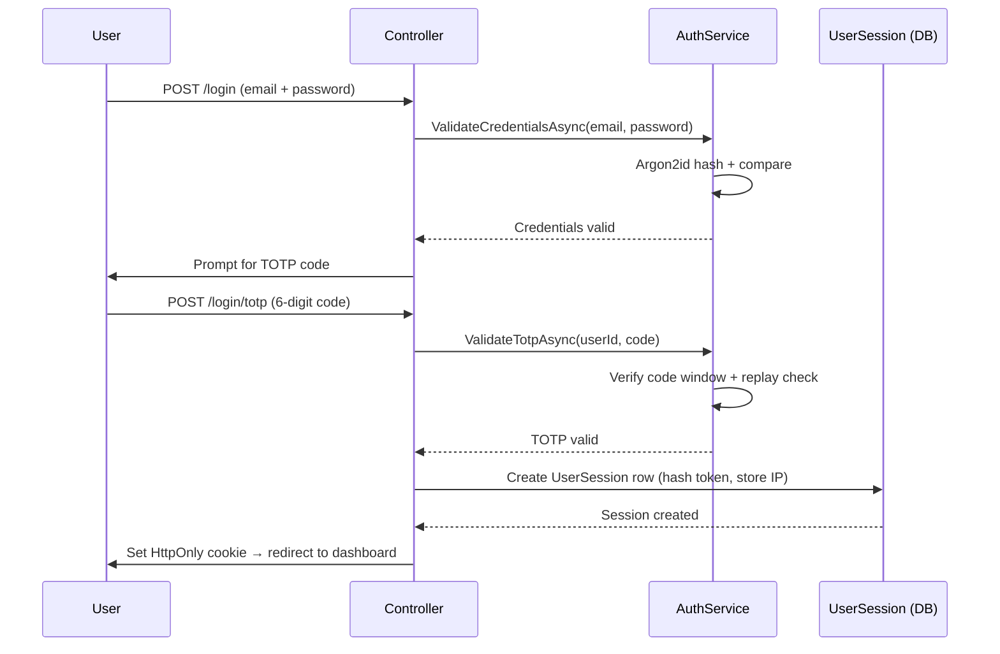
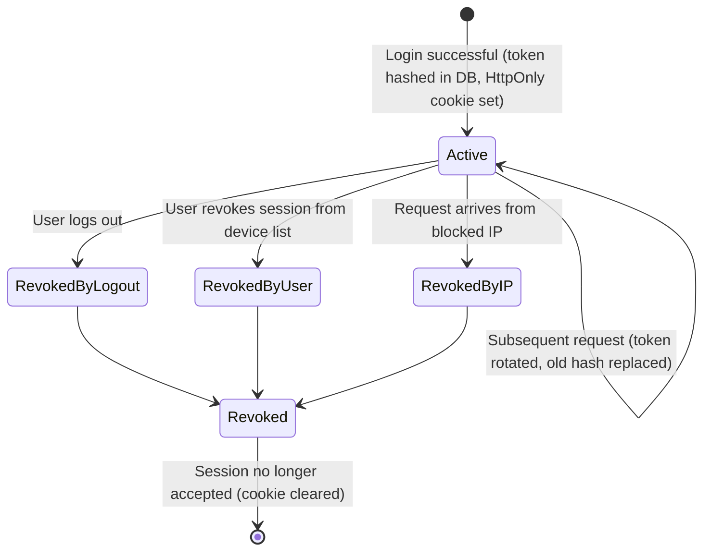

# Project Ceres — Phase 3 Planning (Hosted Beta)

> **Diataxis type:** Reference — defines Phase 3 scope, security requirements, and open decisions for the hosted beta.

## Index

1. [Planned Features (Phase 3)](#planned-features-phase-3)
   - [Login with TOTP — happy path](#login-with-totp--happy-path)
   - [Session token lifecycle](#session-token-lifecycle)
   - [IDOR enforcement](#idor-enforcement)
2. [Design System & Visual Overhaul](#design-system--visual-overhaul)
3. [MVC → SPA Migration Plan](#mvc--spa-migration-plan)
4. [Deferred from Phase 2](#deferred-from-phase-2)
5. [Open Questions (blocks Phase 3)](#open-questions-blocks-phase-3)

---

**Phase 2 is complete as of 2026-04-28. This is now the active phase.**

The app moves from local to a hosted server. Goal: make the app accessible to a small group
of collaborators who can help test and improve it. This phase introduces the foundational
changes needed for any multi-user product.

---

## Planned Features (Phase 3)

- **Authentication** — user registration and login with username + password (hashed with Argon2, never stored in plain text), with optional social login (Google, Facebook, Apple, Microsoft) as an alternative credential method. Social login eliminates password storage complexity but introduces an external availability dependency — if the provider is down, users can't log in. If social login is implemented, it is offered alongside email/password, not as a replacement. TOTP MFA applies regardless of login method.

**Login with TOTP — happy path**

- **Password policy** — minimum 8 characters, no maximum below 64 (NIST SP 800-63B). Do not enforce mandatory complexity rules — check against a breached password list (Have I Been Pwned API or local top-N list) instead. Hashing: Argon2id with pinned parameters: m=19456 (19 MB memory), t=2 iterations, p=1 parallelism (OWASP minimum baseline). Do not rely on library defaults.
- **Password reset flow** — token format: cryptographically random 256-bit value, stored as Argon2id hash only. Expiry: 15 minutes. Single-use: token is invalidated on first successful use. On successful reset: all existing `UserSession` rows for the user are revoked. MFA: the reset flow must require a valid TOTP code before accepting the new password — backup codes are the recovery path if the TOTP device is lost, not a TOTP bypass in the reset flow. Enumeration prevention: the reset request endpoint returns an identical response regardless of whether the email is registered. See `security-model.md → Password Reset` for the full spec.
- **Account enumeration prevention** — login and password-reset endpoints must return identical error messages and take identical wall-clock time regardless of whether the email exists. Always run the Argon2id hash even when the user is not found — hash against a dummy value and discard the result.
- **MFA** — mandatory for all users via authenticator app (TOTP). No SMS — vulnerable to SIM-swap attacks.
- **TOTP shared secret storage** — TOTP seed must be stored encrypted at rest. Verify encryption is applied via ASP.NET Core Data Protection before Phase 3 launch.
- **TOTP replay prevention** — server must track recently accepted codes per user and reject any code already used within its window. ASP.NET Core Identity does not do this by default.
- **Session management** — sessions tracked server-side in a `UserSession` table. Supports multi-device, user-visible session list, per-session revocation.
  - **Always enforced:** session token regenerated after login (session fixation prevention); server-side session record marked revoked on logout.
  - **User-configurable:** session lifetime (short vs. persistent "remember me"). Persistent sessions: long-lived token in `HttpOnly` secure cookie, store only a hash in the database, rotate token on each use.
  - **IP enforcement (user-configurable):** per session, not per user. Each `UserSession` stores its creation IP. Multiple devices with different IPs are fully compatible.
  - **IP blocking:** users can block specific IPs from Security settings. Any request from a blocked IP is rejected and all active sessions from that IP revoked.

**Session token lifecycle**

- **Secure cookie configuration** — `HttpOnly = true`, `Secure = true`, `SameSite = Strict` or `Lax`. Configure via `CookieAuthenticationOptions` in `Program.cs`.
- **Multi-tenancy** — all data scoped to the logged-in user
- **Per-user settings** — single-row Settings table migrates to per-user preferences table
- **Hosting setup** — deploy to a server. No business model yet — invite-only for beta testers.
- **HTTP security headers** — `X-Content-Type-Options: nosniff`, `X-Frame-Options: DENY`, `Referrer-Policy: strict-origin-when-cross-origin`, HSTS once HTTPS is enforced. Define `Content-Security-Policy` when Phase 2 JS is added — avoid inline scripts. Use `NetEscapades.AspNetCore.SecurityHeaders` or custom middleware.
- **Rate limiting** — protect login and registration against brute-force. Fixed window (e.g. 10 requests/min/IP) minimum. Add account-level lockout: after N consecutive failed attempts (e.g. 10), lock for a fixed period (e.g. 15 min) and notify by email. Lockout counter resets on successful login.
- **IDOR prevention** — every controller action loading a resource by ID must scope the query to the authenticated user's data. Integration tests must cover: User A targeting User B's resource must return 404, not 403.

**IDOR enforcement**

- **UUID primary keys** — all user-created entities use `uuid` PKs, not sequential integers. System lookup tables retain `int` PKs. Decision applies from Phase 1 — no migration required later. See models.md Primary Key Strategy.
- **CORS policy** — required when a separate frontend origin is introduced. Whitelist only known frontend origin(s). Never combine `AllowAnyOrigin` with `AllowCredentials`.
- **Dependency vulnerability scanning** — run `dotnet list package --vulnerable` before each release. In Phase 3, integrate into CI pipeline on every code push.
- **Forwarded headers middleware** — register `app.UseForwardedHeaders()` with `XForwardedFor | XForwardedProto` before all other middleware. Restrict trusted proxy addresses via `KnownProxies` to prevent IP spoofing.
- **Audit logging** — required for GDPR. Minimal audit record for: login/logout, account creation, data export, right-to-erasure requests. Schema: `(Id, UserId, Action, EntityType, EntityId, OccurredAt, IpAddress)`. Auto-purged after 6 months per `legal.md`. Do not log financial amounts in audit entries.
- **Support ticket system** — users submit support requests (subject + message). Stored in `SupportTicket` table. Email notification to configurable admin address. Status: `Open`, `InProgress`, `Resolved`, `Closed`. Priority: `Low`, `Normal`, `High`, `Urgent`.
- **GDPR & legal compliance** — required before any user outside yourself can access the app. See [`legal.md`](legal.md). Minimum before Phase 3 launch: privacy policy, legal basis for each data type, data retention policy enforced, data breach notification procedure, right to erasure flow.
- **Full data export (GDPR portability)** — a structured ZIP download containing all data held for the authenticated user: one CSV per entity type (accounts, transactions, transfers, budgets, categories, recurring transactions), plus all attachment files in their original format. Required to satisfy GDPR Art. 15 (right of access) and Art. 20 (right to portability) — the Phase 2 transaction-only CSV export does not cover this. Must be available before any external user accesses the app. The export link lives in user Settings and produces an audit log entry. Each export is rate-limited (maximum one per 24 hours per user) to prevent abuse. **Implementation: asynchronous** — the export must be generated as a background job (accept request → queue job → return 202 Accepted → notify user by email when ready). A synchronous ZIP export of years of data plus attachments will exhaust HTTP worker threads and time out. The download link must be authenticated and time-limited (24-hour expiry).
- **Account-level notes** — a free-text `Notes` field (`text`, nullable) on the `Account` entity. Displayed on the account detail view. Allows users to annotate accounts with intent or constraints (e.g. "emergency fund — minimum €5,000", "joint account, do not use for autónomo expenses"). Trivial schema change; bundled with Phase 3 account UI work.
- **Category budget period start day** — users can define which day of the month their budget period starts (e.g. the 15th, to align with salary arrival), preventing false "budget available" signals mid-cycle. Two levels: (1) a global default in user Settings (applies to all category budgets), and (2) a per-budget override on each `CategoryBudget` (overrides the global default for that budget only). When the user sets or changes the start day, the current period is calculated retroactively from the most recent occurrence of that day — no gap or overlap in history. The `CategoryBudget` entity gains an optional `PeriodStartDay` column (`int?`, 1–28); the Settings/preferences table gains a `BudgetPeriodStartDay` column (`int`, default 1). Day 29–31 are excluded to avoid month-length edge cases.
- **Weekly financial digest email** — a scheduled email (every Monday morning) summarising the previous week: net worth delta, income vs. expenses, any CategoryBudget over 80% of limit. Delivered by the same email service used for auth. **Opt-in only** — disabled by default, enabled from notification preferences in Settings. Users who enable it can disable it at any time from the same settings page or via a one-click unsubscribe link in every digest email. Never sent to users who have not explicitly opted in.
- **New session alert email** — when a new `UserSession` is created from an IP address not seen before for that user, an email notification is sent: "A new sign-in was detected from IP x.x.x.x at [time]. If this was you, no action is needed. If not, revoke this session here: [link]." **Opt-out** — enabled by default; users may disable from notification preferences in Settings with a disclosure of the security implication. The active sessions list and per-session revocation are always available regardless of this setting — the email is a convenience layer on top, not the primary security control.
- **API authentication and identity masking** — two layers required for Phase 3, one deferred to Phase 4. (1) **JWT access tokens:** all API requests are authenticated via short-lived JWTs (15-minute expiry) carrying `sub` (user UUID) and `tid` (tenant UUID) claims, signed with a secret held in the hosting secrets store — never stored in the database. Refresh tokens rotate on each use and are stored as hashes only in `UserSession`. (2) **HMAC pseudonymisation:** every data row stores `UserRef = HMAC-SHA256(USER_REF_SECRET, userId)` instead of the raw UUID — a DB dump cannot link financial records to real user identities without the server secret. `USER_REF_SECRET` lives in the secrets store; a rotation procedure must be documented before Phase 3 launch. (3) **Per-tenant payload encryption** (Phase 4+): encrypt financial payload columns (amount, description, merchant) under per-tenant keys derived from a master key via HKDF — deferred until Phase 4 when investment and tax data raises the sensitivity of individual records. See [`security-model.md — API Authentication and Identity Masking`](security-model.md#api-authentication-and-identity-masking).
- **Email security** — three layers required before Phase 3 launch. (1) **DNS authentication:** configure SPF, DKIM, and DMARC on the sending domain once the email provider is chosen. SPF and DKIM must be active and passing; DMARC at minimum `p=none` at launch, advancing to `p=reject` after aggregate reports confirm clean sending. (2) **Application controls:** lock all outgoing email `To:` addresses to the authenticated user's own verified address (never from a request parameter); sanitize any user-controlled strings rendered into email subject or body; apply a tight per-user rate limit on all email-triggering endpoints. (3) **API key hygiene:** store the provider API key in environment variables or the hosting secret store — never in source control; use a send-only scoped key where supported; document the rotation procedure before launch. See [`security-model.md — Email Security Rules`](security-model.md#email-security-rules).

## Design System & Visual Overhaul

> **Status: Approved.** Design decisions locked via brainstorming session 2026-04-28. See full spec: [`docs/superpowers/specs/2026-04-28-spa-migration-ux-overhaul-design.md`](superpowers/specs/2026-04-28-spa-migration-ux-overhaul-design.md).

The full SPA migration (Razor deleted, ASP.NET Core becomes a pure Web API, React Router handles all routing) is the architectural prerequisite for this work. That decision is already committed — see [architecture.md](architecture.md#phase-3--full-spa-evaluation-point). Approach: design-first, then migrate feature by feature — each ported page gets the final design on arrival, no second-pass redesign.

---

### 1. Navigation shell

**Left sidebar (primary navigation)**
- Fixed position, full height
- Expanded state: icon + label, ~240px wide
- Collapsed state: icon-only rail, ~56px wide — toggle at the bottom of the sidebar
- Logo/wordmark at top in both states

Nav groups:

| Group | Items |
|---|---|
| Main | Dashboard, Movements, Transactions, Transfers |
| Money | Accounts, Categories, Budgets |
| Tools | Recurring Transactions, Import, Reports |
| (bottom-pinned) | Settings, Support |

All nav items use Lucide icons. Every item must have an icon that works standalone in rail mode.

**Top bar (global)**
- Fixed, full width; logo area width matches sidebar and shifts on collapse
- Left: logo; Center: global search input; Right: quick-add "+", notifications bell, user avatar
- User avatar dropdown: Profile, Preferences, Security (sessions), Logout

**Responsiveness (applies to all surfaces)**
- Desktop (≥1024px): sidebar expanded by default, collapsible to rail
- Tablet (640px–1023px): sidebar collapsed to icon-rail by default
- Mobile (<640px): sidebar hidden entirely; hamburger in top bar opens a slide-over drawer
- Top bar search collapses to a search icon on mobile; tapping expands it inline
- Tables scroll horizontally on small screens with priority columns pinned left
- Forms stack to single-column on mobile

---

### 2. Global search

- Triggered from top bar input or `⌘K` / `Ctrl+K`
- Opens a modal with a focused search input and grouped results below
- Searches across: transactions (description, amount), accounts (name), categories, recurring transactions, reports
- Results grouped by entity type; keyboard navigable (arrows + Enter); Escape to close
- **MVP:** plain text search, no filters
- **Future:** filter layer (by entity type, date range, account, category); full command palette with page navigation and action triggers

---

### 3. Per-table search & saved searches

- Filter bar above every table: text search input + entity-specific filter chips
- Active filters shown as dismissible chips; "Clear all" resets all at once
- Entity-specific filters:
  - Transactions / Movements: date range, category, account, type, cleared status
  - Transfers: date range, source account, destination account
  - Accounts: type, currency, active/inactive
  - Categories: type, active/inactive
  - Recurring Transactions: frequency, next due date range, active/inactive
- "Save search" appears when any filter is active → name it → stored server-side per user per table
- Saved searches accessible from a dropdown next to the filter bar; deletable with confirmation
- **MVP:** filters + text search saved. **Future:** include column visibility and sort order (named views)

---

### 4. Form fields

**Visual polish**
- Floating labels: animate above the field on focus or when a value is present
- Focus ring: brand color, smooth transition
- Error state: red border + inline message below the field — never a top-of-form summary
- Required indicator: `*` next to label, legend at the bottom ("* Required")
- Disabled state: muted appearance, consistent across all input types
- Submit button: spinner + disabled during loading; re-enables on error

**Smarter field behavior**
- Category / account selectors: searchable combobox, recently used items at top
- Date fields: date picker with presets (Today, Yesterday, This week, This month, Last month, Custom range)
- Amount fields: formats as currency as the user types, respects user's currency setting
- Multi-step forms (onboarding, import): progress indicator at top showing step N of M
- Unsaved changes: browser `beforeunload` warning + in-app confirmation dialog on navigate away

**Cancel / back navigation**
- All forms track the originating route and Cancel returns there — never a hardcoded redirect
- Full audit of all cancel/back paths during implementation (recurring transaction dismiss is a known case)

---

### 5. Movements & quick-add fixes

- "New Transaction" and "New Transfer" buttons added to the Movements page header
- After creating from Movements, return to Movements — not the respective index page
- Quick-add "+" in the top bar: compact modal (type, date, amount, account, category, description); saves without navigating away; confirms with a toast

---

### 6. Brand foundation

Resolve all of these as design decisions before writing any component. Write outcomes into `docs/design-system.md` at Phase 3 kickoff.

- **Color palette** — primary brand color, surface colors, semantic colors (success, warning, destructive, info). All as CSS custom properties — not hardcoded Tailwind classes.
- **Typography** — one typeface, size scale (xs → 4xl), weight scale, line heights.
- **Spacing scale** — confirm Tailwind default or define custom. No magic numbers.
- **Border radius scale** — sm / md / lg / full. One value per level, used consistently.
- **Shadow scale** — subtle / default / elevated. Communicates depth hierarchy.
- **Chart color palette** — 6–8 distinct accessible colors, separate from brand palette.
- **Motion tokens** — transition duration and easing defined once, not duplicated.
- **shadcn/ui token override strategy** — override CSS variables with Ceres brand values; document which are overridden vs. left at shadcn defaults.

---

### 7. Dark mode

Commit to the token structure that supports dark mode — no hardcoded color values anywhere. Ship light-only at Phase 3 launch. Enable dark mode as a fast follow once the token layer is verified.

---

### 8. Accessibility baseline

Non-negotiable before any beta user accesses the app:
- WCAG AA color contrast on all text/background pairs — verify at token definition time
- Visible focus ring on all interactive elements
- `aria-label` on all icon-only buttons (Lucide standard from Phase 2)
- Screen reader labels on all charts (`aria-label` on canvas, `role="img"`)
- All form fields have associated `<label>` elements — no placeholder-as-label
- Error messages programmatically associated with their fields (`aria-describedby`)
- Modal focus trap — shadcn/ui Dialog handles this; verify it is not overridden anywhere

---

### 9. Toast and feedback system

The SPA model eliminates Razor redirect-with-flash-message. Replace with:
- Toast notifications for non-critical success (transaction saved, attachment uploaded)
- Field-level inline errors for form validation
- Full error state for failed page loads (error boundary with retry)
- Optimistic UI where appropriate — `ClearedBadge` already does this; extend the pattern

---

### 10. Auth screen design

Login, TOTP, register, and password reset are the first thing beta users see — design to a higher bar:
- Ceres logo / wordmark placement
- Minimal layout: centered card, no sidebar or app shell
- Clear error states: wrong password, expired TOTP, locked account
- TOTP setup flow: QR code display, manual entry fallback, backup codes download

---

### 11. Onboarding flow design

Multi-step wizard for first-run users (deferred from Phase 2 — see ADR-0053):
1. Create first asset account (checking, savings)
2. Create first liability (optional)
3. Record opening balance
4. Immediate net worth display

Full-screen stepper with progress indicator, distinct from the standard app shell.

---

### 12. `docs/design-system.md`

Create at Phase 3 kickoff. Source of truth for all visual decisions:
- Token definitions: CSS variable name → purpose → light value → dark value
- shadcn/ui override list
- Color palette with hex values and contrast ratios
- Typography, spacing, chart color palette, component usage guidelines, icon rules, motion tokens

---

### 13. Component library additions

shadcn/ui covers the Phase 2 baseline. Phase 3 additions required:

| Component | Where needed |
|---|---|
| `Tabs` | Settings page, report filter panels |
| `Tooltip` | Contextual help on financial terms |
| `Sheet` (slide-over) | Mobile-friendly edit forms, sidebar mobile drawer |
| `Breadcrumb` | Deep navigation (Account → filtered Movements) |
| `Avatar` | User menu, session list |
| `Skeleton` | Loading states for async chart and table data |
| `Toast` / `Sonner` | Success/error feedback — replaces full-page redirects |
| `Command` / `Combobox` | Global search modal, category/account selectors |
| `DataTable` | Transactions, Movements, Transfers lists |

---

### 14. Implementation order

1. Token layer + `docs/design-system.md` — zero visible change; everything downstream depends on it
2. App shell (sidebar, top bar, responsive behavior)
3. Auth screens (login, TOTP, register, password reset) — outside the shell
4. Onboarding wizard — outside the shell
5. Dashboard — first page inside the shell
6. Movements + Transactions + Transfers — highest daily usage; includes quick-add, per-table search, saved searches
7. Accounts + Categories + Budgets + Recurring Transactions — management screens
8. Reports + Import/Export — complex, lower frequency
9. Settings + Sessions + Support — lowest frequency; includes saved searches management

---

## MVC → SPA Migration Plan

The execution plan for migrating from ASP.NET Core MVC + Razor Views to a pure Web API + React SPA is maintained in a dedicated document to keep this file readable.

See [planning-phase3-spa-migration.md](planning-phase3-spa-migration.md).

> **Status: Approach locked (2026-04-28).** Design-first, migrate feature by feature — each feature area is fully API-tested, then React-built, then Razor-deleted. Never a big-bang deletion. Hosting model: Option A (React served from ASP.NET Core `wwwroot/`). See full spec: [`docs/superpowers/specs/2026-04-28-spa-migration-ux-overhaul-design.md`](superpowers/specs/2026-04-28-spa-migration-ux-overhaul-design.md).

---

## Deferred from Phase 2

- **Recurring reminder email push** — daily digest and per-reminder email notifications. Deferred from Phase 2; lands alongside the Phase 3 email service (already needed for registration and password reset). User-configurable opt in/out. See ADR-0044.
- **OFX import** — deferred from Phase 2. Revisit at Phase 3 or Phase 4 based on real usage data. If implemented, use `<FITID>` as primary duplicate detection key. See ADR-0046.
- **Irregular income baseline budgeting** — rolling average income baseline for category and goal budget evaluation. Priority deferral from Phase 2 — `LifestyleTag` groundwork already in place. Revisit at Phase 3 scope definition. See ADR-0048.
- **Guided onboarding** — first-run experience for new users: enter assets and liabilities, produce immediate net worth. Build alongside multi-tenancy as the first impression for Phase 3 beta users. See ADR-0053.
- **InvestmentHolding entity** — tracks individual positions within an investment account (ticker, units, purchase price, current price, unrealized gain/loss). Deferred from Phase 2 — revisit at Phase 3 or Phase 4 based on whether investment accounts are actively used.
- **Spending by Category Over Time** — month-by-month category spending trend. Deferred from Phase 2 — overlaps with Expense Breakdown + date range. Reassess at Phase 3 scope definition. See ADR-0054.
- **Year-over-Year Comparison** — income, expenses, and net worth between two calendar years. Deferred from Phase 2 — requires at least two years of data to be meaningful. Reassess at Phase 3 scope definition. See ADR-0054.
- **Saved report configurations** — named snapshots of report parameters for quick re-use. Deferred from Phase 2 — insufficient usage experience to design correctly. Reassess after Phase 2 daily use reveals which parameters are worth saving and whether a full report builder is warranted. See ADR-0055.
- **Goal budget milestones** — allow users to define intermediate milestones within a goal budget (e.g. "Trip to Japan — €3,000" with milestones at €1,000 flights, €2,000 hotel). Each milestone displayed as a progress bar segment. Requires a `BudgetMilestone` table. Deferred from Phase 2 — validate basic goal tracking in daily use first.
- **Recurring transfers — revisit at end of Phase 2.** Not planned for Phase 2. A `RecurringTransfer` entity would mirror `RecurringTransaction` for transfers that repeat on a schedule (mortgage payments, monthly savings sweeps, loan repayments). Structural shape is identical to `RecurringTransaction`. Decision at Phase 2 completion: implement in Phase 3, defer to Phase 4, or discard based on whether recurring transactions prove useful in daily use.
- **Split transactions — revisit at Phase 3 scope definition.** Not committed for Phase 3 — decision is: implement, defer again, or discard based on Phase 2 daily use. Would require a `TransactionLine` table touching reports, import, views, and budget eligibility. Workaround in Phase 2: record multiple transactions. See ADR-0041.

## Open Questions (blocks Phase 3)

See [planning.md — Open Questions](planning.md#open-questions--decisions) for the full list. Key items:

- Authentication framework
- Hosting platform
- Email service
- Invite mechanism
- Multi-tenancy implementation
- Settings migration
- MVC → Web API decoupling — base migration plan documented in [planning-phase3-spa-migration.md](planning-phase3-spa-migration.md); finalize at Phase 3 kickoff
- Production migration strategy
- CI service
- CD strategy
- E2E testing — Playwright chosen; implement after Phase 2 React migration stabilizes. See [testing.md](testing.md#e2e-tool-playwright).
