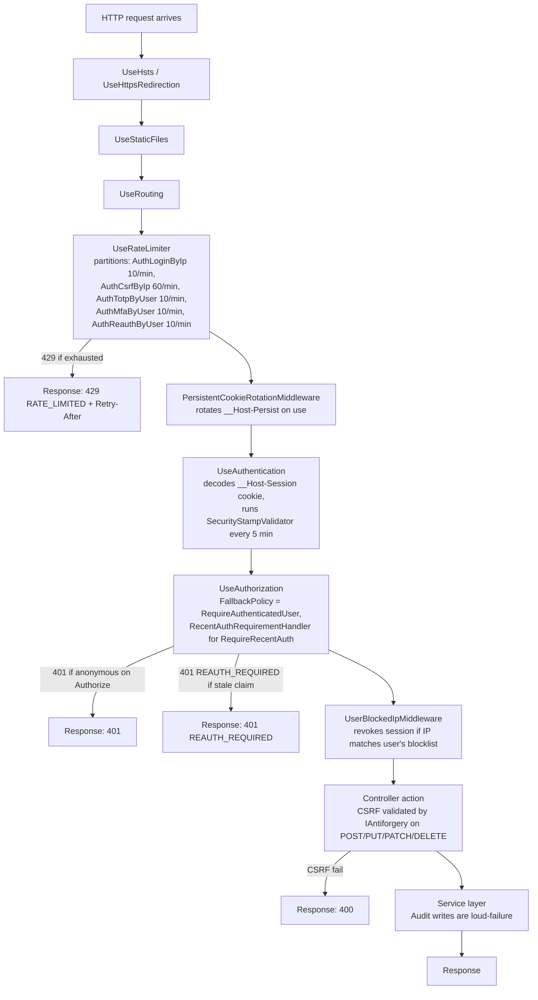
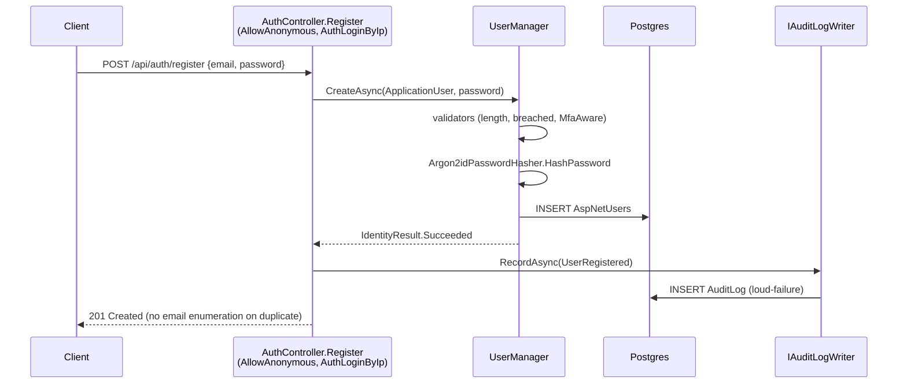
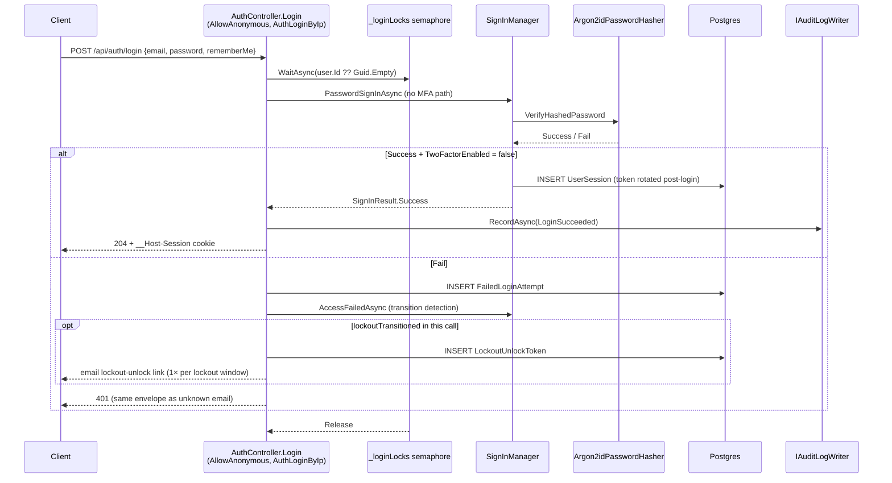
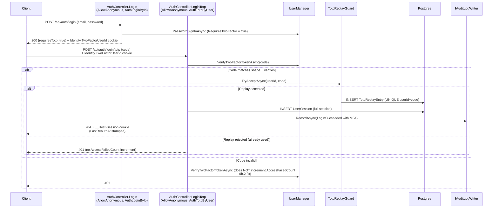
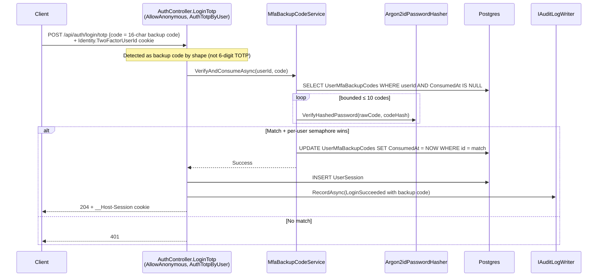
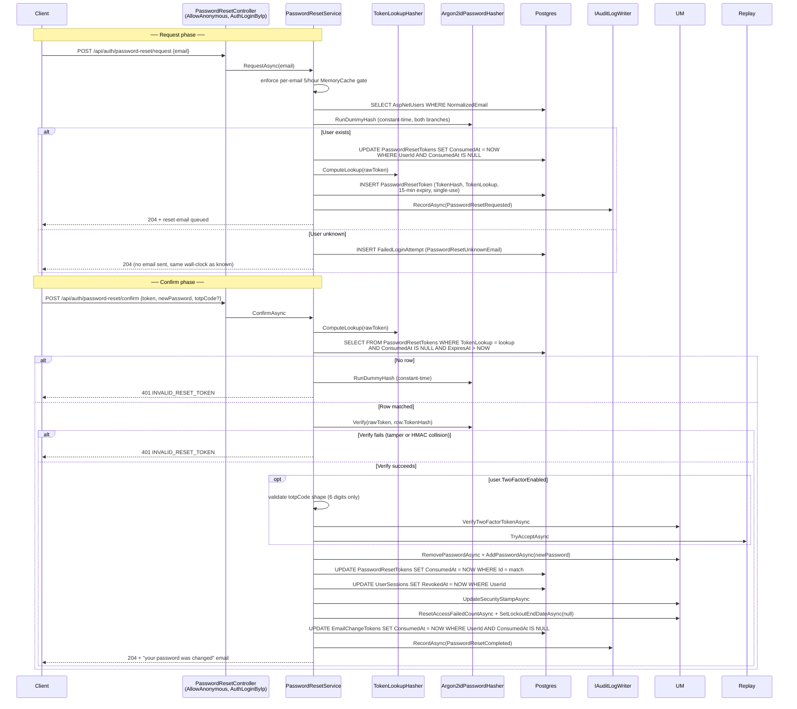
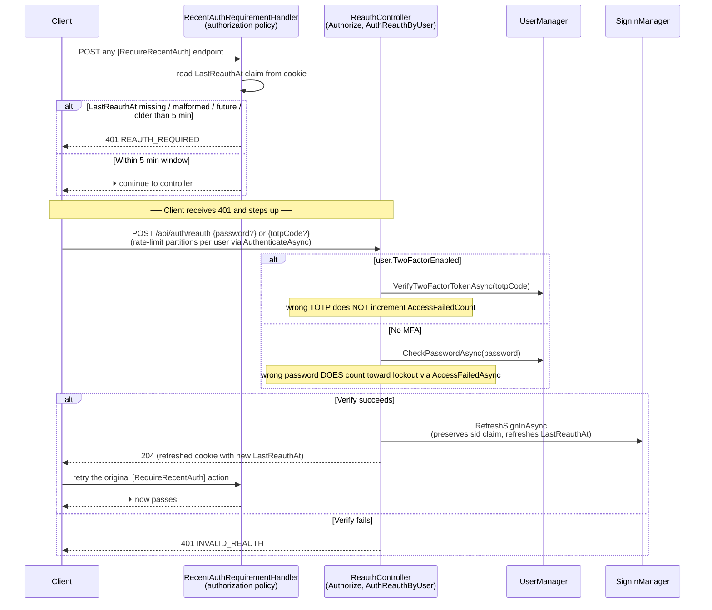
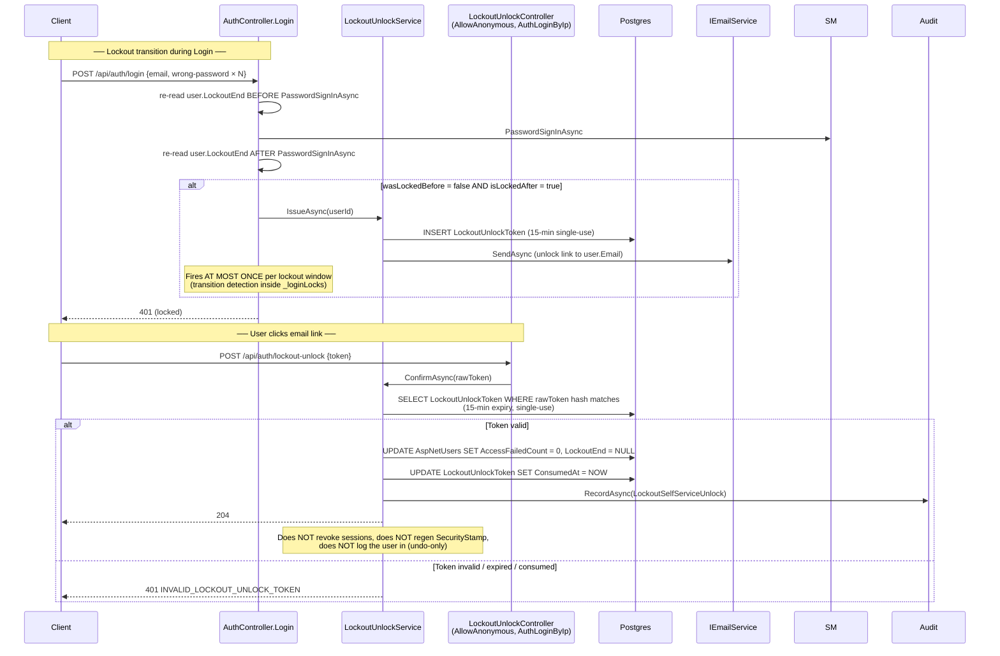
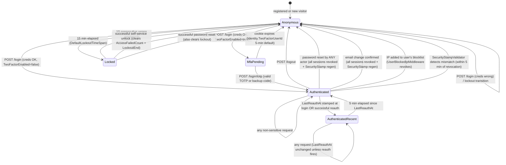

# Security Model

> **Diataxis type:** Reference + Explanation — defines what we are protecting against and the rules that enforce protection. Individual implementation details live in `planning.md` (Phase 3) and the relevant ADRs; this document is the unified view.

## Index

1. [Threat Model](#threat-model)
2. [Data Protection Rules](#data-protection-rules)
3. [Backup Security](#backup-security)
4. [Access Control Rules](#access-control-rules)
5. [Authentication and Session Rules](#authentication-and-session-rules)
6. [Transport and Infrastructure Rules](#transport-and-infrastructure-rules)
7. [Input Validation Rules](#input-validation-rules)
8. [File Handling Rules](#file-handling-rules)
9. [Logging and PII Redaction](#logging-and-pii-redaction)
10. [Error Handling and Information Disclosure](#error-handling-and-information-disclosure)
11. [Email Security Rules](#email-security-rules)
12. [SSRF Prevention](#ssrf-prevention)
13. [API Authentication and Identity Masking](#api-authentication-and-identity-masking)
14. [GDPR and Legal Compliance](#gdpr-and-legal-compliance)
15. [Operational Security](#operational-security)
16. [Dependency Scanning and Secrets Hygiene](#dependency-scanning-and-secrets-hygiene)
17. [Security Rules by Phase](#security-rules-by-phase)
18. [Appendix A — Stack-Specific CVEs (Snapshot)](#appendix-a--stack-specific-cves-snapshot)

---

## Threat Model

### What we are protecting

This is a personal finance application. The data it holds is among the most sensitive personal data a user can have: account balances, income, spending habits, financial goals, and (in Phase 4) tax information. The threat impact is high even for a small user base.

**Primary assets:**
- Financial transaction records and account data
- Authentication credentials (passwords, TOTP secrets)
- Session tokens
- File attachments (receipts, invoices — may contain personal or tax-sensitive information)
- Audit logs (login history, IP addresses)

### Who the adversary is

| Adversary | Capability | Target |
|-----------|-----------|--------|
| **External attacker** | Network access to the hosted app | Credentials, other users' financial data |
| **Curious user** | Valid account, knowledge of URL patterns | Other users' data via ID manipulation |
| **Compromised session** | Stolen session cookie or token | All data accessible to the victim user |
| **Database dump attacker** | Read access to a database backup | Plaintext passwords, TOTP secrets, financial data |
| **Passive network observer** | Ability to intercept HTTP traffic | Credentials, session tokens (mitigated by HTTPS) |
| **Supply-chain attacker** | Compromised npm or NuGet dependency | RCE, credential exfiltration, data exfiltration |
| **Abusive legitimate user** | Valid account; probing their own data for injection surfaces | Application stability, data integrity |
| **Developer machine compromise** | Malware on the maintainer's laptop; access to dotfiles, SSH keys, deployment credentials | Production environment, signing keys, secrets store credentials. Mitigation: hardware-key-protected SSH and signing keys; no plaintext secrets in repository or shell history; deployment credentials scoped per environment. |

### What we are not trying to defend against

- Malware running on the user's own device (out of scope for any web app)
- A malicious hosting platform administrator (trust the hosting provider). Compensating control: Phase 4 payload encryption reduces the blast radius of a hosting-layer breach.
- Quantum computing attacks on current cryptography (not a near-term threat at this scale)

### Regulatory scope statement

Project Ceres is a **read-only personal finance categorization tool**. It does not:

- Initiate payments, transfers, or any movement of funds (no Payment Initiation Service activity under PSD2)
- Hold customer funds (not an electronic money institution under Directive 2009/110/EC)
- Provide regulated financial advice (not a MiFID II investment service)
- Issue credit, lending products, or insurance

In Phase 1–3 the application has no third-party banking integrations, so it is also not an Account Information Service Provider (AISP) under PSD2. **Phase 4** introduces optional read-only integration with financial aggregators (e.g., Tink, TrueLayer); in that phase, Ceres becomes a downstream consumer of an AISP's data — the AISP is the regulated entity, and contractual flow-through requirements from the aggregator's DPA will apply. Re-evaluate this scope statement at Phase 4 kickoff.

---

## Data Protection Rules

### Passwords

- **Never store plaintext.** Hash with Argon2id using explicitly pinned parameters: `m=19456` (19 MiB), `t=2` iterations, `p=1` parallelism. This matches the OWASP Password Storage Cheat Sheet baseline. Either `m=19456, t=2, p=1` or `m=47104, t=1, p=1` is acceptable — they are documented as equal-strength trade-offs (more memory vs more iterations). The lower-memory variant is preferred here for solo-developer VPS budgets.
- **Never use bcrypt** for new implementations — Argon2id is the current standard.
- **Do not rely on library defaults** — pin the parameters explicitly. Default values in libraries may be weaker than the minimum.
- **Policy (per NIST SP 800-63B-4 §3.1.1.2, final 31 July 2025):**
  - SHALL: minimum 8 characters for user-chosen passwords
  - SHALL: accept up to at least 64 characters
  - SHALL: screen new and changed passwords against a compromised-password blocklist (Have I Been Pwned API or local top-N list)
  - SHALL NOT: impose composition rules (uppercase, symbols, digits)
  - SHALL NOT: require periodic rotation except on evidence of compromise
  - SHOULD: apply Unicode NFC or NFKC normalization before hashing
  - SHOULD (our addition): require ≥15 characters when MFA is not yet enrolled. Once MFA is enrolled, the 8-character SHALL floor is sufficient. **Implementation (Stage 6b.3):** `MfaAwareLengthValidator` now reads `user.TwoFactorEnabled` from the database to determine which floor applies. Prior to 6b.3 the validator was wired to a hardcoded `false`, meaning the 15-char floor was always applied regardless of MFA status — the code now matches the documented policy.
- **Cryptographic agility:** the canonical Argon2 PHC string format stores algorithm and parameters alongside the hash (`$argon2id$v=19$m=19456,t=2,p=1$…`). On each successful login, if the stored parameters are below the current target, re-hash the plaintext with the new parameters and update the row in the same transaction. This migrates the user base without coordinated downtime.

### TOTP Secrets

- The TOTP seed (generated during MFA setup and encoded in the QR code) must be stored **encrypted at rest** in the database.
- A plaintext seed in a database dump allows offline generation of valid TOTP codes, bypassing MFA entirely.
- **Implementation (Stage 6b.1, shipped 2026-05-09):** ASP.NET Core Identity stores TOTP secrets in `AspNetUserTokens` (one row per user keyed under `[AspNetUserStore].AuthenticatorKey`), encrypted via ASP.NET Core Data Protection. We use the framework's built-in `UserManager.GenerateNewAuthenticatorKey` / `GetAuthenticatorKeyAsync` / `VerifyTwoFactorTokenAsync` flow — see `2026-05-09-stage-6b-1-totp-mfa-design.md` § 4 for why we did not roll our own.
- **Data Protection key storage:** Data Protection keys encrypt TOTP secrets. By default they are written to the local filesystem — if the server is compromised, the attacker gets both the ciphertext and the decryption keys. **Stage 6b.1 ships with the filesystem default** (acceptable for local dev + integration tests). Before Phase 3 launch, configure a Data Protection key storage backend external to the application server (Azure Key Vault, AWS KMS, or an encrypted volume with access controls independent of the app) — this is a **Stage 16 (Hosting + ops) launch gate**. Never leave Data Protection keys co-located with the data they protect once a real production deployment exists.
- **TOTP seed exposure at enrollment:** the QR code response contains the raw `otpauth://` URI. This response must include `Cache-Control: no-store, no-cache` headers. The seed must never be logged (application logs, request logs, or error tracking). After the user completes enrollment verification, the seed must not be retrievable via any endpoint. Stage 6b.1's `MfaController` sets these headers on `/enroll`, `/enroll/verify`, and `/backup-codes/regenerate`.
- **TOTP enrollment verification:** MFA is only marked active (`TwoFactorEnabled = true` on `AspNetUsers`) after the user successfully enters their first valid TOTP code against the new seed. A two-step flow is required: (1) `POST /api/auth/mfa/enroll` (display QR code), (2) `POST /api/auth/mfa/enroll/verify` (require a valid code to confirm enrollment). Until step 2 succeeds, `TwoFactorEnabled` remains false. This prevents a user from being locked out due to a misconfigured authenticator app.
- **TOTP replay prevention:** every successful TOTP verify is recorded in `TotpReplayEntry` with an Argon2id hash of the code (per-row salt) and a 2-min sliding window. The same code submitted twice within that window is rejected with 401, even if the framework's verify still accepts it (Identity allows ±1 30-second slot). See `models.md` § TotpReplayEntry.
- **Backup-code recovery path:** `POST /api/auth/login/totp` accepts either a 6-digit TOTP code or a 16-char Crockford base-32 backup code (with or without `-` separators). The endpoint shape-detects and routes accordingly. Backup codes are hashed in our own `UserMfaBackupCode` table — Identity's built-in recovery codes store as plaintext in `AspNetUserTokens` (`dotnet/aspnetcore#5815`), which fails this document's § TOTP Backup Codes Argon2id requirement, so we keep our own.
- **TOTP re-enrollment:** when a user re-enrolls TOTP (e.g., new phone), `UserManager.ResetAuthenticatorKeyAsync` overwrites the candidate seed before the new one is marked active. The user must reauthenticate before starting re-enrollment — **reauth gate is enforced via `[RequireRecentAuth]` on `/api/auth/mfa/enroll` and `/enroll/verify` (Stage 6c.2, 2026-05-10)**. The gate requires a `LastReauthAt` claim within the 5-minute freshness window; the SPA prompts for a step-up via `POST /api/auth/reauth` when the gate fires.
- **MFA enroll idempotency guard (Stage 6b.3):** `POST /api/auth/mfa/enroll` returns `409 MFA_ALREADY_ENROLLED` if `user.TwoFactorEnabled = true`. Prevents silent re-enrollment overwriting a live TOTP seed. A disable-MFA flow (Stage 6c) is required before re-enrollment; until 6c ships there is no UI path to disable MFA.
- **Disable-MFA endpoint:** deferred to Stage 6c. Until then, `MfaController.Enroll` blocks re-enrollment via the 409 guard above.

### TOTP Backup Codes

Backup codes are an account recovery path that permanently bypasses TOTP. Treat them with the same security requirements as passwords.

- **Storage:** hash each backup code with Argon2id before storage. Never store them in plaintext. Never log them.
- **Entropy:** generate 8–10 codes with at least 128 bits of entropy each (e.g. 10 characters from a base-32 alphabet ≈ 50 bits minimum; prefer 16 characters for 80 bits).
- **Single-use:** mark each code used in the database on first successful verification. A used code must never be accepted again.
- **Re-generation:** when new backup codes are generated (e.g. user requests fresh codes after using one), all existing codes for that user are immediately invalidated before new ones are issued. **Re-generation is gated by `[RequireRecentAuth]` (Stage 6c.2)** — the user must have stepped up via `POST /api/auth/reauth` (or just logged in) within the past 5 minutes; otherwise the endpoint returns `401 REAUTH_REQUIRED`. Returns `409 MFA_NOT_ENABLED` if MFA is not enabled. The Stage 6b.3 in-body `{ totpCode }` stopgap was removed when 6c.2 shipped.
- **Display:** backup codes are shown to the user exactly once, at the time of generation. After the user acknowledges them, they are never displayed again. The response must include `Cache-Control: no-store, no-cache`.
- **Consume race prevention (Stage 6b.3):** `MfaBackupCodeService.VerifyAndConsumeAsync` acquires a per-user `SemaphoreSlim` before the SELECT-then-UPDATE sequence, closing a TOCTOU window where two concurrent requests could both pass the "code is valid/unused" check and consume the same code. Single-host band-aid only — must be replaced with a DB-level uniqueness constraint before multi-host scale-out (Stage 16+).
- **NIST requirement (800-63B §5.1.2):** each code must have at least 20 bits of entropy, must be single-use, and must be stored using approved cryptography.

### Session Tokens

- Persistent "remember me" tokens: store only a hash of the **secret** portion of the token in the database — never the raw value. Rotate the token on each use (issue new, invalidate old).
- **Persistent cookie format (Stage 6b.3):** the `__Host-Persist` cookie value is `{base64url(UserSession.Id)}.{secret}`. The server extracts `UserSession.Id` from the prefix to look up the row in O(1) by primary key, then verifies `Argon2id(secret) == PersistentTokenHash`. The previous format was an opaque 256-bit token requiring a linear N×Argon2id scan across all persistent sessions — a pre-auth DoS vector. The new format eliminates the scan: DB lookup is a single indexed PK read; only one Argon2id verify is required per request. `PersistentTokenService.FormatCookie` and `TryParseCookie` own the encoding/decoding.
- **Persistent cookie rotation behavior (Stage 6b.3):** `PersistentCookieRotationMiddleware` no longer stamps `context.User` directly. On the first request with a `__Host-Persist` cookie but no `__Host-Session` cookie, the middleware verifies and rotates the token and writes fresh cookies, but returns 401 for the current request. The second request (with the new `__Host-Session` cookie) succeeds normally. This closes a SecurityStamp timing window where the rotation hop could have been authenticated with a stale stamp. The cost is one extra round-trip on rememberMe-bootstrap; this is acceptable because bootstrap is rare (once per 30-day expiry). A per-token `SemaphoreSlim` prevents a concurrent duplicate-rotation race (single-host band-aid; Stage 16 must replace with a DB-level unique constraint or CAS update).
- Regular session tokens: managed by ASP.NET Core's cookie authentication. Regenerate immediately after login to prevent session fixation.
- On logout: mark the `UserSession` row as revoked in the database. Clearing the cookie alone is insufficient — a stolen cookie can still be replayed.
- **`LastUsedAt` write debounce (Stage 6b.3):** `SessionRevocationValidator.OnValidatePrincipal` skips the `LastUsedAt = now` UPDATE if `session.LastUsedAt > now − 60 seconds`. This reduces write amplification on rapid-fire authenticated GETs (e.g. a dashboard that fans out to a dozen endpoints) without weakening the revocation guarantee (the SELECT still runs on every request).

### Database Credentials

- The application's runtime user has DML rights only: `SELECT`, `INSERT`, `UPDATE`, `DELETE`.
- A separate migration user holds DDL rights and runs `dotnet ef database update`.
- Credentials are never stored in source control. Local development: `dotnet user-secrets`. Production: hosting platform secret store (Azure Key Vault, environment variables, or equivalent). See `planning.md → Secrets & Config`.

### Sensitive Fields at Rest

| Data | Protection |
|------|-----------|
| Passwords | Argon2id hash (never stored in plaintext) |
| TOTP secrets | Encrypted at rest via ASP.NET Core Data Protection |
| Session tokens | Stored as hash; raw token in cookie only |
| Financial records | PostgreSQL at-rest encryption at the infrastructure layer (hosting platform responsibility) |
| File attachments | Stored outside `wwwroot` — not publicly accessible; served only through authenticated controller actions |
| IP addresses (audit log, UserSession) | Stored in plaintext — necessary for security features (IP enforcement, IP blocking, audit trail) |
| User-Agent strings (UserSession) | Stored in plaintext with explicit 90-day retention cap |

### Constant-Time Comparisons

Timing attacks leak information by measuring how long a comparison takes. Apply `CryptographicOperations.FixedTimeEquals` — **never** `==`, `.Equals()`, or `SequenceEqual` — when comparing any of the following:

- Password reset token hashes
- Email verification token hashes
- TOTP backup code hashes
- CSRF token values
- HMAC `UserRef` lookup results
- Webhook signature values (Phase 4)
- API key hashes (Phase 4)

Login timing is already covered by the mandatory dummy Argon2id call when the email is not found. All other token comparisons listed above require the same discipline.

---

## Backup Security

The threat model lists "Database dump attacker" as an adversary. Backups are the most common source of such dumps. This section defines how backups are protected.

### Encryption

- All database backups must be encrypted at rest before leaving the database host. Use AES-256-GCM.
- The backup encryption key must be stored in a **separate trust boundary** from the backup data itself. Acceptable: a managed KMS (Azure Key Vault, AWS KMS, Hetzner Vault). Not acceptable: an environment variable on the same server, or a file in the same blob storage bucket as the backup.
- The same payload-encryption guarantees planned for Phase 4 (per-tenant HKDF key derivation) must apply to backups, otherwise the Phase 4 encrypted-column controls are bypassed by anyone with backup access.

### Access Controls

- Access to backup storage must be restricted to a separate service principal with no overlap with the application's runtime identity.
- All reads and restores from backup storage must be logged and those logs retained independently of the backup data.
- No developer, including the owner, should have standing access to production backup decryption keys — access should be just-in-time with audit log.

### Retention Policy

- Define a numeric maximum retention period per backup tier (e.g., daily for 30 days, weekly for 90 days, monthly for 1 year). Infinite retention is not acceptable under GDPR Art. 5(1)(e) storage limitation.
- Automated deletion of backups beyond the retention window, with a deletion audit log entry.
- When a user exercises their GDPR right to erasure, the erasure must propagate to backups within the stated timeline. Document the expected backup lag and disclose it in the privacy policy.

### Restoration Testing

- A restoration test must be performed **at least quarterly**. For a solo developer with limited bandwidth, semi-annual is the realistic minimum; document whichever cadence is actually achievable and stick to it. The test must verify: (a) the backup decrypts successfully, (b) the schema matches the current application schema, (c) a representative query returns expected data.
- The restoration test result (pass/fail, tester identity, date) must be recorded and retained.

### Backup Encryption Key Rotation

- Rotate the backup encryption key annually, and immediately on any suspected exposure of the secrets store.
- Rotation procedure: generate the new key in the KMS or hosting secret store, configure new backups to use it, retain decryption capability for the old key for the duration of the existing-backup retention window, then retire the old key.
- A key-rotation drill must be performed alongside the restoration test at least once per year to verify the multi-key decryption path works.

---

## Access Control Rules

### IDOR Prevention (Insecure Direct Object Reference)

Every controller action that loads a resource by ID must scope the query to the authenticated user:

```
WHERE Id = ? AND UserId = currentUserId
```

This applies to: Transactions, Accounts, Transfers, Budgets, CategoryBudgets, SavedReports, RecurringTransactions, TransactionAttachments.

**When a resource is not found (either because it does not exist or belongs to another user): return `404`, not `403`.**

Returning `403` confirms the resource exists, which tells an attacker that their guessed ID was valid. A resource the user cannot see should appear not to exist.

### System-Level Controls (IsSystem)

Categories with `IsSystem = true` are seeded by the app and cannot be renamed or deleted by any user. This rule is enforced **server-side in the service layer**, not just hidden in the UI. A direct HTTP request bypassing the UI must be rejected. UI-only enforcement is not enforcement.

### Role Boundaries (Phase 3+)

Phase 3 is single-role (all authenticated users have the same permissions over their own data). The admin role is introduced in Phase 3 alongside user auth.

**Admin access model (ADR-0028):**

- Admin routes live under `api/admin/*` as API controllers, gated by `[RequireAdmin]` at the **class** level — never per-action, because a per-action check is satisfiable by omission. `[Authorize(Roles = "Admin")]` is not used anywhere: role claims are baked into the auth cookie at sign-in and are never re-issued mid-session, so a revoked admin would keep access until the cookie expired. `[RequireAdmin]` is backed by the `AdminLive` policy, which reads the role from the database on every request. See [ADR-0080](decisions/ADR-0080-admin-gating-via-live-role-policy.md), which supersedes [ADR-0028](decisions/ADR-0028-admin-dashboard-architecture.md) on this point; the ASP.NET Core Area that ADR-0028 describes is obsolete because no Razor views remain. The `ProjectCeres/Admin/` **namespace** remains the isolation boundary ([ADR-0065](decisions/ADR-0065-ef-global-query-filters-with-explicit-redundancy.md)), enforced by an architecture test
- Admins do not have direct read access to a user's transaction data. Support access goes through an **impersonation session**, which is fully audited (start, every action, end) via `AdminAuditLog`
- Every admin mutation writes an append-only `AdminAuditLog` record. No endpoint exposes edit or delete on this table — not even to admins
- Impersonation of other admin accounts is not permitted
- GDPR erasure flows are the only context where cascading deletes are permitted; they require an explicit confirmation step and produce an audit record
- Admin file serving (e.g. viewing a user's attachment during impersonation) must apply the same ownership-and-authentication checks as user-facing file access — admin role does not bypass file access controls

### File Access Control

Files stored in `uploads/` are never served directly by the web server. Every file download goes through an authenticated controller action that:
1. Verifies the requesting user owns the file (via the TransactionAttachment record)
2. Returns the file via `FileStreamResult` with `Content-Disposition: attachment; filename*=UTF-8''...` (RFC 5987 encoding for non-ASCII filenames)
3. Re-verifies the stored MIME type — do not trust the stored extension alone

**TransactionAttachment ownership:** the service layer verifies attachment ownership by joining through the parent `Transaction`. The join was the only check originally; Stage 7.5 closed the fragility by adding a denormalized `UserId` column directly to `TransactionAttachment` and `TransferAttachment` (RLS migration Phase A), so they now carry the same `user_isolation` RLS policy as every other user-owned table. The database enforces isolation even if an endpoint were to accept an attachment ID without the transaction ID in the path.

**Per-user storage quota:** enforce a maximum total file storage per user (e.g. 500 MB for Phase 3 beta). Check the current total before writing any new attachment to disk. Return 422 with a clear error message when the quota is exceeded. Without a quota, a single user can exhaust server disk space and take down the application for all users. Log quota utilization for monitoring.

### List Endpoint Scoping

IDOR prevention applies equally to list endpoints (GET /api/v1/transactions, GET /api/v1/accounts, etc.) and to single-resource endpoints. An unfiltered list endpoint that returns all users' records is the same severity as a direct IDOR — it is just less obvious.

**Rule:** every list query must include a `WHERE UserId = currentUserId` clause (or its equivalent via EF Core Global Query Filters). This must be verified by integration tests for every entity type, not just by code review.

**EF Core global query filter bypass:** `IgnoreQueryFilters()` is a valid EF Core method that silently removes all global filters, including security-critical UserId scoping. Any call to `IgnoreQueryFilters()` must carry an inline comment explaining the justification. Treat an unexplained `IgnoreQueryFilters()` call with the same severity as a missing `[Authorize]` attribute in code review.

**EF Core raw SQL:** `FromSqlRaw` and `ExecuteSqlRaw` accept non-parameterized strings and bypass global query filters entirely. Use `FromSqlInterpolated` / `ExecuteSqlInterpolated` exclusively for raw queries. `FromSqlRaw` and `ExecuteSqlRaw` are prohibited without explicit code-review approval.

**Integration test requirement:** for every list endpoint, there must be a test that: (1) creates records belonging to User A and User B, (2) authenticates as User A, (3) calls the list endpoint, and (4) asserts the response contains only User A's records.

### PostgreSQL Row-Level Security (Defense in Depth — Phase 3, Stage 7.5 — built 2026-05-14)

RLS ships in Phase 3, immediately after the Stage 7 multi-tenancy cutover. It catches the one failure mode the EF global-query-filter stack does not: raw SQL (e.g. `FromSqlRaw`) against user-owned tables without an explicit `WHERE UserId = @currentUser` clause. RLS was originally deferred to Phase 4 by ADR-0065 — that deferral was overturned by [ADR-0068](decisions/ADR-0068-postgres-rls-as-phase-3-defence-in-depth.md) on 2026-05-09.

Enable RLS on every user-owned table with both `USING` and `WITH CHECK` policies. The `WITH CHECK` clause catches inserts/updates that try to write a `UserId` other than the current one, not just reads:

```sql
ALTER TABLE "Transactions" ENABLE ROW LEVEL SECURITY;
ALTER TABLE "Transactions" FORCE ROW LEVEL SECURITY;  -- applies even to table owners
CREATE POLICY user_isolation ON "Transactions"
  USING ("UserId" = NULLIF(current_setting('app.current_user_ref', true), '')::uuid)
  WITH CHECK ("UserId" = NULLIF(current_setting('app.current_user_ref', true), '')::uuid);
```

The `NULLIF(..., '')` guard handles a Postgres quirk: `DISCARD ALL` (Npgsql's default reset on pooled-connection return) resets custom GUCs to their boot value, which for a custom-namespace GUC is empty string — not NULL. Without `NULLIF`, the `::uuid` cast raises `22P02 invalid input syntax for type uuid: ""` on every pooled-connection reuse. With it, both unset (NULL) and reset-to-empty collapse to NULL; the policy then evaluates to false / fails closed.

**Which tables get RLS is derived from the EF model, not a hand-list (Stage 9.5b).** A table is user-owned iff its entity implements `IUserOwned`, is concrete, and maps to a physical table — computed by `UserOwnedModel.RlsTables(model)` (26 tables today: 11 finance + 3 Movement-TPC-concrete + 2 attachments + 9 auth-internal). This replaced the hand-typed `UserOwnedTables.All`, which was a single source of drift (the `EmailConfirmationTokens` RLS gap shipped in Stage 9.3 because the entity was missing from that list). `RlsParityStartupCheck` runs at boot (beside the privilege-leak check) and **refuses to start** if any applied user-owned table lacks both `relrowsecurity` and `relforcerowsecurity` — pending-migration tables are skipped so a rolling deploy doesn't crash. An architecture test (`AdminContextDisciplineTests`) additionally requires every consumer of the BYPASSRLS `AdminDbContext` to carry `[RequiresAdminContext]`, so all RLS bypasses are greppable by one marker.

**Auth write-flows are verified under `ceres_app` (Stage 9.5d).** The `AppRoleTests` suite runs register / login / logout / MFA-enroll / password-reset / email-confirmation / email-change / lockout-unlock through the production HTTP pipeline wired to the RLS-active `ceres_app` role, asserting each user-owned write is visible only to its owner. This closed the test-blindness that let the 9.3 `EmailConfirmationTokens` gap ship, and caught a **class of latent pre-auth-confirm bugs**: `EmailChangeService.ConfirmAsync`/`RevokeAsync` and `LockoutUnlockService.ConfirmAsync` looked their token up via the `ceres_app` context (`IgnoreQueryFilters`, no `BeginPreAuthUserScopeAsync`) on `[PreAuthCallSite]` endpoints — so under the restricted role the GUC was reset, the lookup returned zero rows, and the operation returned 401 for every user. Both were fixed to the canonical **admin-lookup-then-`PreAuthUserScope`** pattern (the rule below). The standing rule for any pre-auth call site that must read or write a user-owned table by a token (before the principal is established): resolve the token via `AdminDbContext` (BYPASSRLS), then open `_db.BeginPreAuthUserScopeAsync(match.UserId)` for the writes — exactly as `PasswordResetService` and `EmailConfirmationService` do. A completeness audit (9.5d) confirmed every such path now follows it.

The application sets `app.current_user_ref` once per database connection acquisition via a `DbConnectionInterceptor.ConnectionOpenedAsync` hook that issues `SELECT set_config('app.current_user_ref', '<uuid>', false)` (session scope, not local). **Connection-open scope is mandatory, not per-command.** EF Core 7+ bulk operations (`ExecuteDeleteAsync`, `ExecuteUpdateAsync`) do not open an explicit EF transaction by default — `SET LOCAL` outside a transaction is a NOTICE and a no-op, so a per-command interceptor would silently bypass the GUC on every token-consumption update, MFA cleanup, and IP-block revocation in production. Connection-open scope fires before any command (bulk or otherwise) runs. The leak surface that connection-open scope opens up — a pooled connection retaining the GUC across handouts — is closed by Npgsql's default `DISCARD ALL` reset, plus a defensive `RESET "app.current_user_ref"` issued by the interceptor whenever `ICurrentUserAccessor.UserId == Guid.Empty` (belt-and-braces against any future `No Reset On Close=true` deployment).

Three Postgres roles back this:

- `ceres_app` — application runtime; RLS policies apply.
- `ceres_admin` — Admin services + `IUserJobRunner` cross-tenant background jobs (ADR-0067); has `BYPASSRLS`. Selected via a separate connection string + DI scope; the `Admin/` architecture test enforces that no non-admin code path reaches this connection.
- `ceres_migrator` — DDL + `BYPASSRLS`; only `dotnet ef database update` uses it.

Setup script `scripts/setup-postgres-roles.sql` is idempotent and creates the three roles + default-privilege grants + a one-time ownership reassignment of legacy public-schema tables to `ceres_migrator`. A privilege-leak startup check in `Program.cs` refuses to start if the runtime `ApplicationConnection` can issue DDL (CREATE TABLE → expects 42501; if it succeeds, the connection string is wired to a privileged role and the app exits).

Background-job entry points route through `IBackgroundJobScope.RunAsync(userId, jobName, work)` rather than calling `IUserScope.EnterAs` directly. The wrapper refuses `Guid.Empty` with `LogError` + `InvalidOperationException` before invoking the work delegate. An architecture test in `ProjectCeres.Tests/Integration/Authentication/ArchitectureTests.cs` pins that `.EnterAs(` only appears in `BackgroundJobScope.cs` — every other background path must inherit the doorway refusal.

RLS remains a secondary control — application-layer IDOR prevention via EF global query filters + explicit `.Where(t => t.UserId == _currentUser.UserId)` redundancy + the IDOR integration test suite is still primary. RLS is not a substitute for correct `WHERE UserId = ?` clauses; it is the last layer that catches the cases primary controls miss.

See `roadmap-phase-three.md` § Stage 7.5 for the full sub-stage breakdown and verification checklist.

### Compile-time invariant enforcement (Roslyn analyzers — Stage 9.5c, shipped 2026-05-27)

The cross-cutting security rules above are now enforced at compile time by four Roslyn analyzers + one source generator, shipped via `ProjectCeres.Analyzers` and wired into `ProjectCeres` as a `<ProjectReference OutputItemType="Analyzer">`. Compile-time enforcement complements the existing runtime layers (EF query filters + Postgres RLS + architecture tests); a violation surfaces in the IDE as the developer types and fails `dotnet build` once the warning→error flip lands (scheduled for ~2026-05-29 after the 48h soak completes per condition C-2).

| Diagnostic | Enforces | Escape attribute |
|---|---|---|
| **CER001** (Reliability) | `[PreAuthScope]`-marked classes must use `BeginPreAuthUserScopeAsync(userId, ct)`, not plain `BeginTransactionAsync` (otherwise pre-auth writes hit Postgres RLS `42501`) | n/a — the marker IS the contract |
| **CER002** (Security) | `IgnoreQueryFilters()` on `IUserOwned`-entity queries via `AppDbContext` requires `[RlsBypassJustified("CER-NNNN")]` on the enclosing method | `[RlsBypassJustified("ticket")]` — ticket regex enforced by CER010 |
| **CER004** (Reliability) | `DateTime.UtcNow` / `DateTime.Now` in production code requires `[AllowsWallClock("reason")]`; excludes `ProjectCeres.Models` property initialisers + `Migrations/` | `[AllowsWallClock("reason")]` |
| **CER010** (Style) | `[RlsBypassJustified(ticket)]` ticket argument must match `^(CER\|TICKET\|ADR)-\d+$` (catches lazy "temp"/"TODO" justifications) | n/a — the regex IS the contract |
| **CER020** (Localization, error from day 1) | EN/ES `*.resx` parity — compile-time error if either culture is missing a key its sibling has | n/a |

Three classes that retroactively carry escape attributes after the Stage 9.5c retro-decoration sweep (commits `ae42c17`, `6f9802c`, `a9b2379`):
- **`[PreAuthScope]`** — `AuthController`, `AuditLogWriter`, `EmailConfirmationService`, `LockoutUnlockService`, `MfaBackupCodeService`, `PasswordResetService`, `TotpReplayGuard` (7 classes).
- **`[RlsBypassJustified("CER-1001..CER-1015")]`** — 15 methods across `Common/Authentication/` services + `Common/Email/LanguageResolver.cs` + `Services/CategorySeedService.cs`. Ticket-to-method mapping in `docs/superpowers/specs/2026-05-26-stage-9-5c-roslyn-analyzers-design.md` Appendix A.
- **`[AllowsWallClock("...")]`** — `SessionRevocationValidator` (static class), `CsvImportProfileViewModel` (DTO), `TransferDetectionService` (no DI surface), `ApplicationUser.CreatedAt` (entity property initialiser — analyzer-excluded by namespace but decorated defensively).

**`TimeProvider.System` is registered in DI** (`Program.cs`, Stage 9.5c). Production services constructor-inject `TimeProvider` to read the clock via `_timeProvider.GetUtcNow().UtcDateTime` instead of `DateTime.UtcNow` directly. Integration tests pass `TimeProvider.System` at construction; future time-sensitive tests can swap in a fake clock for deterministic time control.

Decision record: `docs/decisions/ADR-0077-roslyn-analyzers-for-invariant-enforcement.md`.

---

## Authentication and Session Rules

### Login

- **Account enumeration prevention:** login and password-reset endpoints return identical error messages and take identical wall-clock time regardless of whether the email exists. Always run Argon2id hash even when the user is not found — hash a dummy value and discard the result. The timing difference between "user not found" (no hash) and "wrong password" (Argon2id takes ~300ms) leaks whether an email is registered.
  - **Register endpoint (Stage 6b.3):** `POST /api/auth/register` returns `204 No Content` on duplicate email — the same shape as a successful registration. This prevents an attacker from probing whether an email is already registered. Stage 6c will add a "someone tried to register with your address" notification email to the existing account holder (requires email-send infrastructure).
- **Rate limiting:** auth endpoints are rate-limited via the framework `Microsoft.AspNetCore.RateLimiting` middleware (`Program.cs`):
  - `auth-login-by-ip` policy: sliding window, 10 permits per 60 seconds (4 segments × 15 seconds), partitioned by client IP. Applied to `/api/auth/login`, `/api/auth/register`, `/api/auth/logout`. Sliding window closes the 2N-burst-at-window-boundary attack that fixed-window limiters allow. **Stage 6b.3:** `/api/auth/logout` is now rate-limited under this policy; `/api/auth/csrf` was moved off this policy to its own bucket (see below).
  - `auth-csrf-by-ip` policy: sliding window, 60 permits per 60 seconds, partitioned by client IP. Applied to `/api/auth/csrf`. Separate bucket prevents CSRF-endpoint hammering from consuming login-bucket capacity (and vice versa). Stage 6b.3.
  - `auth-totp-by-user` policy: sliding window, 10 permits per 60 seconds, partitioned by the user-id from the `Identity.TwoFactorUserId` scoped cookie (read via `Principal.Identity.Name` — the cookie carries the user-id under `ClaimTypes.Name`, NOT `NameIdentifier`). Applied to `/api/auth/login/totp`. Falls back to a shared `"anonymous-totp"` partition when the cookie is missing/expired so an attacker cannot dodge the limit by stripping the cookie.
  - `auth-mfa-by-user` policy: sliding window, 10 permits per 60 seconds, partitioned by authenticated user-id. Applied to `/api/auth/mfa/enroll`, `/api/auth/mfa/enroll/verify`, and `/api/auth/mfa/backup-codes/regenerate`. Prevents brute-force enumeration of backup codes and TOTP-verify probing by authenticated-but-untrusted callers. Stage 6b.3.
  - Rejection (429) emits the standard error envelope `{ error: { code: "RATE_LIMITED", message: "..." } }` and a `Retry-After` header (15s segment-duration fallback because `SlidingWindowRateLimiter` does not populate `RetryAfter` lease metadata).
  - In-memory partition state is single-host only. Multi-host (Stage 16+) requires either a Redis-backed limiter or pinning auth endpoints to one host.
  - Reverse-proxy gotcha: `Program.cs` does NOT call `UseForwardedHeaders`. Behind any reverse proxy `Connection.RemoteIpAddress` collapses to the proxy IP and the `auth-login-by-ip` partition becomes a global cap. Stage 16 must wire `UseForwardedHeaders` before deploying behind a proxy.
- **Account lockout:** Identity-managed via `MaxFailedAccessAttempts = 10` and `DefaultLockoutTimeSpan = 15 min`. Counter increments on bad password (Identity's `PasswordSignInAsync` with `lockoutOnFailure: true`). Counter does NOT increment on bad TOTP or bad backup-code (Stage 6b.2 replaced `TwoFactorAuthenticatorSignInAsync` with `VerifyTwoFactorTokenAsync` to remove the framework's automatic counter mutation). Successful TOTP/backup-code on a locked account clears both `AccessFailedCount` and `LockoutEnd` (see § Login → Account lockout extension above). Lockout email with signed self-service unlock link is deferred to Stage 6c.
- **MFA:** TOTP is offered as an **opt-in** security feature. Users enable it from Settings → Security; users who enable it must use it on every subsequent login (the second factor is enforced once a user has chosen to add it). Onboarding presents MFA as recommended-but-skippable; the login flow does not block on enrollment, and there is no enrollment grace period or deadline. Sensitive operations (password change, email change, GDPR erasure, account deletion) require step-up authentication: a fresh TOTP code if the user has MFA enabled, a fresh password if not. New-device login from an account without MFA enabled triggers an email-link step-up (ships in 6c with the email service, see ADR-0069). No SMS — vulnerable to SIM-swap. See **[ADR-0069](decisions/ADR-0069-mfa-opt-in-for-personal-users.md)** for the rationale (NIST SP 800-63B-4 AAL1 classification, industry-norm survey, onboarding-conversion impact). The compensating-control stack for non-MFA accounts is HIBP breached-password screening + Argon2id + lockout + new-device email-link step-up + step-up reauth on sensitive ops + new-device login email alert. **Recovery balance:** for a solo-developer support context, the ratio of "users locked out and emailing me" to "accounts compromised because MFA wasn't on" must be managed via a robust backup-codes flow and the self-service unlock link below. Do not tighten lockout thresholds beyond the values stated below — overly aggressive lockouts become a DoS lever an attacker can pull against known emails.
- **TOTP replay prevention:** track recently accepted codes per user in a **persistent store** (database table or Redis — not an in-memory cache). An in-memory store loses replay history on application restart, allowing code reuse within the 30-second TOTP window after a restart. Store the accepted code hash and expiry timestamp; auto-purge entries older than 2 minutes.
- **Account lockout self-service unlock:** the lockout notification email must include a time-limited signed unlock link (separate from the password reset flow). This allows the legitimate user to self-recover without waiting for the lockout period to expire. Without this, an attacker who knows a target's email can re-trigger lockout continuously, effectively DoS-ing the account indefinitely. Additionally, a valid TOTP code should be accepted even during a lockout — the lockout protects against password guessing, not TOTP abuse. **The same policy applies to backup codes**: a valid backup code completes login on a locked account, and the success clears both `AccessFailedCount` and `LockoutEnd`. Backup codes carry ~80 bits of entropy, are single-use, and are Argon2id-hashed; the per-user 10/min rate limit on `/api/auth/login/totp` prevents brute force. (Stage 6b.2.) **Self-service unlock endpoint shipped Stage 6.10:** `POST /api/auth/lockout-unlock` consumes a 15-min Argon2id-hashed token (issued by `AuthController.Login` on the lockout transition only, ensuring at most one unlock email per lockout window); on success clears `AccessFailedCount` + `LockoutEnd` and writes `AuditLogAction.LockoutSelfServiceUnlock`. Confirm is undo-only (no MFA gate, no session revocation, no `SecurityStamp` regen).
- **Failed login logging:** every failed login attempt must be logged (without the attempted password) with timestamp, IP address, and whether the failure was credential-based or TOTP-based. This enables post-incident analysis (e.g., distributed credential stuffing detection across multiple accounts).
- **Reauthentication for sensitive operations (NIST 800-63B §7.2):** **Status: ✅ Shipped (Stage 6c.2, 2026-05-10).** A `LastReauthAt` claim is stamped on the auth cookie at login (no-MFA, MFA, and backup-code paths) and refreshed by `POST /api/auth/reauth`. `[RequireRecentAuth]` attribute backed by the `"RecentAuth"` authorization policy + custom `IAuthorizationMiddlewareResultHandler` enforces a 5-minute freshness window and emits `401 REAUTH_REQUIRED` (envelope shape per `api-contract.md`) when the claim is missing/malformed/future/stale. Reauth endpoint accepts `{password}` for non-MFA users or `{totpCode}` for MFA users (server enforces required field based on `user.TwoFactorEnabled`); backup codes are NOT accepted at reauth — they remain a recovery path at `/login/totp`. Wrong password counts toward lockout via `AccessFailedAsync`; wrong TOTP does not (uses `VerifyTwoFactorTokenAsync` directly, mirroring the Stage 6b.2 fix). Per-user rate limit 10/min via `AuthReauthByUser`. `RefreshSignInAsync` preserves the existing `sid` claim across the cookie refresh so `SessionRevocationValidator` continues to identify the session. Three existing endpoints retroactively gated: `/api/auth/mfa/enroll`, `/api/auth/mfa/enroll/verify`, `/api/auth/mfa/backup-codes/regenerate`. Long persistent sessions do NOT bypass this requirement (the gate reads the application-cookie claim, independent of `__Host-Persist` rotation). Future endpoints with `[RequireRecentAuth]`: change password (6.12), change email (6.12), sessions list (Stage 12), GDPR erasure (Stage 13). See `docs/superpowers/specs/2026-05-10-reauth-middleware-design.md`.

### Password Reset

**Status: ✅ Shipped (Stage 6c.1, 2026-05-10).** Endpoints `POST /api/auth/password-reset/request` and `POST /api/auth/password-reset/confirm` ship the rules below. Email delivery uses the dev-only `LogOnlyEmailService` until Stage 8 wires the real provider. See `docs/superpowers/specs/2026-05-10-password-reset-design.md` and `docs/superpowers/plans/2026-05-10-stage-6c-1-password-reset-plan.md` for the full design and implementation; ship-gate covered by 46 integration tests under `ProjectCeres.Tests/Integration/Authentication/PasswordReset*`.

Password reset is a high-risk flow because it is the most common path attackers use to bypass TOTP — many implementations skip MFA during reset.

- **Token format:** generate a cryptographically random 256-bit value (`RandomNumberGenerator.GetBytes(32)`), base64url-encode, persist only its Argon2id hash. The raw token is transmitted once in the reset email URL **fragment** (`/app/password-reset#token=…`) so it never appears in `Referer` headers or server logs per § Logging and PII Redaction.
- **Expiry:** 15 minutes maximum from the time of issue.
- **Single-use:** invalidate the token immediately upon first successful use. A second submission of the same token must fail with `INVALID_RESET_TOKEN`.
- **Supersession:** a new `/request` for the same user marks all prior unconsumed tokens consumed. Only the latest token can complete a reset.
- **Session revocation on reset:** on successful password reset, revoke all existing `UserSession` rows for that user (bulk `ExecuteUpdateAsync`) and regenerate `SecurityStamp` so any in-flight Identity cookies are rejected by `SecurityStampValidator` within the 5-min interval.
- **MFA during reset (conditional on user's MFA-enabled state per ADR-0069):**
  - **If the user has MFA enabled:** the reset flow requires a valid 6-digit TOTP code before the new password is accepted. Backup codes are NOT accepted at reset — backup codes are the recovery path if the TOTP device is lost (used at `/login/totp`), not a TOTP bypass in the reset flow. The DTO accepts up to 32 chars on `TotpCode` so the service-side `MfaConstants.TotpCodeShape` regex (six digits) is the authoritative format check; backup-code-shaped submissions are rejected with `INVALID_MFA_CODE`.
  - **If the user does not have MFA enabled:** the reset flow accepts the email-link token alone. The email-channel ownership proof (the user clicked the link sent to their address) IS the second factor. Compensating controls remain in place: single-use, 15-minute expiry, all sessions revoked on success, notification email sent to the address-of-record on completion.
- **TOTP miss does not poison password lockout:** the reset flow uses `UserManager.VerifyTwoFactorTokenAsync` directly, NOT `TwoFactorAuthenticatorSignInAsync`, so a wrong TOTP at reset does not increment `AccessFailedCount` (mirroring the Stage 6b.2 fix on `/login/totp`). Brute-force defence is the per-IP rate limit + 30-second TOTP rotation + `TotpReplayGuard` (shared with login).
- **Account enumeration:** the password reset request endpoint returns an identical response (`204 No Content`, same wall-clock timing) regardless of whether the email address is registered. The known and unknown branches both run an Argon2id dummy hash; the unknown branch records a `FailedLoginAttempt` with reason `PasswordResetUnknownEmail` (cross-tenant observability) but emits nothing back to the caller.
- **Lockout interaction:** a successful reset clears any active lockout (`AccessFailedCount = 0`, `LockoutEnd = null`). Reset is the canonical recovery path for users who forgot their password; lockout must not block it.
- **EmailConfirmed promotion:** if the resetting user's `EmailConfirmed` was false, completing the reset flips it to true. The email itself is proof of address ownership.
- **Rate limiting:** `/request` is gated by per-IP `AuthLoginByIp` (10/min/IP) AND a service-side `MemoryCache`-backed per-email window (5/hour/email). Per-email exceedance returns 429 with `Retry-After`. Unknown emails burn the same per-email bucket as known ones — no enumeration via rate-limit timing. `/confirm` is gated by per-IP `AuthLoginByIp` only (the per-email bucket is request-side; confirm doesn't accept email).
- **Notification:** send an email to the account's address on any password reset request when the email resolves to a real user (suppressed for unknown emails to avoid being a spam relay; the unknown-email branch is silent). On successful reset, send a separate notification email informing the user their password was changed. Both emails use `IEmailService.SendAsync` and are non-blocking — a send failure is logged but does not roll back the database changes.
- **Concurrency:** `PasswordResetService` holds a per-user `SemaphoreSlim` in a static `ConcurrentDictionary<Guid, SemaphoreSlim>` (mirroring `AuthController._loginLocks`). Two concurrent `/confirm` calls with the same token serialise; the first wins (sets `ConsumedAt` synchronously), the second observes the consumed state and returns `INVALID_RESET_TOKEN`. Two concurrent `/request` calls for the same email also serialise; the second supersedes the first.
- **Verify path is O(1) (Stage 6.15):** `PasswordResetToken` carries an HMAC-SHA256-derived `TokenLookup` column (32 bytes, unique index) computed from the raw token + server-side `Authentication:TokenLookupSecret`. `/confirm` resolves the matching row via a single indexed `FirstOrDefaultAsync` filtered on `(TokenLookup, ConsumedAt IS NULL, ExpiresAt > now)`, then runs ONE Argon2id `Verify` against the matched `TokenHash` (defence-in-depth). The constant-time dummy Argon2id hash is preserved on lookup miss. Before Stage 6.15, the verify path ran one Argon2id per unconsumed unexpired candidate, which was an amplification DoS vector — at N=200 active tokens each `/confirm` ran ~20s of Argon2id. See `docs/superpowers/specs/2026-05-11-stage-6-15-token-lookup-design.md` and `TokenLookupSecret` in § Secrets Rotation Procedures.

### Email Address Change

> **Status: ✅ Shipped (Stage 6.12, 2026-05-10).** Endpoints `POST /api/auth/email-change/request|confirm|revoke`. See `docs/superpowers/specs/2026-05-10-stage-6-12-email-change-design.md`; ship-gate covered by 37 integration tests under `ProjectCeres.Tests/Integration/Authentication/EmailChange*`.

Email change is a high-risk flow because changing the email changes the account recovery address. A compromised session that changes the email locks the legitimate user out permanently.

- **Reauthentication required** before initiating an email change (already covered by the sensitive-operations policy above). Implemented via `[RequireRecentAuth]` on `POST /api/auth/email-change/request`; `/confirm` and `/revoke` are anonymous because the email-link token IS the auth.
- **Dual-address verification:**
  1. Send a verification link to the **new** address (256-bit token, single-use, 30-minute expiry). The new address becomes the address of record only after this link is clicked.
  2. Send a notification to the **old** address immediately, including a "revoke this change" link (256-bit token, single-use, 7-day expiry). If the legitimate user did not initiate the change, they have 7 days to cancel it.
  3. Until the new address is verified, the old address remains the address of record and receives all security notifications.
- Notify the old address on successful completion of the change.
- **Per-user concurrency:** a `SemaphoreSlim` keyed by `userId` serialises supersede + insert in `/request`, the Identity update + sibling consume + session revoke in `/confirm`, and the dual-row consume in `/revoke`. Two concurrent `/confirm` calls with the same raw token resolve to one `204` and one `401 INVALID_EMAIL_CHANGE_TOKEN`.
- **Rate limiting:** `/confirm` and `/revoke` use the global per-IP `AuthLoginByIp` policy (10/min/IP). `/request` is reauth-gated and additionally caps service-side at 5/hour per **new** email (`MemoryCache` sliding window) — the abuse vector is spamming a known address with verification mail.
- **Cross-feature with password reset:** a successful `/api/auth/password-reset/confirm` atomically cancels any pending email-change for the same user (sets `ConsumedAt` on every active `EmailChangeToken` row in the same transaction as the password write) and sends a "Pending email change cancelled" notification to the old address. Reasoning: a password reset is itself a recovery/compromise signal; an attacker-initiated change with a still-live verify token must not survive the legitimate user's recovery.
- **Session revocation policy:** `/confirm` revokes all `UserSession` rows + regenerates `SecurityStamp`; `/revoke` does NEITHER (revoke is a cancel, not a security event for the legitimate user).
- **Lockout policy:** `/confirm` does NOT clear lockout (`LockoutEnd`, `AccessFailedCount` unchanged) — explicit divergence from password-reset, because email proof is not equivalent to password recovery.
- **Verify path is O(1) (Stage 6.15):** `EmailChangeToken` carries the same HMAC-SHA256-derived `TokenLookup` column as `PasswordResetToken`. `/confirm` filters `(TokenLookup, Purpose == VerifyNew, ConsumedAt IS NULL, ExpiresAt > now)`; `/revoke` filters `(TokenLookup, Purpose == RevokeOld, ConsumedAt IS NULL, ExpiresAt > now)`. The `Purpose` filter is defence-in-depth — distinct raw tokens are issued for VerifyNew and RevokeOld so their lookups never collide. Pre-6.15 the 7-day `RevokeOld` lifetime made this table the worst amplification target (N could grow indefinitely under any sustained `/request` rate); the indexed lookup makes verify cost independent of N.

### Security Event Notifications

The following events must always trigger an email notification to the address of record, regardless of user preferences. These are security-critical and must not be silenced by notification opt-out settings:

| Event | What the email must include |
|-------|-----------------------------|
| New device/session login | IP, location (from IP geolocation), device UA summary, "This wasn't me" link that revokes the session |
| Password changed | Timestamp, IP; link to revoke all sessions if unexpected |
| Email address change initiated | Old + new address; revoke link (7-day TTL) |
| Email address change confirmed | Confirmation only |
| TOTP enrolled / re-enrolled | Timestamp, IP; reset-password advisory. **Shipped Stage 9 close-out (2026-06-14)** — one `TotpEnrolled` template covers both first-enrol and re-enrol (same `enroll/verify` endpoint, same user-facing event); sent from `MfaController.EnrollVerify`. |
| TOTP disabled | Timestamp, IP; reset-password advisory. **Shipped Stage 9 close-out** — `TotpDisabled` template sent from `MfaController.Disable`. |
| Backup codes regenerated | Timestamp, IP; reset-password advisory. **Shipped Stage 9 close-out** — `BackupCodesRegenerated` template sent from `MfaController.RegenerateBackupCodes`. |
| Account locked out | Cause (too many failures), IP, self-service unlock link |
| Active sessions viewed | Timestamp, IP (this is a high-sensitivity action under reauthentication policy) |
| GDPR erasure initiated | Confirmation of what will be deleted and when |

> **Divergence from the original "This wasn't me / revoke" link spec (Stage 9 close-out decision, 2026-06-14).** The three MFA security-event emails ship as **plain advisories** — body is "this happened on {timestamp} from {IP}; if it wasn't you, reset your password immediately" pointing at the existing password-reset flow (which revokes all sessions + regenerates the `SecurityStamp`) — rather than a per-event one-click revoke link. Rationale: no per-event revoke endpoint exists, and building one for an MFA-enrolment event overlaps the session-management work scheduled for Stage 12; the password-reset flow is the existing, safe recovery path. The "This wasn't me link that revokes the session" affordance on the **New device/session login** row remains future work tied to that Stage 12 sessions surface. These three sends carry no token and run in-session (`[Authorize]`), so they need no `PreAuthUserScope`.

### Sessions

See `docs/decisions/ADR-0019-session-management-user-configurable-with-ip-controls.md` for the full decision.

Summary:
- Sessions are tracked server-side in `UserSession` (one row per active session per device)
- Session token regenerated on login (session fixation prevention) — always enforced
- Logout marks the server-side record as revoked — always enforced
- Session lifetime, IP enforcement, and IP blocking are user-configurable with risk disclosure

### Cookie Configuration

Authentication cookies must be set with:
- `HttpOnly = true` — blocks JavaScript access, mitigates XSS cookie theft
- `Secure = true` — HTTPS-only transmission
- `__Host-` prefix — forces `Secure`, no `Domain` attribute, `Path=/`; modern browsers enforce these constraints and reject non-compliant cookies
- `SameSite = Lax` — resolved by [ADR-0063](decisions/ADR-0063-cookie-samesite-lax-with-csrf-tokens.md). Strict was rejected because it blocks the cookie on the first navigation from email links (security alerts, password reset, GDPR export ready, "this wasn't me" links) and would also block OAuth top-level-navigation callbacks if social login is added in Phase 4 (per [ADR-0064](decisions/ADR-0064-social-login-deferred-to-phase-4.md)). The remaining CSRF gap is fully closed by the XSRF-TOKEN double-submit pattern (mandatory regardless of `SameSite` choice — see CSRF section below).

**SecurePolicy: environment-conditional.** In Production: `Always` (the `__Host-` prefix browser-side already enforces `Secure`). Outside Production: `SameAsRequest`, so `WebApplicationFactory` integration tests over plain HTTP can exercise the antiforgery + cookie pipeline without tripping the framework's `CheckSSLConfig` SSL-required guard.

**Cookies in play after Stage 6a + 6b.1:**

| Cookie | Set by | HttpOnly | Purpose |
|---|---|---|---|
| `__Host-Session` | Identity (`SignInManager.SignInAsync`) | yes | Short-lived (sliding 30-min) authenticated session. Carries the `"sid"` claim that points at the `UserSession` row. |
| `__Host-Persist` | `AuthController.Login` / `PersistentCookieRotationMiddleware` (when `rememberMe=true`) | yes | 30-day rolling remember-me token. Format: `{base64url(UserSession.Id)}.{secret}` (Stage 6b.3). Argon2id hash of the secret stored in `UserSession.PersistentTokenHash`. O(1) lookup by PK; rotated on every use. First request after rotation returns 401; second succeeds. |
| `__Host-XSRF` | `IAntiforgery` | **no** (SPA must read it) | Antiforgery double-submit cookie. Rotated on login and logout. |
| `Identity.TwoFactorUserId` | Identity (`SignInManager.PasswordSignInAsync` when `RequiresTwoFactor=true`) | yes | Scoped half-auth cookie — only valid for `/api/auth/login/totp`. Other endpoints reject it. Cleared on successful TOTP verify. Stage 6b.1. |
| `Mfa.RememberMe` | `AuthController.Login` (Path=`/api/auth/login`, 10-min TTL) | yes | Transient carrier of the `rememberMe` preference between credentials step and TOTP step. Cleared on successful TOTP verify. Stage 6b.1. |

The CSRF token cookie (`__Host-XSRF`) does not use `HttpOnly` — the double-submit pattern depends on JavaScript reading it. It must be `Secure` and at minimum `SameSite=Lax`.

### Authentication Model — Cookie vs. JWT

The Phase 3 API uses **cookie-based authentication** (as specified in `api-contract.md`). The JWT/refresh token description in the API Authentication and Identity Masking section applies to Phase 4+ when a mobile client or third-party API consumer is introduced.

For Phase 3:
- Session state is tracked in `UserSession` via HttpOnly cookie
- CSRF protection is required via the XSRF-TOKEN double-submit pattern (see CSRF section)
- JWTs are not issued to the React SPA — the SPA relies on the session cookie
- No token is stored in localStorage, sessionStorage, or any JS-accessible global state

**Prohibition:** never store session tokens, JWTs, or user IDs in `localStorage` or `sessionStorage`. These are accessible to any script on the page. An XSS vulnerability combined with localStorage token storage yields account takeover. Preferences and UI state (e.g. collapsed sidebar) are acceptable in localStorage; credentials and session identifiers are not.

### Global Authorization Policy

Set a global fallback authorization policy in `AddAuthorization`:

```csharp
options.FallbackPolicy = new AuthorizationPolicyBuilder()
    .RequireAuthenticatedUser()
    .Build();
```

This means any endpoint without an explicit authorization attribute requires authentication by default. Apply `[AllowAnonymous]` only at the **method level** on API controllers (a class-level allow on a controller in `Controllers/Api/*` is forbidden by an architecture test). The current whitelist (Stage 6a + 6b.1):

- `POST /api/auth/register`, `POST /api/auth/login`, `POST /api/auth/login/totp`, `GET /api/auth/csrf`
- `GET/POST /api/health` (method-level `[AllowAnonymous]`)
- Legacy Razor SPA-shell controllers (`AppController`, `HomeController`) carry class-level `[AllowAnonymous]` because they have no API surface and are slated for **Batch 4 deletion** (Stage 11). The architecture test restriction on class-level `[AllowAnonymous]` will widen back to all controllers once Stage 11 deletes those — see `planning-phase3-spa-migration.md` § Final cleanup plan.

Stage 6c expands the whitelist with `/api/auth/password-reset/*`, `/api/auth/email-verify/*`, and `/api/auth/lockout-unlock`. This inverts the default — a forgotten `[Authorize]` attribute is safe rather than dangerous.

### ASP.NET Core Identity Hardening

Pin explicit values for the following Identity options rather than relying on defaults:

```csharp
options.Lockout.MaxFailedAccessAttempts = 10;
options.Lockout.DefaultLockoutTimeSpan = TimeSpan.FromMinutes(15);
options.Lockout.AllowedForNewUsers = true;
options.User.RequireUniqueEmail = true;
options.SignIn.RequireConfirmedEmail = true;
```

Configure security-stamp validation to catch revoked sessions promptly. The correct API is `SecurityStampValidatorOptions.ValidationInterval` (not `SecurityStampValidationInterval`):

```csharp
builder.Services.Configure<SecurityStampValidatorOptions>(o =>
    o.ValidationInterval = TimeSpan.FromMinutes(5));
```

The security stamp changes on password reset, MFA change, and session revocation. With a 5-minute validation interval, a stolen cookie is rejected within 5 minutes of the legitimate user revoking it. The default is 30 minutes; values much lower than 5 minutes increase database load without proportional benefit on a solo-budget VPS.

#### `ILookupNormalizer` registration changes require a same-commit data-migration

ASP.NET Identity stores normalized lookup values (`AspNetUsers.NormalizedEmail`, `AspNetUsers.NormalizedUserName`, `AspNetRoles.NormalizedName`) and uses them as the matching key in `FindByEmailAsync`, `FindByNameAsync`, etc. Swapping `ILookupNormalizer` changes the format of NEW lookup values, but pre-existing rows retain the previous format. The result: every pre-existing user's `FindByNameAsync`/`FindByEmailAsync` lookup returns null, `PasswordSignInAsync` returns "invalid login" without ever checking the password, `AccessFailedCount` stays at 0, and the user is locked out of the application with no audit trail.

Any commit that registers a new `ILookupNormalizer` (e.g. swapping `UpperInvariantLookupNormalizer` for a custom variant, or changing the algorithm of an existing custom normalizer) MUST include an EF migration in the same commit that backfills every populated normalized column to the new normalizer's output. The migration MUST be idempotent (filtered `UPDATE` that no-ops on already-correct rows).

Precedent: commit `4b35911` (Stage 9 mid-stream) swapped to `LowercaseLookupNormalizer` without this migration and silently broke login for every pre-existing user. The fix shipped in Stage 9.1.5.h (`BackfillIdentityNormalizedToLowercase`) — see `docs/superpowers/specs/2026-05-17-stage-9-1-5-h-lookup-normalizer-backfill-design.md`.

**Tables currently covered:** `AspNetUsers.NormalizedEmail`, `AspNetUsers.NormalizedUserName`, `AspNetRoles.NormalizedName`. All three are backfilled by the Stage 9.1.5.h migration regardless of whether the table currently has rows.

---

## Authentication Flow Diagrams (Stage 6 close-out)

> **Shipped 2026-05-11.** Single end-of-stage pass per `roadmap-phase-three.md` § Stage 6 close-out documentation. These diagrams reflect the as-shipped Stage 6 surface (commits up to and including the Stage 6.15 + AuthMfaByUser fixes). They are reference material for the Stage 7 multi-tenancy cutover security review and for onboarding future contributors to the auth surface. Each diagram is paired with audit prompts the reviewer should answer before approving downstream changes.
>
> **Scope.** Every flow that issues, mutates, or revokes session credentials. Out of scope: SPA pages (Stage 9), email delivery internals (Stage 8), reverse-proxy + headers (Stage 14), GDPR consent (Stage 13).

### Request pipeline

The middleware order matters: rate limiting fires BEFORE authentication, so any rate-limit policy that needs to partition per user must call `httpContext.AuthenticateAsync(...)` inline (see `AuthMfaByUser`, `AuthReauthByUser`, `TotpByUserPartitioner` in `Program.cs`).



**Audit prompts:**
- Is every state-changing endpoint a POST (or PUT/PATCH/DELETE) so the CSRF check fires? `architecture test Api_HttpGet_actions_must_not_have_write_verb_names` enforces this.
- Does any rate-limit policy read `httpContext.User` directly without first calling `AuthenticateAsync`? The Stage 6c.2 + 6c.2-follow-up bugs were both this shape.
- Is `UseAuthorization` after `UseAuthentication` AND before any controller-level middleware that depends on `User.Identity`? Order is asserted by manual review; consider adding an integration test that asserts an anonymous request to any `[Authorize]` action returns 401 not 429 (the `MfaRegenerate_anonymous_request_returns_401_not_429` test pins this for one endpoint).

### Registration



**Audit prompts:**
- Does the duplicate-email branch return the SAME response shape + status as a successful registration? Stage 6b.3 Gap 5 ("register no longer enumerates accounts") fixed this; pin with a test if missing.
- Is `EmailConfirmed = false` at this point until either email-link confirmation or a successful password reset promotes it?
- Audit row fires even if the email send fails (which it does — there's no welcome email in Phase 3).

### Login — no-MFA branch



**Audit prompts:**
- The wrong-password and unknown-email branches must produce identical response envelopes + wall-clock timing (RunDummyHash defence). `LoginEndpointTests.Login_returns_401_on_unknown_email_with_same_shape_and_status_as_wrong_password` pins shape; `PasswordResetRequestTests.Request_with_unknown_email_returns_204_with_same_timing` pins the < 200ms timing parity.
- Lockout email is issued AT MOST ONCE per lockout window — the transition detection (`wasLockedBefore` + `isLockedAfter` re-reads) inside the semaphore is the email-DoS defence.

### Login — MFA TOTP branch



**Audit prompts:**
- Wrong-TOTP MUST NOT increment `AccessFailedCount` (Stage 6b.2 fix). `LockoutBehaviorTests.WrongTotp_DoesNotIncrementPasswordLockoutCounter` pins this.
- `TotpReplayGuard` uses a DB-backed table with UNIQUE constraint — survives app restart. `TotpReplayDuringLockoutTests` covers this.
- `Identity.TwoFactorUserId` cookie alone must NOT grant access to authenticated endpoints. `Mfa/LoginScopedCookieTests` pins this.

### Login — backup-code branch



**Audit prompts:**
- Backup codes are bounded at 10 per user — the candidate-loop is acceptable here (cf. Stage 6.15 § 12 which explicitly carved this out). If the cap ever changes, audit for the same O(N) DoS the password-reset / email-change flows had.
- Per-user `SemaphoreSlim` in `MfaBackupCodeService` prevents double-spend race. `Mfa/MfaBackupCodeRaceTests.VerifyAndConsumeAsync_ConcurrentSubmissionsOfSameCode_OnlyOneSucceeds` pins this.
- Backup code use IS honoured during lockout (lockout protects against password guessing, not TOTP abuse). `BackupCodeLockoutBypassTests` pins this.

### Password reset



**Audit prompts:**
- Verify path is O(1) — the indexed `TokenLookup` lookup replaces the pre-6.15 candidate loop. `PasswordResetVerifyDosAmplificationTests` + `TokenLookupArchitectureTests` pin this.
- Defence-in-depth Argon2id verify branch (`!_tokens.Verify(rawToken, match.TokenHash)`) is pinned by `TokenLookupTamperResistanceTests.PasswordReset_confirm_with_matching_TokenLookup_but_wrong_TokenHash_returns_401`.
- Backup codes are NOT accepted at reset — recovery path is `/login/totp`. The DTO accepts up to 32 chars on `TotpCode`; the service-side `MfaConstants.TotpCodeShape` regex rejects backup-code shapes with 401 `INVALID_MFA_CODE`.
- Cross-feature: a successful confirm atomically consumes any pending `EmailChangeToken` for the same user. `EmailChangeCrossFeatureTests` pins this.

### Reauth step-up (`[RequireRecentAuth]` gate)



**Audit prompts:**
- The reauth grant is 5 minutes, scoped to a single sensitive action. `ReauthEndpointTests` and `ReauthGateTests` pin the window and the per-action scoping.
- Persistent `__Host-Persist` cookie ("remember me") does NOT bypass the gate. `PersistentCookieRotationTests` + `ReauthEndpointTests.RefreshSignInAsync_after_reauth_does_not_disrupt_persistent_cookie` pin this.
- Backup codes are NOT accepted at reauth. Same recovery-path-not-MFA-bypass rule as password reset.

### Email-address change

```mermaid
sequenceDiagram
    participant Client
    participant ECC as EmailChangeController<br/>(request: RequireRecentAuth;<br/>confirm/revoke: AllowAnonymous, AuthLoginByIp)
    participant ECS as EmailChangeService
    participant TLH as TokenLookupHasher
    participant UM as UserManager
    participant DB as Postgres

    Note over Client,ECS: ── Request phase ──
    Client->>ECC: POST /api/auth/email-change/request {newEmail}<br/>(reauth-gated)
    ECC->>ECS: RequestAsync
    ECS->>ECS: enforce per-newEmail 5/hour MemoryCache gate
    ECS->>DB: collision check on newEmail
    ECS->>DB: supersede prior unconsumed tokens (this user)
    ECS->>TLH: ComputeLookup(verifyRaw), ComputeLookup(revokeRaw)
    ECS->>DB: INSERT EmailChangeToken Purpose=VerifyNew (30 min)
    ECS->>DB: INSERT EmailChangeToken Purpose=RevokeOld (7 days)
    ECS-->>Client: 202 + emails: verify→new, revoke→old

    Note over Client,ECS: ── Confirm phase (clicked by new-address owner) ──
    Client->>ECC: POST /api/auth/email-change/confirm {token}
    ECC->>ECS: ConfirmAsync
    ECS->>TLH: ComputeLookup(rawToken)
    ECS->>DB: SELECT WHERE TokenLookup AND Purpose = VerifyNew AND fresh
    alt No row
        ECS->>Argon: RunDummyHash
        ECS-->>Client: 401 INVALID_EMAIL_CHANGE_TOKEN
    else Row matched + Argon2id verify
        ECS->>DB: re-check collision (between request and confirm)
        ECS->>UM: SetEmailAsync + SetUserNameAsync + EmailConfirmed=true
        ECS->>DB: UPDATE matched VerifyNew row ConsumedAt = NOW
        ECS->>DB: UPDATE sibling RevokeOld row ConsumedAt = NOW
        ECS->>DB: UPDATE UserSessions SET RevokedAt = NOW WHERE UserId
        ECS->>UM: UpdateSecurityStampAsync
        ECS-->>Client: 204 + emails: "your email was changed" to BOTH new AND old
        Note over ECS: Does NOT clear lockout (divergence from password reset)
    end

    Note over Client,ECS: ── Revoke phase (clicked by old-address owner) ──
    Client->>ECC: POST /api/auth/email-change/revoke {token}
    ECC->>ECS: RevokeAsync
    ECS->>TLH: ComputeLookup(rawToken)
    ECS->>DB: SELECT WHERE TokenLookup AND Purpose = RevokeOld AND fresh
    alt Matched + Argon2id verify
        ECS->>DB: UPDATE BOTH sibling rows ConsumedAt = NOW
        ECS->>UM: Email stays UNCHANGED (critical)
        ECS-->>Client: 204 + email: "change cancelled" to OLD address only
        Note over ECS: Does NOT revoke sessions, does NOT touch SecurityStamp
    end
```

**Audit prompts:**
- `/confirm` revokes sessions + regenerates SecurityStamp; `/revoke` does NEITHER. This divergence is intentional: revoke is a cancel-pending-change, not a security event for the legitimate user.
- `/revoke` MUST leave `user.Email` unchanged. `EmailChangeRevokeTests.Revoke_happy_path_leaves_user_Email_UNCHANGED` is the critical assertion here.
- Cross-feature: a successful password reset consumes any pending EmailChangeToken. See § Password reset audit prompts above.
- Verify path is O(1) for both Confirm and Revoke. `EmailChangeVerifyDosAmplificationTests` + `TokenLookupArchitectureTests` pin this.
- Tamper resistance: `TokenLookupTamperResistanceTests.EmailChange_{confirm,revoke}_with_matching_TokenLookup_but_wrong_TokenHash_returns_401` pins the defence-in-depth Argon2id check in both methods.

### Lockout self-service unlock



**Audit prompts:**
- The transition detection (`wasLockedBefore` + `isLockedAfter` re-reads inside `_loginLocks`) is the email-DoS defence — at most one unlock email per lockout window. `LockoutUnlockIssuanceTests` covers this.
- `/login/totp` is deliberately NOT wired for issuance because Stage 6b.2 removed framework counter mutation from the TOTP path. `LockoutUnlockIssuanceTests.LoginTotp_observing_locked_state_does_NOT_issue_token` pins this.
- Confirm is undo-only — mirrors `EmailChangeService.RevokeAsync`. `LockoutUnlockConfirmTests.Confirm_does_NOT_revoke_UserSessions` + `Confirm_does_NOT_change_SecurityStamp` pin this.

### Audit-log writes overlay

The Stage 6.14 `AuditLog` table captures authentication events. 12 call sites wired today; 4 enum values reserved for later stages (`MfaDisabled`, `DataExportRequested`, `GdprErasureRequested`, `FinancialEventsTBD`).

| Call site | `AuditLogAction` written |
|---|---|
| `AuthController.Register` (success) | `UserRegistered` |
| `AuthController.Login` (no-MFA success) | `LoginSucceeded` |
| `AuthController.LoginTotp` (TOTP branch success) | `LoginSucceeded` (with `EntityType=Totp`) |
| `AuthController.LoginTotp` (backup-code branch success) | `LoginSucceeded` (with `EntityType=BackupCode`) |
| `AuthController.Logout` | `Logout` |
| `MfaController.EnrollVerify` (success) | `MfaEnrolled` |
| `MfaController.RegenerateBackupCodes` (success) | `MfaBackupCodesRegenerated` |
| `PasswordResetService.RequestAsync` (known email only) | `PasswordResetRequested` |
| `PasswordResetService.ConfirmAsync` (success) | `PasswordResetCompleted` |
| `EmailChangeService.RequestAsync` (success) | `EmailChangeRequested` |
| `EmailChangeService.ConfirmAsync` (success) | `EmailChangeConfirmed` |
| `EmailChangeService.RevokeAsync` (success) | `EmailChangeRevoked` |
| `LockoutUnlockService.ConfirmAsync` (success) — Stage 6.10 | `LockoutSelfServiceUnlock` |

**Audit prompts:**
- Writes use `IAuditLogWriter` with a FRESH `DbContext` scope (`IServiceScopeFactory`) and are loud-failure — if the INSERT throws, the parent action returns 500 AND does NOT issue session cookies / mutate Identity state. `AuditLogIntegrationTests.Failed_audit_insert_during_login_returns_500_AND_does_NOT_issue_session_cookie` pins this.
- Financial amounts NEVER appear in audit entries. `ArchitectureTests.AuditLog_entity_contains_no_financial_amount_columns` enforces.
- 6-month auto-purge job is **deferred to Stage 7** (needs `IUserJobRunner` cross-tenant background-job foundation).
- Failed-login attempts go to a SEPARATE table (`FailedLoginAttempt`) — explicitly NOT the audit log. The audit log only records succeeded auth events.

### Cross-flow authentication state machine

Captures every state a user's session can be in, with the transitions between them. The arrows are labelled with the action that triggers the transition.



**Audit prompts:**
- `AuthenticatedRecent` is just `Authenticated` with a fresh `LastReauthAt` claim — it's not a separate cookie. The state-machine distinction matters because `[RequireRecentAuth]` endpoints reject `Authenticated` and accept `AuthenticatedRecent`.
- `Locked → Anonymous` via password reset is the cross-feature interaction that lets a user recover from lockout WITHOUT waiting 15 minutes.
- The `Authenticated → Anonymous` via SecurityStamp detection is the 5-minute eventual-consistency floor — a stolen cookie is rejected within 5 minutes of legitimate revocation, not instantly.

---

## Transport and Infrastructure Rules

### HTTPS and TLS

- All traffic must use HTTPS. HTTP must redirect to HTTPS. HSTS (`Strict-Transport-Security`) must be configured once HTTPS is enforced. Configure in `Program.cs` via `UseHttpsRedirection()` and `UseHsts()`.
- **TLS version:** require TLS 1.2 minimum; TLS 1.3 preferred. Explicitly disable TLS 1.0 and 1.1 in the hosting platform configuration. Verify with `testssl.sh` or SSL Labs before Phase 3 launch. The goal is TLS 1.3-only by Phase 4 — the user population for a personal-finance SPA in 2026 is overwhelmingly TLS 1.3-capable.
- **Cipher suites (TLS 1.2):** permit only ECDHE+AESGCM and ECDHE+CHACHA20 suites. Disable RC4, 3DES, NULL, EXPORT, ANON, and all non-AEAD suites. Recommended allowlist: `TLS_ECDHE_ECDSA_WITH_AES_128_GCM_SHA256`, `TLS_ECDHE_RSA_WITH_AES_128_GCM_SHA256`, `TLS_ECDHE_ECDSA_WITH_AES_256_GCM_SHA384`, `TLS_ECDHE_RSA_WITH_AES_256_GCM_SHA384`, `TLS_ECDHE_ECDSA_WITH_CHACHA20_POLY1305_SHA256`, `TLS_ECDHE_RSA_WITH_CHACHA20_POLY1305_SHA256`. Use Mozilla's "Intermediate" configuration as the reference target.
- **HSTS preload (deferred):** submission to the HSTS preload list at `hstspreload.org` requires `max-age >= 31536000; includeSubDomains; preload` and is **effectively irreversible** for 6–12 months once accepted. For a solo developer with a single Phase 3 architecture still settling (SPA host, subdomain layout), defer preload submission until the architecture is stable — i.e., after Phase 3 launch, not before. In the meantime, set `Strict-Transport-Security: max-age=63072000; includeSubDomains` (without `preload`). A first-time visitor before the first HTTPS response is theoretically vulnerable to a downgrade attack; this is an accepted residual risk during early Phase 3.
- **OCSP stapling:** enable at the reverse proxy to avoid client-side OCSP requests leaking browsing context to the CA.

### Database Connection TLS

The application-to-database connection is an attack surface for credential interception. The Npgsql default (`SslMode=Prefer`) does not require TLS and does not validate the server certificate.

- Set `SslMode=VerifyFull` in all production connection strings. `VerifyFull` requires both a valid certificate and a matching hostname.
- Never use `Trust Server Certificate=true` in production. Only acceptable for local development against a dev container.
- Pin the root CA certificate in the host trust store and document the rotation procedure when the certificate expires.
- Set `Check Certificate Revocation=true` if the database CA supports OCSP or CRL.
- Never use `SslMode=Disable` in any environment above local development.

Example production connection string fragment:
```
Host=db.example.com;SslMode=VerifyFull;RootCertificate=/path/to/ca.crt
```

### Reverse Proxy

When the app runs behind a reverse proxy (nginx, Caddy, or a hosting platform load balancer), register `app.UseForwardedHeaders()` with `ForwardedHeaders.XForwardedFor | ForwardedHeaders.XForwardedProto` **before all other middleware**. Without this, `Request.IsHttps` returns false, HSTS does not activate, and redirect-to-HTTPS logic fails silently. Restrict trusted proxy addresses via `KnownProxies` or `KnownNetworks`.

### HTTP Security Headers

Every response must include:

| Header | Value | Purpose |
|--------|-------|---------|
| `X-Content-Type-Options` | `nosniff` | Prevents MIME-type sniffing |
| `X-Frame-Options` | `DENY` | Prevents clickjacking (legacy browsers; superseded by `frame-ancestors 'none'` in CSP) |
| `Referrer-Policy` | `strict-origin-when-cross-origin` | Limits referrer information leakage |
| `Strict-Transport-Security` | `max-age=31536000; includeSubDomains` | Enforces HTTPS after first visit |
| `Content-Security-Policy` | See skeleton below | Restricts script/style sources, mitigates XSS |
| `Permissions-Policy` | See below | Disables browser features the app does not use |
| `Cross-Origin-Opener-Policy` | `same-origin` | Process-isolates the document; mitigates XS-Leaks and Spectre-class side-channels |
| `Cross-Origin-Resource-Policy` | `same-origin` | Prevents other origins from loading your assets (e.g., file attachment downloads) |

**Cross-Origin-Embedder-Policy is intentionally not set.** `require-corp` is only needed for cross-origin isolation (SharedArrayBuffer, WASM threading) and breaks third-party embeds — including any future Stripe, financial-aggregator widget, or payment iframe. COOP `same-origin` plus CORP `same-origin` on your own assets already covers the relevant XS-Leak surface for this app. Re-evaluate if Phase 4 introduces a feature that requires cross-origin isolation.

Use `NetEscapades.AspNetCore.SecurityHeaders` or custom middleware.

**Permissions-Policy skeleton:**
```
Permissions-Policy: camera=(), microphone=(), geolocation=(), payment=(),
  usb=(), accelerometer=(), gyroscope=(), magnetometer=()
```
Explicitly deny every feature the application does not use. This limits damage from a successful XSS payload attempting to access device APIs.

**CSP must be defined before any React routes go live** — not after. Even with HttpOnly cookies (which block cookie theft), a XSS payload can call authenticated API endpoints using the session cookie automatically. CSP is the primary control against this.

**Phase 3 CSP skeleton:**
```
default-src 'none';
script-src 'self' 'nonce-{NONCE}' 'strict-dynamic';
style-src 'self' 'nonce-{NONCE}';
img-src 'self' data:;
font-src 'self';
connect-src 'self';
object-src 'none';
frame-ancestors 'none';
form-action 'self';
base-uri 'self';
upgrade-insecure-requests;
report-to csp-endpoint;
report-uri /csp-report;
```

Notes:
- `'strict-dynamic'` allows a server-nonced script to load further scripts without requiring additional domain allowlists. Host-allowlist CSPs (e.g. `script-src 'self' cdn.example.com`) are bypassable in the majority of real-world deployments; nonces + `strict-dynamic` are the current recommendation.
- **Inline pre-paint theme-init script** (`ProjectCeres.Client/index.html`, added in Stage 9.1.5.c-revised) — must receive the server-injected nonce when CSP middleware lands. Without a nonce, the script will be blocked, causing a first-paint flash of incorrect theme for OS-dark users. See `docs/superpowers/specs/2026-05-17-stage-9-1-5-c-revised-theme-provider-design.md` §4.11.
- `'unsafe-inline'` and `'unsafe-eval'` are prohibited for `script-src`. Modern Vite/webpack outputs are eval-free.
- `'unsafe-inline'` for `style-src` may be required by Tailwind v4 — evaluate at implementation time; replace with a nonce if possible.
- `frame-ancestors 'none'` supersedes `X-Frame-Options: DENY` in modern browsers — both must be present for full coverage.
- `report-to` (paired with a `Reporting-Endpoints` response header) is the successor to `report-uri`; emit both for now. CSP violation reports are a source of real-time XSS detection.
- `dangerouslySetInnerHTML` is prohibited in React components. Enforce via ESLint `react/no-danger` rule. If rich text rendering is ever needed, use a sanitized markdown renderer (DOMPurify + marked).
- Any CDN, web font provider, or analytics service requires additional `src` directives — add only what is needed.

### Authenticated Response Cache Headers

Authenticated HTML responses must not be cached by shared proxies or stored by browsers for later retrieval by other users of the same device.

- All authenticated page responses: `Cache-Control: private, no-store, max-age=0`
- The logout response: include `Clear-Site-Data: "cache","cookies","storage"` in addition to the cookie-clearing logic. This instructs the browser to evict all stored data for the origin. Avoid the `executionContexts` directive — it has variable browser support and can produce unexpected reload behaviour; the trio above is widely supported.
- Health check endpoints (`/health/ready`, `/health/live`): `Cache-Control: no-store`. These endpoints must not reveal connection strings, schema versions, or dependency details.

### CORS

Required when the React SPA is on a different origin from the API (Phase 3). Configure via `AddCors` / `UseCors` in `Program.cs`. Whitelist only known frontend origins. **Never combine `AllowAnyOrigin` with `AllowCredentials`** — the CORS specification prohibits this and it collapses same-origin protection.

### CSRF

All state-changing API endpoints authenticated via cookies require CSRF protection. CORS does not prevent CSRF — it only blocks cross-origin reads, not cross-origin state-changing requests. `SameSite` cookies reduce the risk but are not a complete substitute for an explicit token.

**Pattern for the React SPA (double-submit cookie pair — see [ADR-0076](decisions/ADR-0076-spa-csrf-token-source-via-response-header.md) for the full mechanism):**

ASP.NET's `IAntiforgery` generates a **cryptographic pair** of tokens on each `GetAndStoreTokens` call: a cookie token and a separate request token. They are different values; sending the cookie value as the header value fails validation. The mechanism:

1. `GET /api/auth/csrf` sets the cookie token in `__Host-XSRF` (`HttpOnly = false`, `Secure`, `SameSite = Lax`) AND emits the matching request token in the `X-XSRF-TOKEN` response header.
2. The React SPA reads the response header (NOT the cookie), caches the request token in a module-level memo in `csrf.ts`, and includes it as the `X-XSRF-TOKEN` request header on every subsequent POST/PUT/PATCH/DELETE.
3. ASP.NET's `AutoValidateAntiforgeryTokenAttribute` checks both tokens are present AND were generated together by `GetAndStoreTokens`.
4. Because cross-site requests cannot read the response header (same-origin policy on `fetch`/`XHR`), forged requests cannot supply the correct header value.

**Common anti-pattern (do NOT do this):** an earlier version of this doc described "the client reads the cookie and includes it as the header." That description was wrong for this server's `IAntiforgery` configuration — the cookie and header values are distinct, so reusing the cookie as the header fails validation every time. That misdescription caused the early-Stage-9 "400 on every login POST" bug, fixed in commit `ce2d9e9` and documented in ADR-0076.

**Note:** `planning-phase3-spa-migration.md` previously stated that anti-forgery tokens are "replaced by CORS + HttpOnly cookie auth." This is also incorrect — CORS does not prevent CSRF. The double-submit pattern above is the required approach. That statement in the migration doc has been corrected.

---

## Input Validation Rules

- **Validate at the boundary:** all user input is validated at the controller/ViewModel level before reaching services. Services trust input from controllers but validate cross-entity business rules (e.g. currency matching).
- **ViewModels, not entities:** form inputs bind to ViewModel classes with validation attributes (`[Required]`, `[StringLength]`, etc.), not directly to EF Core entity classes. This prevents mass-assignment vulnerabilities.
- **Length limits:** define `[StringLength]` on all string fields in ViewModels to match the database column constraint. Never accept unbounded string input.
- **Collection size limits:** apply `[MaxLength]` to all array and list properties in ViewModels. A ViewModel that accepts an unbounded list of items is a DoS vector independent of string lengths.
- **Request body size limits:** pin `KnownBodySizeLimits` per endpoint category. Default Kestrel limit is 28.6 MB; non-upload endpoints should be capped at 1 MB or lower. Use `[RequestSizeLimit]` per controller and `[RequestFormLimits]` for multipart uploads.
- **JSON depth limit:** set `JsonSerializerOptions.MaxDepth = 32` (or lower) to prevent stack overflow via deeply nested JSON payloads. The ASP.NET Core default is 64, which is too permissive. **Edge case:** if the data model legitimately requires deeper nesting (e.g., user-defined nested category trees), prefer normalising the schema so client-submitted trees cannot grow unbounded; do not raise the global default. If a per-endpoint override is genuinely needed, scope it to that endpoint and document the rationale.
- **CSV export injection:** any exported CSV field must be sanitized. Values starting with `=`, `@`, `+`, or `-` are interpreted as formulas by spreadsheet applications. Prefix such values with a single quote to neutralize them. The same rule applies to XLSX cells on import — treat imported cell values starting with those characters as text, not as formulas to be evaluated.
- **Open redirect prevention (server-side):** any controller action that accepts a `returnUrl` parameter must validate it with `Url.IsLocalUrl(returnUrl)` before redirecting. If the value is not a local URL, fall back to the controller's own Index action. This applies to every Edit POST and Delete POST action that supports `returnUrl`. An unvalidated redirect allows an attacker to craft a link like `/Transactions/Edit/123?returnUrl=https://evil.com` that sends the user to an external site after a legitimate form submission.
- **Open redirect prevention (client-side):** the React Router login component captures the pre-login URL from location state (`from`) and redirects there after authentication. This client-side redirect must also be validated against a known-safe path allowlist before use. Reject any destination that starts with `javascript:`, `data:`, `//`, or any protocol scheme other than a local path. Server-side `Url.IsLocalUrl()` does not cover this — the React component must do its own validation.
- **XXE injection prevention (XLSX import):** XLSX files are ZIP archives containing XML. Explicitly configure the XML parser used by ClosedXML with `DtdProcessing = DtdProcessing.Prohibit` and `XmlResolver = null`. Without this, a crafted XLSX file can use XML external entities to read arbitrary files from the server (application secrets, private keys) or make SSRF calls. Verify this configuration is in place before enabling XLSX import in production. Add a fuzz test with a crafted XXE payload as part of the import test suite.

---

## File Handling Rules

### Upload (validation)

1. **MIME whitelist:** accept only `image/jpeg`, `image/png`, `image/webp`, `application/pdf`. Reject all other MIME types.
2. **Magic bytes check:** verify the file's actual byte signature matches the declared MIME type. Do not trust the `Content-Type` header or the file extension — they can be spoofed.
3. **Size limit:** enforce a maximum file size (e.g. 10 MB) at the server level, not just in client-side form validation.
4. **Filename sanitization:** generate a new system-assigned filename (UUID + allowed extension) for storage. Store the original filename in `TransactionAttachment.FileName` for display only — never use it for filesystem paths. Prevents path traversal attacks.
5. **Polyglot awareness:** a file can have valid JPEG bytes at the start and contain embedded scripts later (a "polyglot file"). Magic bytes check reduces but does not eliminate this risk — the MIME whitelist and strict `Content-Disposition` headers on serving are the remaining controls.
6. **Pre-save validation (`ValidateAsync`):** when a file is submitted alongside a new transaction (Create form), `IFileAttachmentService.ValidateAsync` runs size and magic-byte checks before the transaction row is written. If validation fails, the form returns with an inline error and nothing is persisted. This prevents orphaned transactions with no valid attachment.

### Serving (security)

1. **Authentication required:** every file download goes through an authenticated controller action. Static file serving for the `uploads/` directory must be disabled.
2. **Ownership check:** verify the requesting user owns the file before streaming it.
3. **Content-Disposition header:** always set `Content-Disposition: attachment; filename*=UTF-8''...` (RFC 5987). This forces the browser to download the file rather than render it inline, mitigating stored XSS via uploaded HTML files.
4. **MIME re-verification:** use the stored MIME type from the database when setting the response `Content-Type` — do not re-derive it from the filename extension at serve time.
5. **Cross-Origin-Resource-Policy: same-origin** on all file-serving responses to prevent other origins from loading user attachments via `` or `<script>` tags.

### Import files (upload-only, not stored)

Import files (CSV, XLSX) are parsed in memory and discarded. They are never written to `uploads/` or any other filesystem path.

1. **File size limit:** enforce a maximum of 10 MB at the controller level before any parsing begins. Return 400 if exceeded. Prevents ClosedXML from loading an unbounded workbook into memory.

2. **XLSX magic bytes check:** XLSX files are ZIP archives with magic bytes `PK\x03\x04` (bytes 0–3). `ExcelImportParser` verifies this before opening with ClosedXML. A file with a `.xlsx` extension that fails the check throws `InvalidOperationException` with a user-facing message. This check runs before any library code processes the bytes.

3. **Zip bomb defense:** before decompressing any XLSX archive, check the declared uncompressed size of each entry against a maximum (e.g., 100 MB total). If the declared size exceeds the limit, reject the file before decompression begins. ClosedXML does not apply this limit by default.

4. **No filesystem persistence:** parsed `ParsedImportRow` objects are the only output that persists beyond the request — as `Transaction` rows in the database. The original file is never saved.

---

## Logging and PII Redaction

Application logs (structured/diagnostic logs, distinct from the security audit log) are personal data under GDPR when they contain IP addresses, user identifiers, or user-supplied content. They require the same protection as any other personal data.

### Redaction Policy

Use an allowlist approach: define the set of properties that are safe to log. Everything not on the allowlist must be redacted or omitted. The following are **never** written to any log sink:

- Passwords (attempted or stored)
- TOTP codes or seeds
- Backup codes
- Session tokens, JWTs, refresh tokens
- `USER_REF_SECRET` and any HMAC intermediate values
- Account numbers and financial amounts (log event type and timestamp, not values)
- File attachment content and original filenames (log attachment ID only)
- Full request bodies
- Full URLs when they may contain tokens (e.g., password-reset links in Referer headers)
- Authorization and Cookie headers
- Any user-supplied string that has not been through an explicit scrubbing step

### Implementation

- Use Serilog with destructuring policies that explicitly destructure safe types and redact everything else.
- Configure a log scrubber pipeline step that runs before sink writes. Common libraries: `Serilog.Enrichers.Sensitive` or a custom `ILogEventEnricher`.
- Never call `.ToString()` on an entire request or response object in a log statement — these are too wide and frequently capture credentials.

**E2E test exception (Stage 9.11).** `FileSinkEmailService` deliberately writes full email bodies — including the verify/reset/unlock token URLs the redaction policy otherwise forbids — to a local JSON directory so Playwright can read the links. This is acceptable only because it is `ASPNETCORE_ENVIRONMENT=E2E`-gated: it is registered exclusively under that environment (pinned by an architecture test that asserts it can never resolve under Production/Development), and `E2eDatabaseGuardStartupCheck` refuses to boot the E2E environment against any database other than `project_ceres_e2e`. Production never instantiates it.

### Log Retention

- Define a maximum retention period per log tier (e.g., diagnostic logs: 30 days; security event logs: 1 year).
- Logs are personal data — include them in the RoPA (see GDPR and Legal Compliance) and in the retention policy documentation.
- Restrict log access to specific roles; logs must not be publicly queryable.

---

## Error Handling and Information Disclosure

Production error responses must not reveal internal application state. Stack traces, exception types, SQL errors, and EF Core constraint names are all useful information for an attacker mapping the application.

### Configuration

```csharp
if (app.Environment.IsProduction())
{
    app.UseExceptionHandler("/Error");
}
else
{
    app.UseDeveloperExceptionPage();
}
```

`UseDeveloperExceptionPage` must never be active in any environment reachable from outside the developer's own machine.

### Rules

- **Generic 500 responses:** all unhandled exceptions return a generic "something went wrong" response in production. Do not include exception type, message, or stack trace.
- **Correlation IDs:** attach a randomly generated correlation ID to every request and include it in the error response. The user can report this ID; you can look it up in logs without needing the user to describe the error.
- **Database errors:** catch `InvalidOperationException` and `DbUpdateException` at the service layer. Do not allow EF Core error messages (which may contain table names, column names, or constraint names) to propagate to the controller response.
- **Validation errors:** return a structured 422 response with field-level messages. Field messages must not include internal IDs, database column names, or implementation details.
- **Health checks:** `/health/ready` and `/health/live` endpoints must return only a status indicator (e.g., `Healthy` / `Unhealthy`). They must not reveal database connection strings, schema version, dependency names, or response-time breakdowns.
- **404 vs 403:** as established in the IDOR section, inaccessible resources return 404. The general rule: never confirm the existence of a resource to an unauthorized requester.

---

## Email Security Rules

These rules apply from Phase 3 onwards, when an email service is introduced.

### Layer 1 — DNS authentication (spoofing prevention)

These are DNS records configured once when the email service provider is chosen. They prevent anyone from sending mail that claims to be from the Ceres domain without access to the DNS zone.

| Control | What it does | How to configure |
|---------|-------------|-----------------|
| **SPF** | Lists the IP addresses and services authorized to send mail as the domain. Receiving servers reject or flag mail from unlisted senders. | Add a `TXT` record: `v=spf1 include:<provider> -all`. The exact `include:` value is given by the email provider. |
| **DKIM** | The email provider signs outgoing messages with a private key. The public key is published in DNS. Forged messages cannot produce a valid signature. | Add a `TXT` record at the CNAME or selector subdomain the provider specifies. Verify signing is active before going live. |
| **DMARC** | A policy that tells receiving servers what to do when SPF or DKIM fails. Also sends aggregate reports so you can detect unauthorized sending attempts. | Start with `p=none` (monitor only) to verify SPF and DKIM are passing cleanly, then advance to `p=quarantine` (ramp via `pct=` tag: 25 → 50 → 100 over 90 days) and eventually `p=reject`. Example: `v=DMARC1; p=quarantine; rua=mailto:dmarc@<domain>; aspf=s; adkim=s`. Allow 90 days at each stage. **DMARCbis transition note:** DMARCbis is queued at the RFC Editor at time of writing; once published, replace `pct=` ramping with the binary `t=y` test-mode tag during testing, then remove it at full enforcement. Both tags are expected to coexist for an extended transition. |
| **MTA-STS** | Publishes a policy that requires TLS for inbound mail delivery to your domain. Prevents downgrade attacks on mail in transit to you. | Publish a policy file at `https://mta-sts.<domain>/.well-known/mta-sts.txt` and a `_mta-sts` DNS TXT record. |
| **TLS-RPT** | Sends failure reports when MTA-STS or DANE enforcement fails for mail to your domain. | Add a `_smtp._tls` TXT record: `v=TLSRPTv1; rua=mailto:tlsrpt@<domain>`. |

**Required before Phase 3 launch:** SPF and DKIM must both be active and passing. DMARC must be at minimum `p=none` at launch; advance to `p=reject` once aggregate reports confirm no legitimate sending sources are missed.

**DKIM key rotation:** rotate DKIM keys **at least every 6 months** (semi-annual rotation), aligned with current M3AAWG and Google sender guidance. Quarterly rotation is preferred for higher-sensitivity domains. Use dual-selector rotation: publish a new selector alongside the old one, switch sending to the new selector, wait 48 hours for DNS TTL, then remove the old selector DNS record.

### Layer 2 — Application controls (abuse prevention)

These rules prevent a user from exploiting the app's own email-sending functionality.

- **Lock the `To:` address to the authenticated user's verified email.** Transactional emails (password reset, digest, session alert) must only send to the email address on the authenticated user's own account. Never accept a destination address from a request parameter — derive it server-side from the session.
- **Sanitize all user-controlled content before rendering it into an email.** Subject lines and body content that incorporate user-supplied strings (e.g. username, transaction description) must have HTML stripped and special characters escaped. Treat user input as untrusted even inside a plain-text email template.
- **Rate-limit all email-triggering endpoints.** Password reset and notification endpoints are already subject to the general rate-limiting rule. Apply a tighter per-user limit specifically to email sends (e.g. maximum 5 password-reset emails per hour per account) to prevent the app from being used as a spam relay.
- **Scope email triggers to the authenticated user's own data.** No endpoint should accept a `userId` or `email` parameter that allows one user to trigger an email send for another. All email dispatch is initiated from session context, not request parameters.

### Layer 3 — API key protection

The app holds an API key for the email service provider. A leaked key allows an attacker to send mail as the Ceres domain until the key is rotated.

- Store the API key in environment variables or the hosting platform's secret store. Never commit it to source control or log it in error output.
- Use a **send-only API key** if the provider supports permission scoping (Postmark, Resend, and SendGrid all support this). A send-only key cannot read inboxes, manage lists, or change account settings even if compromised.
- Rotate the key immediately on any suspected exposure. Document the rotation procedure before Phase 3 launch.

**Operational runbook for DNS configuration:** [`docs/runbooks/email-dns-setup.md`](runbooks/email-dns-setup.md).

**Compile-time recipient lock (Stage 8a):** `ProjectCeres.Common.Email.EmailMessage.To` is of type `EmailRecipient`, not `string`. There is no public constructor accepting a raw string for the `To` slot. The two legitimate factories are `EmailRecipient.FromVerifiedUser` (reads `ApplicationUser.Email` by server-context `UserId`) and `EmailRecipient.OverrideForEmailChange` (used only by `EmailChangeService` to send notifications to the OLD address during an email change). Pinned by reflection tests in `ProjectCeres.Tests/Integration/Email/EmailRecipientTests.cs`.

---

## SSRF Prevention

Server-Side Request Forgery (SSRF) — OWASP A10:2021 — occurs when the application makes HTTP requests to a destination determined by user input. For Ceres, the risk surfaces in Phase 4 when third-party financial aggregator (OpenBanking / Plaid / TrueLayer / Tink) callbacks and webhook registrations are introduced. Address the controls before that phase begins.

### Outbound Network Policy

- The application server must operate under a default-deny outbound firewall policy. Only explicitly allowlisted hostnames and ports may be reached.
- The allowlist must be defined per integration (e.g., `api.tink.com:443`, `api.plaid.com:443`). Wildcard allowlists (`*.tink.com`) are acceptable only when the provider controls the subdomain space; always use HTTPS-only.
- Cloud metadata endpoints (`169.254.169.254`, `fd00:ec2::254`) must be on the firewall deny-list even if you are not currently on a cloud provider — your hosting may change.

### Application-Layer Defenses

For any code path where the application fetches a URL determined by user input or by data received from a third party:

1. **Allowlist scheme:** reject anything that is not `https`. Explicitly reject `file://`, `gopher://`, `ftp://`, `dict://`, `ldap://`, `data:`, and `javascript:`.
2. **Pre-resolve DNS:** resolve the target hostname to an IP before making the request. Validate the resolved IP against a deny-list:
   - RFC 1918 private ranges: `10.0.0.0/8`, `172.16.0.0/12`, `192.168.0.0/16`
   - RFC 6598 CGNAT: `100.64.0.0/10`
   - Link-local: `169.254.0.0/16`
   - Loopback: `127.0.0.0/8`, `::1`
   - IPv6 ULA: `fc00::/7`
   - Any IP that resolves to the application server itself
3. **Use the resolved IP for the actual request** to prevent DNS rebinding (the attacker changes the DNS record between your pre-resolution check and the actual connection).
4. **Disable automatic redirect following** on outbound HTTP clients used for user-controlled URLs: `HttpClientHandler.AllowAutoRedirect = false`. Validate each redirect destination independently.
5. **Use a scoped `HttpClient`** registered via `IHttpClientFactory` with a named handler that enforces the above rules. Never create `new HttpClient()` in code paths that accept user-supplied URLs.

### Webhook Registrations

When a financial aggregator sends webhook callbacks to Ceres:

- Validate the webhook signature (HMAC over the raw request body) using `CryptographicOperations.FixedTimeEquals`. Reject requests with missing or invalid signatures immediately, before processing the payload.
- Apply a timestamp tolerance window (e.g., ±5 minutes) to the webhook timestamp claim to prevent replay of old valid webhooks.
- Maintain a per-provider IP allowlist as a defense-in-depth layer (not a substitute for signature verification).

---

## API Authentication and Identity Masking

These rules apply from Phase 3 onwards, when the app becomes multi-user and hosted.

### Layer 1 — API request authentication (JWT + tenant claim)

The React SPA and any future API consumer authenticate via short-lived **JWT access tokens**, not long-lived API keys stored in the database. Storing tokens in the database is the pattern this section is designed to avoid — a DB dump should not yield a usable credential.

**Token shape**

Each JWT must carry the following claims:

| Claim | Value | Purpose |
|-------|-------|---------|
| `sub` | User UUID | Identifies the authenticated user |
| `tid` | Tenant UUID | Identifies the tenant scope (Phase 3: one tenant per user; Phase 4+: shared tenants for teams) |
| `aud` | Resource server identifier | Prevents a token issued for one service being accepted by another |
| `iss` | Token issuer URL | Identifies the authorization server |
| `iat` | Unix timestamp | Issued-at time |
| `exp` | Unix timestamp | Short expiry — 15 minutes maximum |
| `nbf` | Unix timestamp | Not-before time |
| `jti` | UUID | Unique token ID; enables revocation list lookups if needed |

Algorithm: pin `EdDSA` or `ES256` (asymmetric). Never accept `none`. Never accept `HS256` on a public client — asymmetric algorithms prevent the client from forging tokens.

**How it works**

- The server signs the JWT with a private key held in the environment/secrets store — the private key never touches the database.
- On each API request the server validates the signature, the `aud` claim, the `exp` claim, and reads `sub` and `tid` directly from the token payload — no database lookup required per request.
- Short expiry (15 min) limits the damage window if a token is intercepted. A **refresh token** (opaque, stored as a hash in `UserSession`) issues new access tokens without re-login.

**Refresh token security (RFC 9700)**

- Refresh tokens rotate on each use: issue new, invalidate old.
- **Reuse detection (required):** if a previously-rotated (old) refresh token is presented after it has already been rotated, the entire token family for that user must be immediately revoked — not just the presented token. The user must reauthenticate. Log the event as a high-priority security alert, as it indicates either a stolen refresh token or a network race condition. RFC 9700 prescribes rotation, reuse detection, and family revocation; it does **not** prescribe a specific grace-window value. We allow a short replay window of 30–60 seconds for the previous token to absorb client retry races — this is an engineering choice, not an RFC mandate. Document the chosen value in the implementation.
- Refresh tokens must be stored as hashes in `UserSession`, never as plaintext.
- Refresh token expiry must be finite and documented. Inactive refresh tokens (not used for N days) must be automatically revoked.

**What never happens**

- API keys are never stored as plaintext in the database. The only token-related value written to the DB is the hash of the refresh token.
- The JWT private key is never committed to source control. It lives in the hosting platform's secret store.
- `exp` is always set — tokens without expiry are rejected at validation.
- `aud` is always validated — tokens issued for one audience are rejected by other services.

---

### Layer 2 — Identity pseudonymisation (breach mitigation)

Every data row (`Transactions`, `Accounts`, `Transfers`, etc.) stores a `UserId` FK. In a raw database dump this directly links financial records to real user identities. Pseudonymisation replaces that link with an opaque reference that is meaningless without the server-side secret.

**Mechanism — HMAC pseudonym**

Instead of writing the real `UserId` UUID into data rows, the application writes a deterministic HMAC of the UUID:

```
stored_user_ref = HMAC-SHA256(USER_REF_SECRET, userId)
```

- `USER_REF_SECRET` is a high-entropy random value held in the environment/secrets store — never in the database.
- The HMAC is deterministic: the same `userId` always produces the same `stored_user_ref`, so EF Core queries still work: `WHERE UserRef = HMAC(secret, currentUserId)`.
- A database dump exposes only opaque 32-byte values in the `UserRef` column — no real user UUIDs, no link to `AspNetUsers`.
- All comparisons of `UserRef` values must use `CryptographicOperations.FixedTimeEquals`, not `==` or `SequenceEqual`.

**What this protects against**

A dump of the transactions table reveals that *some entity* has 847 transactions totalling €34,000 — but the `UserRef` value cannot be linked to a name, email, or identity without the server secret. The attacker needs both the database dump and the application secrets to correlate data to users.

**Limitations to document explicitly**

- **The pepper is a confirmation-attack defense, not a brute-force defense.** UUID v4 has ~122 bits of entropy — brute-forcing the UUID input space against a dump is computationally infeasible *with or without* the pepper. The value of `USER_REF_SECRET` is preventing an attacker who **already knows or can guess** a target user's UUID (e.g., leaked from a related system, or a known internal user) from confirming the link to specific records by computing one HMAC and looking up the result in the dump. Without the pepper, that confirmation is one hash call away; with the pepper, it requires also obtaining the secret.
- **The secret is the single point of protection.** Storage requirements scale with phase:
  - **Phase 3 (current):** store `USER_REF_SECRET` in the hosting platform's secret store (Azure App Service settings, Render/Fly.io secret store, Hetzner with sops, or equivalent). Avoid logging it. A managed cloud KMS is over-engineering at this scale and creates IAM-and-rotation operational overhead the project cannot absorb.
  - **Phase 4+:** if the project ever integrates with a regulated financial provider that requires KMS-backed key custody, migrate to a managed KMS (Azure Key Vault, AWS KMS) at that point.
  - In all phases: rotate `USER_REF_SECRET` on any suspected exposure. Rotation requires rewriting all `UserRef` columns — plan a migration procedure before Phase 3 launch with a dual-validation window where both old and new HMAC outputs are accepted during the rewrite. Document this as a breach response step.
- **Admin cross-user queries** (e.g. GDPR erasure by email) must resolve the real `UserId` from `AspNetUsers` first, compute the HMAC, then query data tables. No raw-UUID shortcut exists. This is intentional — admin access to financial data is more expensive by design.
- **This is pseudonymisation, not anonymisation.** It satisfies GDPR pseudonymisation requirements (Art. 4(5)) when the secret is held separately from the data, but the data remains personal data and GDPR obligations still apply in full.

---

### Layer 3 — Payload encryption for high-sensitivity fields (Phase 4+)

The HMAC approach above masks *who owns* the data. It does not hide *what the data says*. For the financial payload columns (amount, description, merchant name), consider application-layer encryption in Phase 4 when tax and investment data is introduced — that is when the sensitivity of individual records rises significantly.

**Mechanism — per-tenant key derivation**

```
tenant_key = HKDF(MASTER_ENCRYPTION_KEY, tenantId)
ciphertext  = AES-256-GCM(tenant_key, plaintext_value)
```

- `MASTER_ENCRYPTION_KEY` lives in the secrets store — never the database.
- Each tenant's data is encrypted under a unique derived key. Compromising one tenant's key (e.g. via a targeted attack) does not expose other tenants.
- The `tenantId` used as the HKDF salt is the pseudonymised `TenantRef` (same HMAC pattern as `UserRef`) — so the derivation input is also opaque.
- **Versioned ciphertext format:** store the encrypted value as `v1:<nonce>:<ciphertext>:<tag>`. The version prefix enables future key rotation and algorithm migration without requiring a rewrite of all rows at once.
- **Backup guarantee:** the same encryption must apply to backups. A backup that bypasses payload encryption voids the protection model.

**Trade-offs to evaluate at Phase 4 kickoff**

- Encrypted columns cannot be used in SQL `ORDER BY`, `WHERE amount > X`, or aggregate (`SUM`, `AVG`) expressions. Sorting and filtering must move to application-layer post-decryption. For per-user datasets this is usually acceptable; for cross-user admin reports it requires a separate unencrypted summary table or a different approach.
- Key rotation requires re-encrypting every affected row. Plan a rotation procedure before enabling this.
- Do not implement before Phase 4 — the query complexity cost is not justified until high-sensitivity financial data (investment positions, tax figures) is present.

---

## GDPR and Legal Compliance

All rules in this section are required before any external user has access to the application (Phase 3 launch). The applicable frameworks are: GDPR (Regulation EU 2016/679), LOPDGDD (Ley Orgánica 3/2018, Spain's implementing legislation), LSSI-CE (Ley 34/2002, Spain's electronic services law), and the ePrivacy Directive (2002/58/EC) as implemented in Spanish law.

### Article 30 — Records of Processing Activities (RoPA)

Maintain a written RoPA documenting each processing activity. The Art. 30(5) under-250-employees exemption does **not** apply here because two independent limbs of the exemption test are triggered:

1. **Processing is "not occasional."** Project Ceres processes user-account, financial transaction, and uploaded-document data continuously as part of its core service. Per EDPB and ICO interpretation, regular customer-account processing is non-occasional by default.
2. **Processing is "likely to result in a risk to rights and freedoms."** Financial data, while **not** Article 9 special-category data (Article 9 covers racial/ethnic origin, political opinions, religious/philosophical beliefs, trade-union membership, genetic, biometric for unique ID, health, sex life or orientation), reasonably exposes data subjects to financial loss, fraud, or identity-theft risk if breached.

Either limb is independently sufficient to disapply the exemption. The AEPD provides a template (Plantilla Registro de Actividades de Tratamiento) on its website; use it to stay aligned with the expected inspection format.

Each RoPA entry must include: category of data subjects, categories of personal data, processing purpose, legal basis, categories of recipients, international transfers and safeguards, retention period, and a general description of technical and organizational measures (Art. 32 measures).

### Article 13/14 — Privacy Policy

The privacy policy must contain, at minimum:

- Identity and contact details of the data controller (your full name and Spanish NIF/NIE)
- Contact details for the DPO, if appointed (see below)
- Purposes of processing and the **legal basis for each** — expected bases: Art. 6(1)(b) contract for core functionality; Art. 6(1)(c) legal obligation for tax-related data (Phase 4); Art. 6(1)(f) legitimate interest for fraud prevention and security logging
- Categories of recipients (hosting provider, email provider, financial aggregators)
- International transfers, if any (hosting outside EEA must be covered by SCCs or an adequacy decision)
- Retention periods (aligned with the retention policy in this document)
- Data subject rights: access, rectification, erasure, restriction, portability, objection
- How to exercise those rights (contact email, response time commitment)
- Right to lodge a complaint with the AEPD (Agencia Española de Protección de Datos)
- Whether data provision is a contractual or statutory requirement
- Existence of automated decision-making, if any (state explicitly if none)
- If data is collected indirectly via a financial aggregator (Phase 4): source of the data (Art. 14)

**Aviso Legal, Política de Privacidad, and Política de Cookies must each be independently addressable.** They may be presented as three separate pages (traditional Spanish web practice) or as one combined page with anchored sections — the legal substance, not the document count, is what AEPD inspects in practice. Include the Aviso Legal footer on all public pages per LSSI-CE Art. 10 (legal name, NIF, registered address, contact email).

### Article 28 — Subprocessor Agreements (DPA)

Every external service that processes personal data on your behalf is a data processor and requires a written DPA containing the eight Art. 28(3) elements. Collect and retain a copy of each:

| Processor category | Examples | Notes |
|-------------------|----------|-------|
| Hosting provider | Hetzner, Azure, AWS | Likely publishes a standard DPA; accept by reference |
| Email service | Postmark, Resend, SendGrid | Publish a DPA; accept by reference |
| Error monitoring | Sentry | Configure PII scrubbing before enabling |
| Analytics | (none currently) | If added, requires DPA and cookie consent |
| Financial aggregators | Tink, Plaid (Phase 4) | DPAs required; may require SCCs |

For non-EEA processors, ensure Standard Contractual Clauses (2021 EU Commission decision) are in place or that an adequacy decision covers the destination country.

### Article 35 — DPIA

A formal DPIA (Data Protection Impact Assessment) is strongly advisable before Phase 3 launch even if not strictly mandatory. Financial data meets the EDPB's "sensitive nature or highly personal" criterion (WP248rev.01). With any additional criterion (innovative use of technology, large-scale processing, or Phase 4 automated scoring) the threshold for mandatory DPIA is crossed.

Use the AEPD's free DPIA tool (Gestiona EIPD) before launch. Redo the DPIA when Phase 4 tax data and financial aggregator integrations are introduced.

### Article 33/34 — Breach Notification Runbook

GDPR Art. 33 (and complementary LOPDGDD Art. 32 for Spanish data subjects) requires notification to the AEPD without undue delay and no later than **72 hours** after becoming aware of a breach. Awareness starts when there is reasonable certainty a breach occurred, not when investigation is complete.

The notification must be filed via the AEPD's electronic headquarters (Sede Electrónica de la AEPD) using the dedicated breach-notification procedure. Email submission is not a substitute.

**Pre-breach preparation (required before Phase 3 launch):**

1. Bookmark the AEPD Sede Electrónica breach notification form.
2. Bookmark the AEPD's ASESORA BRECHA tool — determines whether an incident triggers notification.
3. Bookmark the AEPD's COMUNICA-BRECHA RGPD tool — assesses whether Art. 34 direct subject notification is also required.
4. Maintain an internal breach register (required by Art. 33(5) for all breaches, including those below the notification threshold).
5. Prepare draft notification templates in Spanish and English containing: nature of breach, categories and approximate number of data subjects/records, contact point, likely consequences, measures taken or proposed.
6. Define a triage decision tree: within 24 hours of suspecting a breach, determine whether it meets the notification threshold; if yes, file with the AEPD within 48 more hours.

**At incident time:**
- Financial data is generally considered high-risk under EDPB severity methodology (ENISA methodology). Assume Art. 34 direct subject notification may also be required.
- Preserve forensic evidence before remediation where possible.
- Rotate compromised secrets immediately (see rotation procedures in Dependency Scanning section).

### Cookie Consent (ePrivacy + AEPD 2024 Guidelines)

The AEPD published updated cookie guidelines in January 2024 (updated May 2024) implementing EDPB Opinion 8/2024.

- **Strictly necessary cookies** (session, CSRF, language preference) are exempt from prior consent but must be documented in the Política de Cookies.
- **Any non-essential cookie** (analytics, A/B testing, third-party embeds) requires prior, opt-in, granular consent before the cookie is set.
- The consent banner must present an "Accept all" button and an equally prominent "Reject all" button in the first layer. The reject option must not be smaller, less colorful, or require an additional click relative to the accept option.
- Consent must be as easy to withdraw as to give.
- **Maximum cookie consent validity: 24 months** (per AEPD guidance), after which consent must be renewed. The narrower 13-month figure that appears in some sources is the *cookie file lifespan* allowed under the consent-exempt audience-measurement carve-out — it applies only if you are relying on that exemption (you currently are not). Do not conflate the two.
- Even if Ceres currently sets only strictly-necessary cookies, publish the Política de Cookies and implement the banner architecture before launch — adding it later is a remediation event under AEPD enforcement.

### DPO Appointment

DPO appointment is mandatory under LOPDGDD Art. 34 for certain categories (public authorities, large-scale processing of special categories, large-scale systematic monitoring). A personal finance app at Phase 3 scale does not meet these thresholds. Document the "no DPO required" decision with reasoning so the AEPD can verify the analysis if asked.

### Data Retention and Deletion Policy

Define explicit numeric retention periods for every data category. Indefinite retention is not acceptable under GDPR Art. 5(1)(e). Implement automated deletion jobs with their own audit log entries.

| Data category | Retention | Deletion method |
|--------------|-----------|-----------------|
| Transactions, accounts | Duration of active account + 5 years (statute of limitations) | Soft-delete on user erasure; hard-delete 5 years after account closure |
| File attachments | Duration of parent transaction | Hard-delete from filesystem; row deleted |
| Audit log (security events) | 6 months | Auto-purge via `IUserJobRunner` per-user fan-out — aligned with `planning-phase3.md` § Audit log entity + writer (Stage 6c sequencing) |
| Application logs | 30 days | Log sink rotation |
| UserSession rows (revoked) | 90 days | Auto-purge via scheduled job |
| IP addresses | Retained within session/audit rows per the above schedule | Follows parent row deletion |
| User-Agent strings | 90 days | Auto-purge via scheduled job |
| Backup data | Per backup tier (30 days daily, 90 days weekly, 1 year monthly) | Automated backup lifecycle policy |
| Failed login logs | 1 year | Auto-purge via scheduled job |
| GDPR erasure requests | 3 years (for accountability documentation) | Keep the erasure record; delete all referenced personal data |

**Inactive account policy:** after 12 months of no login, send a retention warning email. After 18 months of no login, anonymize the user-controlled profile and delete non-statutorily-retained data. **Statutory override:** Spanish tax law (Ley General Tributaria Art. 66) requires retention of accounting and fiscal records for ~4–6 years; any record falling under that obligation is reduced to the minimum dataset required by the statute and retained for the statutory period regardless of inactivity. Document the policy and the statutory carve-out in the privacy policy.

**Erasure-request audit retention rationale:** the 3-year retention figure for erasure-request audit logs is chosen to cover the 2-year administrative-infringement prescription period under LOPDGDD Art. 78 plus a 1-year buffer. This is a defensibility-driven choice, not a statute-mandated retention floor. If your legal counsel prefers alignment with the 5-year general civil-claim limitation period, extend it accordingly; do not present the figure as arbitrary.

**Right-to-erasure flow:** cascading hard-delete of all user data including attachments from the filesystem. The erasure event produces an audit log row. Backup lag must be disclosed in the privacy policy (e.g., "your data will be removed from backups within 30 days").

---

## Operational Security

### CI/CD Pipeline Hardening

- **Branch protection on `main`:** require at minimum one reviewer, required passing status checks, no force-push, dismiss stale approvals on new commits.
- **Signed commits:** require commit signing via SSH or GPG on the `main` branch.
- **Third-party GitHub Actions pinned by commit SHA**, not by tag. Tags are mutable and have been used in supply-chain attacks (e.g., the `tj-actions/changed-files` incident). Pin as: `uses: actions/checkout@<full-sha>`.
- **Workflow permissions:** pin `permissions` at the workflow level to `contents: read` as the default; elevate per-job only to the minimum required.
- **SBOM generation per release:** `dotnet list package` does not emit CycloneDX — it only lists packages. Use the dedicated `CycloneDX/cyclonedx-dotnet` global tool:
  ```bash
  dotnet tool install --global CycloneDX
  dotnet-CycloneDX src/Ceres.Web/Ceres.Web.csproj -o ./sbom -j
  ```
  For the React side: `pnpm sbom`. Generate SBOMs on tagged releases, not on every commit (per-commit SBOM generation is noise for a solo project). Store SBOMs as build artifacts alongside the deployment package.
- **DAST scan in CI:** run OWASP ZAP baseline scan against a staging environment on a **weekly scheduled job** (or on `main` after merge) — not on every PR. Per-PR DAST is overkill for a solo project. Treat High findings as triage tickets. ZAP's full active scan should be a manual quarterly exercise.
- **Provenance attestations:** use GitHub Actions `attest-build-provenance` or equivalent SLSA provenance for build artifacts.
- **`CODEOWNERS` enforcement:** define ownership for security-critical files (`Program.cs`, middleware registration, Data Protection configuration, CORS policy, auth cookie configuration). Changes to these files require a named reviewer.

### Container / Runtime Hardening

When the application is containerized (Phase 3 onwards), apply these controls in two waves so a solo developer is not blocked by debugging path-write issues during initial deployment:

**Wave 1 — required at Phase 3 launch:**
- Run as a **non-root user** (uid 1000+). Use `cgr.dev/chainguard/aspnet-runtime` or `mcr.microsoft.com/dotnet/aspnet:<version>-alpine` as the base image for minimal attack surface.
- Drop all Linux capabilities; add back only what is explicitly needed.
- Set `--security-opt=no-new-privileges`.
- Pin base images **by digest** (`FROM image@sha256:…`), not by tag.
- Multi-stage builds: the runtime image must not contain the .NET SDK, package caches, `.git`, or any dev toolchain.
- The runtime user must have no shell.
- Set explicit resource limits (`--memory`, `--cpus`) to limit the blast radius of a DoS against a single container.
- Run Trivy or Grype scan in CI against the final image; fail the build on Critical CVEs (treat High as triage tickets, not build failures, to avoid CI churn from upstream advisories).

**Wave 2 — apply once Phase 3 deployment is stable:**
- Mount the container filesystem as **read-only** at runtime, with `tmpfs` mounts for `/tmp`, the Data Protection keyring path (default `~/.aspnet/DataProtection-Keys` unless redirected to KMS), and any upload-staging path. This requires inventorying every path the runtime writes to and is best done after the deployment is otherwise stable.

### Responsible Disclosure and Penetration Testing

- Publish `/.well-known/security.txt` per RFC 9116, containing: `Contact:` (email or URL), `Expires:` (ISO 8601, 1 year out), `Encryption:` (PGP public key fingerprint), `Preferred-Languages: es, en`, and `Policy:` (URL to the responsible disclosure policy).
- Publish a responsible disclosure policy stating: scope (production app, not infrastructure), safe-harbor language (no legal action for good-faith research), expected response time (72 hours acknowledgement, 30 days remediation target), and no-publicity clause until remediation is complete.
- Schedule a third-party penetration test before exposing any production user data. At minimum a grey-box web application test covering OWASP ASVS L2 controls. Repeat annually and after every major architectural change (the Phase 3 SPA migration is one such change).

### WebAuthn / Passkey Readiness (Phase 3+ as option, Phase 4+ as recommended)

TOTP is a supported MFA method but is **not phishing-resistant**. NIST SP 800-63B-4 (final August 2025) recognizes syncable passkeys as meeting AAL2. Plan a path to passkeys, but do **not** mandate them:

- ASP.NET Core 10 ships built-in passkey support in ASP.NET Core Identity (`MakePasskeyCreationOptionsAsync`, `IdentityPasskeyOptions`). For projects already on vanilla ASP.NET Core Identity (Project Ceres is one), this is the recommended implementation path on .NET 10.
- For .NET 8 LTS: use `passwordless-lib/fido2-net-lib` (the maintained community library; the older `abergs/fido2-net-lib` repo redirects to the same maintainer). The library's own README notes the .NET 10 built-in is preferred for vanilla Identity scenarios.
- **Passkey enrollment is offered, not required.** Mandatory passkey enrollment forces every user through a WebAuthn flow on first login and creates a recovery-key support burden a solo developer cannot absorb. TOTP remains the baseline MFA method; passkeys are a stronger alternative the user can opt into.
- Once passkey support is live, **route admin sessions through passkey-only** (phishing-resistant) — this is the one place where mandatory enrollment makes sense because the admin user is the maintainer.

---

## Dependency Scanning and Secrets Hygiene

### Dependency Scanning

- **Server (.NET):** run `dotnet list package --vulnerable` in CI on every push. Treat Critical and High severity CVEs as build failures. Define a remediation SLA: Critical within 48 hours, High within 7 days.
- **Client (React):** run `pnpm audit --audit-level=moderate` in CI on every push. The React client has a completely separate dependency graph — .NET scanning does not cover it.
- **ClosedXML:** given its history of XXE-related CVEs, place it on a dedicated watch list. Subscribe to GitHub security advisories for the `ClosedXML` and `DocumentFormat.OpenXml` packages separately.
- **React Router:** subscribe to React Router GitHub Security Advisories RSS feed. React Router has had a concentrated CVE cluster in 2025–2026 (server-file disclosure, open redirect, CSRF on document POST, prerender data spoofing). Pin to a version >= 7.12.0 when Phase 3 begins and check for updates before each release.
- **Automated patch proposals:** configure Dependabot or Renovate to open PRs when new versions fix known vulnerabilities. Scanning that does not propose fixes requires manual triage on every alert.

### Secrets Scanning

- Add `truffleHog` or GitHub's built-in secret scanning to CI as a pre-push hook and on every PR. This prevents accidental commits of API keys, JWT secrets, database credentials, and TOTP seeds.
- The following secrets must never appear in source control, logs, or error output: JWT signing secret, `USER_REF_SECRET`, Data Protection keys, email service API key, database credentials, TOTP seeds, backup codes.

### Secrets Rotation Procedures

Document all rotation procedures before Phase 3 launch:

| Secret | Rotation procedure |
|--------|-------------------|
| JWT signing private key | (1) Generate new key pair, (2) deploy with both old and new accepted (dual-validation window), (3) wait for all existing tokens to expire (15 min), (4) remove old key |
| `USER_REF_SECRET` | Requires rewriting all `UserRef` columns in all data tables — plan as a scheduled maintenance window with a migration script. Accept both old and new HMAC outputs during migration. Rotation is a high-risk operation; document the rollback procedure |
| `Authentication:TokenLookupSecret` (Stage 6.15) | HMAC-SHA256 key used to derive the `TokenLookup` column on `PasswordResetToken` and `EmailChangeToken`. Rotation invalidates every active password-reset and email-change token — users mid-flow must restart. Independent from `USER_REF_SECRET` (different purpose, separate rotation cadence); both share the same secret store. Procedure: invalidate active rows by setting `ConsumedAt = NOW()`, then swap the secret in the hosting secret store, then rolling deploy. Pre-Phase-3-launch this is a no-op because no real users exist |
| Email service API key | Rotate in provider dashboard, update secrets store, deploy, verify email delivery |
| Data Protection keys | Follow ASP.NET Core Data Protection key management docs — key ring automatically retains old keys for decryption while using the newest for encryption |
| DKIM private key | Use dual-selector rotation: publish new selector → switch sending → wait 48h → remove old selector DNS record |
| Backup encryption key | Requires re-encrypting all existing backups; plan as a coordinated maintenance window |
| Database connection credentials | Rotate in hosting platform → update secrets store → rolling deploy → verify connectivity |

### Audit Log Security

- Audit log rows are insert-only. The runtime database user must have `INSERT` but not `UPDATE` or `DELETE` on the audit log table. This enforces tamper-evidence at the database level.
- **Scope extension — deferred to Stage 7 (multi-tenancy cutover):** the Stage 6.14 audit log covers authentication events (login no-MFA / MFA / backup-code, logout, registration, password reset request + confirm, email change request + confirm + revoke, MFA enrolment, backup-code regeneration). Financial-entity events — `TransactionCreated`, `TransactionDeleted`, `TransferCreated`, `TransferDeleted` (entity ID, timestamp, IP address — no financial amounts) — are required for dispute resolution before public launch and are wired alongside Stage 7's multi-tenancy cutover, when every financial-service method is already being touched to add the `UserId` scope.
- **New session alert email:** default to **enabled** (opt-out, not opt-in). For a financial application, a new sign-in from an unknown IP is always a security-relevant event. A user who never visits settings should still receive compromise notifications. Users may opt out from notification preferences with disclosure of the security implication.

---

## Security Rules by Phase

| Rule | Phase 1 | Phase 2 | Phase 3 |
|------|---------|---------|---------|
| HTTPS enforced | — | — | Required |
| TLS 1.2 minimum, TLS 1.0/1.1 disabled | — | — | Required |
| TLS 1.3-only target | — | — | Phase 4 |
| HSTS configured | — | — | Required |
| HSTS preload list submission | — | — | Deferred until post-launch architecture is stable |
| Database connection TLS (`SslMode=VerifyFull`) | — | — | Required |
| Argon2id for passwords | — | — | Required |
| NFC normalization before hashing | — | — | Required |
| Cryptographic agility: re-hash on login when parameters below target | — | — | Required |
| Password reset: 256-bit token, hashed, 15-min expiry, single-use, revokes all sessions | — | — | Required |
| TOTP available (opt-in per [ADR-0069](decisions/ADR-0069-mfa-opt-in-for-personal-users.md)); enforced on every login once a user enables it | — | — | Required |
| TOTP enrollment verified (user enters first code before MfaEnabled=true) | — | — | Required (for users who enable MFA) |
| TOTP replay prevention (persistent store — DB or Redis, not in-memory) | — | — | Required (for users who enable MFA) |
| TOTP secrets encrypted at rest | — | — | Required (for users who enable MFA) |
| Data Protection keys stored in external backend (not local filesystem) | — | — | Required before launch |
| TOTP backup codes: Argon2id-hashed, 128-bit entropy, single-use | — | — | Required |
| Reauthentication required for sensitive operations | — | — | Required |
| Email address change: dual-address verification (old + new) | — | — | Required |
| Security event notifications (email change, MFA change, backup codes, new session) | — | — | Required |
| Failed login attempts logged (no password, with timestamp + IP) | — | — | Required |
| Account lockout self-service unlock link in notification email | — | — | Required |
| ASP.NET Core Identity options explicitly pinned (lockout, stamp validation) | — | — | Required |
| Refresh token reuse detection: revoke token family on old token presented | — | — | Phase 4 (when JWT introduced) |
| HTTP security headers | — | Required (CSP when JS added) | Required |
| CSP defined before first React route goes live | — | — | Required |
| CSP with `'strict-dynamic'` and nonces (not host allowlists) | — | — | Required |
| `frame-ancestors 'none'` in CSP (supplements X-Frame-Options) | — | — | Required |
| Permissions-Policy header | — | — | Required |
| Cross-Origin-Opener-Policy: same-origin | — | — | Required |
| Cross-Origin-Resource-Policy: same-origin (on file serving) | — | — | Required |
| Cross-Origin-Embedder-Policy: require-corp | — | — | Intentionally not set (re-evaluate if Phase 4 needs cross-origin isolation) |
| `Cache-Control: private, no-store` on authenticated responses | — | — | Required |
| `Clear-Site-Data` header on logout | — | — | Required |
| `dangerouslySetInnerHTML` prohibited; ESLint `react/no-danger` enforced | — | — | Required |
| CSRF double-submit XSRF-TOKEN pattern (not replaced by CORS) | Required | Required | Required |
| Global fallback authorization policy (`RequireAuthenticatedUser`) | — | — | Required |
| UUID primary keys | Required | Required | Required |
| IDOR prevention (UserId scoping on ID-based queries) | — (single user) | — (single user) | Required |
| List endpoint scoping (UserId filter on all list queries) | — | — | Required |
| List endpoint scope integration tests (all entity types) | — | — | Required |
| `IgnoreQueryFilters()` calls require documented justification | — | — | Required |
| `FromSqlRaw` / `ExecuteSqlRaw` prohibited without code-review approval | — | — | Required |
| PostgreSQL Row-Level Security policies | — | — | Required |
| TransactionAttachment direct UserId column | — | — | Required |
| Per-user file storage quota enforced before write | — | — | Required |
| Account enumeration prevention | — | — | Required |
| Rate limiting on auth endpoints | — | — | Required |
| Account lockout after failed logins | — | — | Required |
| Session fixation prevention | — | — | Required |
| Secure cookie flags (`__Host-` prefix, HttpOnly, Secure) | — | — | Required |
| SameSite cookie value decided in ADR (Strict vs. Lax per social login scope) | — | — | Required |
| No tokens/credentials in localStorage or sessionStorage | — | — | Required |
| IP enforcement (user-configurable) | — | — | Required |
| IP blocking | — | — | Required |
| Active session list + revocation | — | — | Required |
| New session alert email: opt-out default (not opt-in) | — | — | Required |
| CORS policy | — | — (no separate origin) | Required |
| Forwarded headers middleware | — | — | Required |
| Request body size limits (Kestrel + per-controller) | — | Required | Required |
| JSON depth limit (`JsonSerializerOptions.MaxDepth`) | — | Required | Required |
| Collection size limits on ViewModels | — | Required | Required |
| Constant-time comparison for all token and HMAC verification | — | — | Required |
| File upload MIME whitelist | Required (if built) | Required | Required |
| File upload magic bytes check | Required (if built) | Required | Required |
| File serving via authenticated action | Required (if built) | Required | Required |
| File upload XLSX zip-bomb defense | — | Required | Required |
| XXE prevention in XLSX import (DtdProcessing=Prohibit, XmlResolver=null) | — | Required | Required |
| Open redirect prevention: server-side (`Url.IsLocalUrl`) | — | Required | Required |
| Open redirect prevention: client-side (React Router `from` allowlist) | — | — | Required |
| CSV export injection sanitization | — | Required (if export built) | Required |
| Error handling: no stack traces or internal details in production | — | Recommended | Required |
| Correlation ID on all error responses | — | Recommended | Required |
| Application log PII redaction policy and scrubber | — | — | Required |
| Log retention bound defined and enforced | — | — | Required |
| SSRF allowlist and application-layer defenses | — | — | Required before third-party integrations |
| Webhook signature verification with constant-time comparison | — | — | Phase 4 (when webhooks introduced) |
| Backup encryption with key separate from backup data | — | — | Required |
| Backup retention policy with automated deletion | — | — | Required |
| Backup restoration test (quarterly) | — | — | Required |
| Dependency vulnerability scanning (.NET) | Manual | Manual | CI pipeline — build fails on Critical/High |
| Dependency vulnerability scanning (React/pnpm) | — | Manual | CI pipeline — `pnpm audit` |
| DAST scan (OWASP ZAP baseline) in CI | — | — | Required (weekly scheduled, not per-PR) |
| Secrets scanning in CI (truffleHog or GitHub secret scanning) | — | — | Required |
| GitHub Actions pinned by commit SHA | — | — | Required |
| Branch protection (required reviews, signed commits, no force-push) | — | Recommended | Required |
| SBOM generated per release (CycloneDX via dotnet-CycloneDX tool) | — | — | Required |
| Container non-root user, capability drop, image digest pinning | — | — | Required (if containerized) |
| Container read-only filesystem with tmpfs mounts | — | — | Required after Phase 3 deployment is stable |
| JWT secret rotation procedure documented | — | — | Required before launch |
| `USER_REF_SECRET` rotation procedure documented | — | — | Required before launch |
| DKIM key rotation procedure documented | — | — | Required before launch |
| Backup encryption key rotation procedure documented | — | — | Required before launch |
| Database least privilege (DML user) | Recommended | Recommended | Required |
| Audit log: insert-only enforced at DB level | — | — | Required |
| Audit log: extended to cover TransactionCreated/Deleted, TransferCreated/Deleted | — | — | Required |
| GDPR compliance | — | — | Required before any external user |
| RoPA (Art. 30) maintained | — | — | Required before launch |
| DPIA performed | — | — | Required before launch |
| Art. 28 DPAs with all subprocessors | — | — | Required before launch |
| Privacy policy (Art. 13/14 content complete) | — | — | Required before launch |
| Cookie consent banner (AEPD 2024 guidelines) | — | — | Required before launch |
| Aviso Legal / LSSI-CE footer | — | — | Required before launch |
| Data retention policy defined with automated deletion jobs | — | — | Required before launch |
| Breach notification runbook (AEPD 72-hour procedure) | — | — | Required before launch |
| IP address storage disclosed in privacy policy | — | — | Required before launch |
| SPF DNS record active and passing | — | — | Required before Phase 3 launch |
| DKIM signing active and passing | — | — | Required before Phase 3 launch |
| DMARC policy configured (`p=none` minimum) | — | — | Required before Phase 3 launch |
| MTA-STS and TLS-RPT configured | — | — | Required before Phase 3 launch |
| Email `To:` locked to authenticated user's own address | — | — | Required |
| User-controlled content sanitized before email render | — | — | Required |
| Email-triggering endpoints rate-limited | — | — | Required |
| Email service API key stored in secrets, send-only scope | — | — | Required |
| `security.txt` (RFC 9116) published | — | — | Required before launch |
| Responsible disclosure policy published | — | — | Required before launch |
| Third-party penetration test | — | — | Required before production data |
| Cookie-based auth for Phase 3 SPA (not JWT in localStorage) | — | — | Required |
| `UserId` pseudonymised via HMAC in all data rows | — | — | Required |
| `USER_REF_SECRET` pepper stored outside DB (managed KMS with access logging) | — | — | Required |
| HMAC rotation procedure documented before launch | — | — | Required before Phase 3 launch |
| GDPR export generated asynchronously (background job, not synchronous HTTP) | — | — | Required |
| WebAuthn / passkey support (offered as opt-in for users; required for admin sessions once available) | — | — | Phase 3 if on .NET 10; otherwise Phase 4+ |
| Per-tenant payload encryption (amounts, descriptions) | — | — | Phase 4+ |

> Phase 1 and 2 are single-user and local. Many security controls are not required because there is no network exposure and no other users. All controls marked Required for Phase 3 must be in place before the app is reachable from outside the developer's machine.

---

## Appendix A — Stack-Specific CVEs (Snapshot)

This list is a **point-in-time snapshot** as of May 2026. Re-evaluate at each phase boundary and after every major dependency upgrade. The patched-version targets below are the floors below which the package must not be deployed.

### .NET / ASP.NET Core

| CVE | Severity | Affected | Fixed in | Notes |
|-----|----------|----------|----------|-------|
| CVE-2025-55315 | Critical (CVSS 9.9) | Kestrel HTTP request smuggling | .NET 8.0.21, 9.0.10, 10.0 RC2; Kestrel.Core 2.3.6 | Microsoft's highest-ever-rated ASP.NET Core advisory. Particularly relevant when running behind a reverse proxy. |
| CVE-2025-55248 | Important | .NET SMTP TLS-downgrade information disclosure | Same release wave (8.0.21, 9.0.10) | Affects outbound SMTP from the application. |
| CVE-2026-40372 | Critical (CVSS 9.1) | ASP.NET Core Data Protection authenticated-encryption regression | DataProtection 10.0.7 (OOB) | Affects Microsoft.AspNetCore.DataProtection 10.0.0–10.0.6. **Patch alone is not sufficient** — a Data Protection key-ring rotation is required after upgrading. Highly relevant because TOTP secrets, CSRF tokens, and session cookies all flow through Data Protection. |

### React / React Router (Phase 3 SPA)

| CVE | Severity | Affected | Fixed in | Notes |
|-----|----------|----------|----------|-------|
| CVE-2025-55182 | Critical (CVSS 10.0) | React Server Components RCE via Flight protocol unsafe deserialization ("React2Shell") | react-server-dom-* patched releases | Affects React 19.0–19.2 and downstream RSC frameworks. CVE-2025-66478 (Next.js) was merged into this advisory. |
| CVE-2025-61686 | Critical (CVSS 9.1) | React Router path traversal in `createFileSessionStorage()` (file-session storage with unsigned cookies) | @react-router/node 7.9.4+ | Note: this is a path-traversal, not XSS as some early reporting labelled it. |
| CVE-2026-22029 | High (CVSS 8.0) | React Router open-redirect to `javascript:` URL → XSS in Framework Mode | react-router 7.12.0; @remix-run/router 1.23.2 | |
| CVE-2025-68470 | Medium (CVSS 6.5) | React Router unexpected external redirect via `navigate()`/`<Link>`/`redirect()` | react-router 6.30.2; 7.9.6 | |
| CVE-2026-22030 | Medium (CVSS 6.5) | React Router CSRF on document POST in Framework Mode action handlers | Same 2026 cluster patches | |
| CVE-2025-43865 | High (CVSS 8.2) | React Router prerender data spoofing via `X-React-Router-Prerender-Data` header | react-router 7.5.2 | Framework Mode with loaders. |

### Action items derived from this snapshot

- Pin `Microsoft.AspNetCore.App` to ≥ 8.0.21 / 9.0.10 / 10.0 (whichever LTS line you adopt) before any production exposure.
- If on .NET 10, pin `Microsoft.AspNetCore.DataProtection` to ≥ 10.0.7 **and** rotate the Data Protection key ring after the upgrade.
- Pin React Router to ≥ 7.12.0 when Phase 3 SPA work begins. Decide between Declarative, Data, and Framework Mode early — some CVEs above only affect Framework Mode.
- If you adopt React Server Components, the deserialization attack surface is large; consider deferring RSC adoption until the protocol stabilizes.
- Subscribe to GitHub Security Advisories RSS feeds for: `dotnet/announcements`, `remix-run/react-router`, `facebook/react`, `ClosedXML/ClosedXML`, `dotnet/efcore`, `npgsql/npgsql`.
